# PINN architecture improvement report

**Measured outcome: better global price fidelity, not a uniform accuracy-and-efficiency improvement.**

The selected published-modified-MLP correction reduced fresh price RMSE from
1.0588034e-05 to 9.6101261e-06 (**9.24%**), IV RMSE by
1.57%, P95 price error by 10.17% and maximum
price error by 16.66%. All four unchanged fidelity gates pass.
It adds **16.37% parameters**, and measured batch inference latency changes
by **+50.06%**. It is therefore not established as a more efficient solver.

There are material qualifications: development 7–30-day price RMSE worsened by
4.16%; fresh PDE RMSE worsened by 0.98% and maximum PDE residual by
7.87%, although PDE P95 improved by 3.59%.
The existing baseline remains unchanged and is **not replaced as the default**.
The selected checkpoint is a research candidate under the predeclared aggregate
gates, not proof of improvement in every difficult region or metric.

Modified gating reduced development price RMSE by 4.35% versus the similarly
sized plain correction. Gradient balancing improved IV error but worsened price
and full-domain PDE error. RAD did not recover the lost price accuracy. Neither
addition was retained. Candidate E was not triggered because A passed and improved;
D was already exact; Fourier features and gPINN were not justified.

**Verification:** 23 tests passed, one optional MLX test skipped. Ten trained runs
preserve their required parent tensors. Six RAD pools retain unique selected points
inside the original domain. Fresh fidelity inputs are disjoint from training,
development, collocation and RAD pools. 24 independent adaptive-integral
teacher checks agree within 4.46e-14. No market quotes were parsed or scored.

Selected development candidate: **ARCH_A_MODIFIED_MLP**. This study improves numerical
Double-Heston PINN fidelity only. The exact teacher, PDE, parameter/state domain,
controlled scenarios and four fidelity gates are unchanged. No market quotes were
parsed, calibrated or scored in this study. No final market test was opened.

## 1. Recovered original architecture

The read-only audit found v5 SHARED as the current best selected checkpoint,
inherited from v4 C3. C1 was not the baseline. All v3/v4/v5 source hashes matched.
See [CURRENT_PINN_BASELINE.md](CURRENT_PINN_BASELINE.md) for the full reproduced specification.
The core has five width-256 tanh hidden layers. Three width-32 two-layer correction
branches augment it. Each seed has 275,684 total parameters; predictions average
seeds 17 and 43. C3 used 40,000 Adam steps and 300 L-BFGS iterations; v5 added 800
Adam steps and 60 L-BFGS iterations, training only its 5,859 extension parameters.
The v6 study starts from these checkpoints and preserves them unchanged on disk.

The output is a positive learned implied total variance passed through an analytic
Black price transform. This is an ansatz, not Black–Scholes training labels. All
supervision uses the unchanged exact Double-Heston teacher. The normalized forward
coordinate is log(F/K), with separate spot/strike/carry removed by homogeneity.

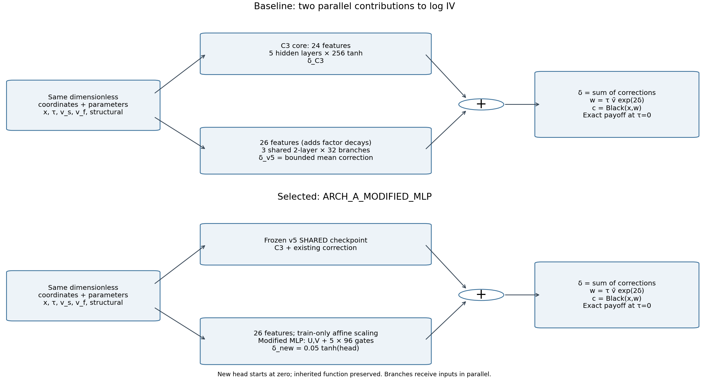

## 2. Diagnosed weaknesses

The baseline already passes all price/IV gates. Its failure is not inability to
cross the originally stated 2e-5 price gate. The observed opportunities were:

- IV gradients are small relative to price gradients: median IV/price L2 ratio
  0.0355 during a separately labelled 200-step continuation. Historical
  gradient trajectories were not logged and are not invented here.
- Short-maturity and wing PDE residuals are larger than medium-maturity residuals.
  The largest price errors occur at long maturities; short-maturity price error
  is not universally worst. Localization justifies testing RAD, not a claimed
  proof of spectral bias.
- Existing generic log-state transforms extend beyond [-1,1]. New branches use
  train-only affine conditioning of exactly the same 26 engineered features.
  Plain and modified branch controls share this conditioning. Its isolated causal
  effect was not measured, so we do not attribute a gain to conditioning alone.
- Terminal payoff is already exact. There is no learned terminal penalty to balance.
  Finite x-domain edges are not the asymptotic S=0 or S=infinity boundaries.

All gradient norms concern the trainable continuation/correction parameters, not
the frozen parent weights. Price, IV, PDE and convexity raw losses are logged
separately. No Greek loss or artificial boundary loss was introduced.

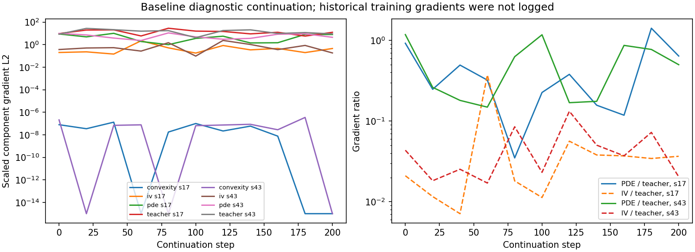

## 3. Research-backed methods and faithful implementation

The recurrence in [Wang, Teng and Perdikaris (2021)](https://arxiv.org/abs/2001.04536)
was checked against the authors' [official implementation](https://github.com/PredictiveIntelligenceLab/GradientPathologiesPINNs/blob/master/Helmholtz/Helmholtz2D_model_tf.py).
Its two input encoders U,V are combined at every hidden layer as H←Z⊙U+(1−Z)⊙V,
where Z=tanh(W H+b). The gates are tanh, not sigmoid. We use that published core
inside a checkpoint-preserving correction branch; we did **not** replace or
retrain the entire inherited core. Zero-initialized output heads start at the
exact parent function. This residual use is our adaptation, disclosed separately
from the paper's architecture. Total model size stays below 1.25× baseline.

[Wang, Yu and Perdikaris (2022)](https://arxiv.org/abs/2007.14527) motivates checking
unequal component convergence; we did not compute an NTK eigendecomposition.
Candidate B uses the later official [JaxPI grad_norm implementation](https://github.com/PredictiveIntelligenceLab/jaxpi/blob/main/jaxpi/models.py):
mean component gradient L2 norm divided by each norm, smoothed with EMA β=.9.
It balances normalized price/IV/PDE terms every 100 Adam steps. Convexity keeps
its original coefficient. Weights are fixed during L-BFGS. This is not described
as the original paper's max/mean statistic. Weight trajectories and failures are retained.

Candidate C uses [Wu et al. (2023)](https://arxiv.org/abs/2207.10289) RAD k=1,c=1:
probability proportional to |R|/mean|R|+1. At three fixed intervals, score 8,192
fresh candidate points and replace 4,096 of 18,000 active collocation locations,
without replacement. 13,904 original global points remain. Every minibatch in
every arm includes marginal coverage of maturity, moneyness, both variance states,
and fast-/slow-heavy states. This does not guarantee every joint stratum has a
point. All arms retain the same number of active collocation slots; RAD incurs
additional scoring cost, explicitly recorded.

Hard-terminal candidate D is not a distinct trained arm because the inherited
condition is already exact. The generic payoff+τN ansatz would leave a spatial
kink at positive τ. See [the mathematical assessment](experiments/pinn_architecture_v6/HARD_TERMINAL_ASSESSMENT.md),
motivated by [Sukumar and Srivastava](https://arxiv.org/abs/2104.08426).
Fourier features were not justified by a demonstrated spectral problem. gPINN's
higher derivatives were unnecessary for the initial ladder. Adaptive activation
E is conditional, as specified before training; untested methods are not invented
as result rows.

## 4. Ablation ladder and development results

All actual arms use 2,000 Adam steps, 512 labels/64 PDE points per step, then 80
strong-Wolfe L-BFGS iterations on the same 4,096-label/256-PDE polishing subset.
Learning rate decays from 2e-4 to 1e-5. Float64 CPU, no weight decay, no gradient
or output clipping. Teacher minibatches use an architecture-independent generator.
Both seeds are retained. A/B/C start independently from the same baseline, not
from each preceding trained arm. This keeps incremental methods attributable.

| arm | Params/seed | price_RMSE | IV RMSE (vol pts) | price_P95 | price_max | PDE_P95 | Train s/seed | 1024 prices ms/seed | eligible |
| --- | --- | --- | --- | --- | --- | --- | --- | --- | --- |
| BASELINE | 275684 | 1.07052e-05 | 0.115907 | 2.23304e-05 | 0.000123331 | 0.0522007 | 45.7901 | 11.1408 | False |
| A0_CONTINUE | 275684 | 1.03708e-05 | 0.115268 | 2.16695e-05 | 0.000124728 | 0.0529503 | 101.874 | 10.8181 | True |
| CONTROL_PLAIN | 322277 | 1.03217e-05 | 0.115737 | 2.14688e-05 | 0.000118912 | 0.0522988 | 153.285 | 15.1091 | True |
| ARCH_A_MODIFIED_MLP | 320805 | 9.8729e-06 | 0.113674 | 2.0566e-05 | 0.000122079 | 0.051832 | 168.434 | 16.7174 | True |
| ARCH_B_MODIFIED_MLP_GRADBAL | 320805 | 1.1618e-05 | 0.107313 | 2.49342e-05 | 0.000119335 | 0.0579721 | 168.238 | 16.6983 | False |
| ARCH_C_MODIFIED_MLP_GRADBAL_RAD | 320805 | 1.2045e-05 | 0.107638 | 2.59868e-05 | 0.000121305 | 0.0601251 | 171.342 | 16.7414 | False |

Price errors are forward-normalized call units; IV errors are volatility points.
PDE summaries average per-seed residual statistics; the pricing row is an ensemble,
so it is not claimed that the averaged per-seed PDE statistic equals the ensemble
PDE statistic. Baseline training seconds above are the historical v5 increment,
not a fresh equal-compute run; A0_CONTINUE is the current equal-step control.
Inherited C3 training averaged about 2,697 seconds per seed and is shared by all
arms. Full process peak RSS includes libraries/data and is not isolated model memory.

Pairwise attribution (positive percentage means lower error):

| Change | Price RMSE improvement % | IV RMSE improvement % | PDE RMSE improvement % |
| --- | --- | --- | --- |
| Additional training and common stratified batching | 3.12371 | 0.550887 | -0.553001 |
| New conditioned plain correction (changes capacity and trainable representation) | 0.473575 | -0.406388 | 0.958353 |
| Modified recurrence vs comparable plain correction | 4.34825 | 1.78204 | -4.57642 |
| Add gradient balancing | -17.6754 | 5.59584 | -5.49461 |
| Add RAD | -3.67533 | -0.302816 | 0.539794 |

A0 is continuation plus common stratified batching; CONTROL_PLAIN additionally
changes branch capacity and conditioning. Only A vs CONTROL_PLAIN isolates the
modified recurrence at approximately equal parameter/step budgets. B vs A and
C vs B isolate balancing and RAD respectively. Equal steps are not equal wall time.

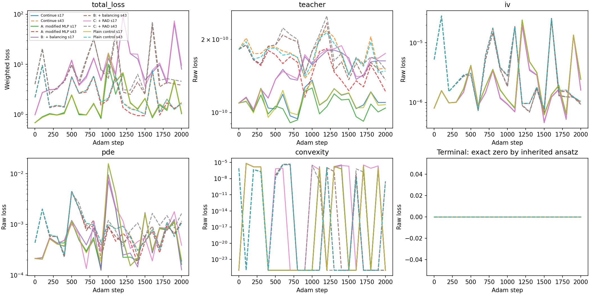
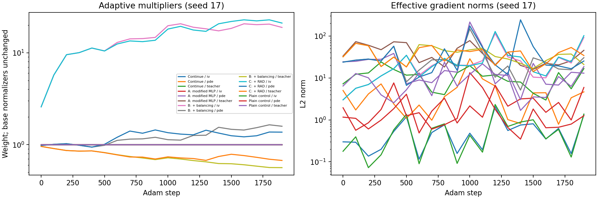
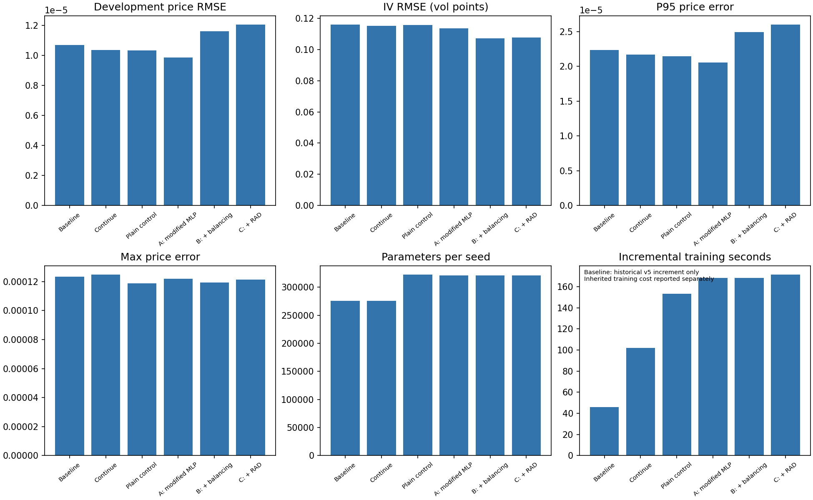

## 5. Selected architecture and development change

Selection is based only on development price RMSE among candidates passing all
four original gates, the inherited PDE guard and baseline price improvement.
Tie-breakers are IV RMSE, parameter count, then latency. Original gates remain
RMSE≤2e-5, P95≤5e-5, max≤2e-4, IV RMSE≤.002 decimal. The inherited guard uses
the original first 256 collocation points and permits at most 10% PDE RMSE increase.
Other physics/curve/regional results remain visible, including regressions.

| Metric | Baseline | Selected | Improvement % |
| --- | --- | --- | --- |
| price_RMSE | 1.07052e-05 | 9.8729e-06 | 7.77497 |
| IV_RMSE_volatility_points | 0.115907 | 0.113674 | 1.92616 |
| price_P95 | 2.23304e-05 | 2.0566e-05 | 7.90123 |
| price_max | 0.000123331 | 0.000122079 | 1.01515 |
| PDE_RMSE | 0.0340765 | 0.0354897 | -4.14698 |
| PDE_P95 | 0.0522007 | 0.051832 | 0.706245 |
| PDE_max | 0.810915 | 0.927358 | -14.3594 |

## 6. Fresh synthetic fidelity, opened once after freezing

The old v4/v5 synthetic tests were already exposed and were not relabelled unseen.
After selection, the experiment hashes checkpoints, metrics and source, then
generates seed 206104 (4,096 prices) and 206105 (512 PDE points) within the same
unchanged domain. Only the baseline and selected model are evaluated. There is
no selection retry based on these results.

| arm | price_RMSE | IV_RMSE_volatility_points | price_P95 | price_max | PDE_RMSE | passes_four_gates |
| --- | --- | --- | --- | --- | --- | --- |
| BASELINE | 1.0588e-05 | 0.119833 | 2.27014e-05 | 9.33769e-05 | 0.0210512 | True |
| ARCH_A_MODIFIED_MLP | 9.61013e-06 | 0.117949 | 2.03923e-05 | 7.78229e-05 | 0.0212574 | True |

Fresh price RMSE improvement: **9.236%**. Final measurements do not trigger reselection.

| metric | baseline | selected | improvement_percent |
| --- | --- | --- | --- |
| price_RMSE | 1.0588e-05 | 9.61013e-06 | 9.23597 |
| IV_RMSE_volatility_points | 0.119833 | 0.117949 | 1.57175 |
| price_P95 | 2.27014e-05 | 2.03923e-05 | 10.1715 |
| price_max | 9.33769e-05 | 7.78229e-05 | 16.6573 |
| PDE_RMSE | 0.0210512 | 0.0212574 | -0.979568 |
| PDE_P95 | 0.0441938 | 0.0426061 | 3.59263 |
| PDE_max | 0.147944 | 0.159587 | -7.86979 |

## 7. Efficiency and seed robustness

| arm | parameters_per_seed | training_seconds_mean | peak_RSS_MB | inference_1024_ms_per_seed | inference_single_ms_per_seed |
| --- | --- | --- | --- | --- | --- |
| BASELINE | 275684 | 45.7901 | not recorded | 11.1408 | 0.569771 |
| A0_CONTINUE | 275684 | 101.874 | 825.891 | 10.8181 | 0.42925 |
| CONTROL_PLAIN | 322277 | 153.285 | 1046.25 | 15.1091 | 0.675365 |
| ARCH_A_MODIFIED_MLP | 320805 | 168.434 | 1644.7 | 16.7174 | 0.649573 |
| ARCH_B_MODIFIED_MLP_GRADBAL | 320805 | 168.238 | 1644.73 | 16.6983 | 0.659062 |
| ARCH_C_MODIFIED_MLP_GRADBAL_RAD | 320805 | 171.342 | 1657.98 | 16.7414 | 0.683062 |

The selected per-seed parameter change is 16.37%.
Latency is measured after warm-up, 20 repetitions, one CPU thread, with no gradients.
It is an environment-dependent measurement, not a universal deployment speed claim.
`efficiency.csv` defines two explicit descriptive scores: 1/(RMSE×million parameters)
and 1/(RMSE×incremental training minutes). They are not formal statistical accuracy
measures, and the baseline historical training-minute score is not directly comparable.
Lower RMSE alone does not establish that a larger architecture is more efficient.

There are **two** inherited independent training seeds, matching the existing
protocol. A new third seed would require a new parent-training arm and was not
fabricated. This limits robustness. Per-seed mean, sample standard deviation,
best and worst are provided in `seed_robustness_long.csv`; no statistical
architecture-superiority claim is based on two seeds alone.

| arm | metric | mean | std | best | worst |
| --- | --- | --- | --- | --- | --- |
| A0_CONTINUE | price_RMSE | 1.21675e-05 | 1.07051e-06 | 1.14105e-05 | 1.29245e-05 |
| ARCH_A_MODIFIED_MLP | price_RMSE | 1.17024e-05 | 1.00369e-06 | 1.09927e-05 | 1.24121e-05 |
| ARCH_B_MODIFIED_MLP_GRADBAL | price_RMSE | 1.45138e-05 | 3.05921e-07 | 1.42975e-05 | 1.47301e-05 |
| ARCH_C_MODIFIED_MLP_GRADBAL_RAD | price_RMSE | 1.48665e-05 | 5.31116e-07 | 1.4491e-05 | 1.52421e-05 |
| BASELINE | price_RMSE | 1.24427e-05 | 1.49045e-06 | 1.13888e-05 | 1.34966e-05 |
| CONTROL_PLAIN | price_RMSE | 1.20956e-05 | 1.30453e-06 | 1.11732e-05 | 1.30181e-05 |

## 8. Optimizer contribution and difficult regions

`lbfgs_effect.csv` compares every seed immediately before and after L-BFGS.
Adaptive weights stay fixed throughout each polishing solve. Its benefit must
not be attributed solely to the architecture.

Selected versus baseline development regions:

| bucket | price_RMSE_base | price_RMSE_new | price_max_base | price_max_new | RMSE_improvement_percent |
| --- | --- | --- | --- | --- | --- |
| 7–30d | 6.86389e-06 | 7.14946e-06 | 7.92053e-05 | 8.07911e-05 | -4.16054 |
| 30–90d | 9.60774e-06 | 9.12905e-06 | 4.69225e-05 | 4.48305e-05 | 4.98233 |
| 90–365d | 1.09888e-05 | 1.02185e-05 | 6.22945e-05 | 6.87225e-05 | 7.00988 |
| 365–730d | 1.67097e-05 | 1.42545e-05 | 0.000123331 | 0.000122079 | 14.6929 |
| ATM |x|≤.02 | 1.26648e-05 | 1.13537e-05 | 4.69225e-05 | 3.78185e-05 | 10.3524 |
| wings |x|>.15 | 9.75089e-06 | 8.89093e-06 | 0.000123331 | 0.000122079 | 8.81933 |
| fast-heavy | 1.03011e-05 | 9.30479e-06 | 7.92053e-05 | 8.07911e-05 | 9.67208 |
| slow-heavy | 1.14015e-05 | 1.08272e-05 | 0.000123331 | 0.000122079 | 5.0366 |
| low slow variance | 9.65283e-06 | 8.67239e-06 | 7.92053e-05 | 8.07911e-05 | 10.1571 |
| high slow variance | 1.1663e-05 | 1.09425e-05 | 0.000123331 | 0.000122079 | 6.17814 |
| low fast variance | 1.03203e-05 | 9.36734e-06 | 0.000123331 | 0.000122079 | 9.2335 |
| high fast variance | 1.10768e-05 | 1.03538e-05 | 7.92053e-05 | 8.07911e-05 | 6.52733 |

Negative improvements are regressions, not excluded quotes. The whole pricing
domain remains x∈[-.36,.36], τ∈[7,730] days with the inherited state/scale bounds.
No claim is made for τ below seven days except the exact expiry payoff itself.
Correlations and reversion speeds are fixed to the existing literature family;
there are no additional extreme-correlation states to sample outside that domain.

## 9. Curves, finite-domain edges and 3D surfaces

The common 81×41 fixed grid uses published baseline parameters, K=1 and r=q=0,
so S/K=exp(x). Exact prices are converted to C/K for curves; this differs from
the C/F units of the main fidelity table. Monotonicity uses C_S=exp(-x)c_x and
convexity uses C_SS=exp(-2x)(c_xx−c_x). Violations below −1e-8 are counted.
At τ=0 the actual payoff is measured, never smoothed for evaluation.

| arm | price_RMSE_C_over_K | max_error_C_over_K | monotonicity_violation_percent | convexity_violation_percent | terminal_max_error | finite_edge_teacher_RMSE | call_bound_violations |
| --- | --- | --- | --- | --- | --- | --- | --- |
| BASELINE | 1.42027e-05 | 0.000141014 | 0 | 0 | 0 | 2.2136e-05 | 0 |
| A0_CONTINUE | 1.33517e-05 | 0.000133753 | 0 | 0 | 0 | 2.12751e-05 | 0 |
| CONTROL_PLAIN | 1.3257e-05 | 0.000127969 | 0 | 0 | 0 | 2.05217e-05 | 0 |
| ARCH_A_MODIFIED_MLP | 1.13676e-05 | 0.00011161 | 0 | 0 | 0 | 1.78435e-05 | 0 |
| ARCH_B_MODIFIED_MLP_GRADBAL | 1.26066e-05 | 0.000104592 | 0 | 0 | 0 | 1.66083e-05 | 0 |
| ARCH_C_MODIFIED_MLP_GRADBAL_RAD | 1.31783e-05 | 9.34406e-05 | 0 | 0 | 0 | 1.50269e-05 | 0 |

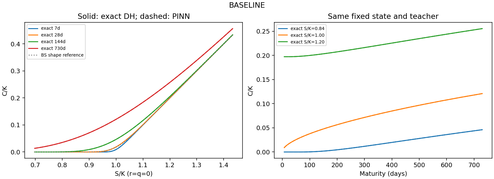
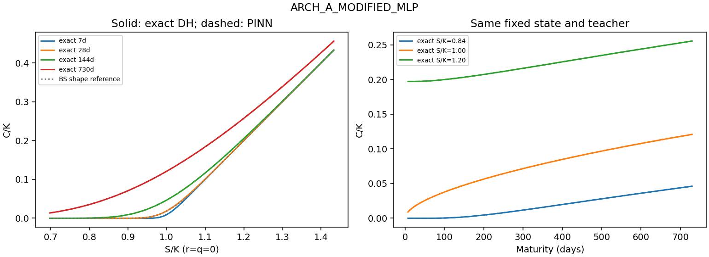
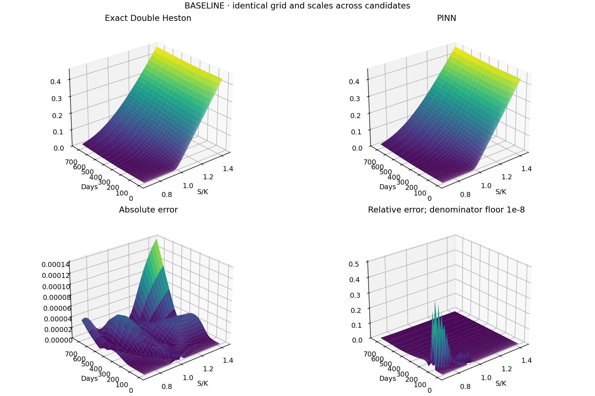
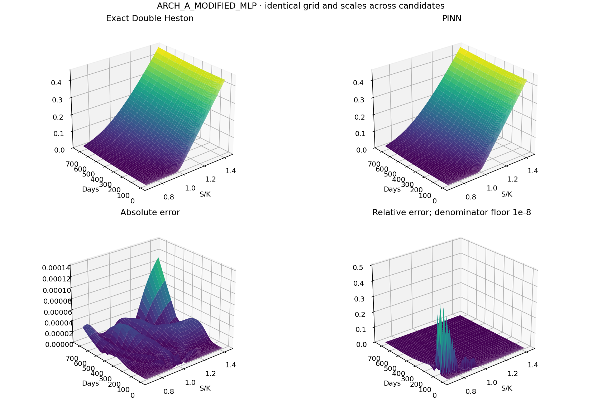
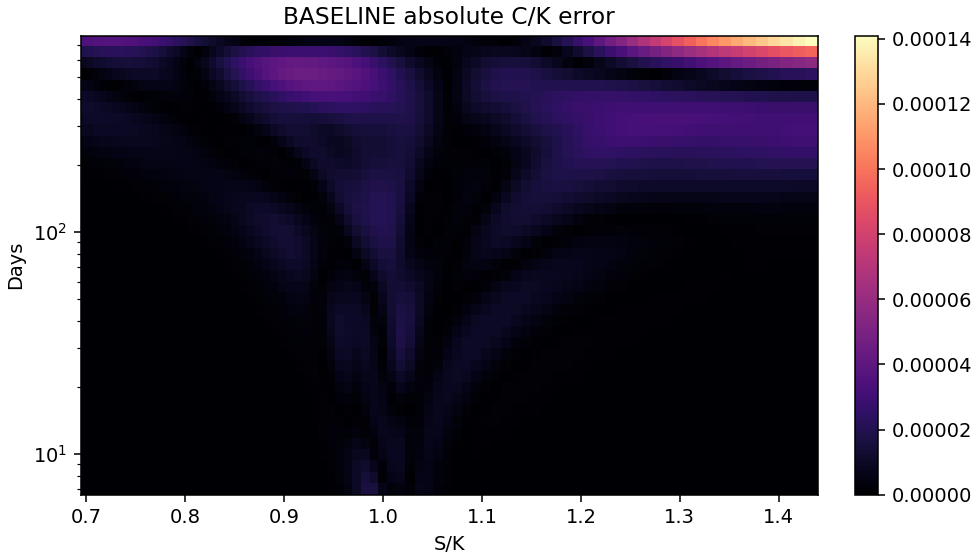
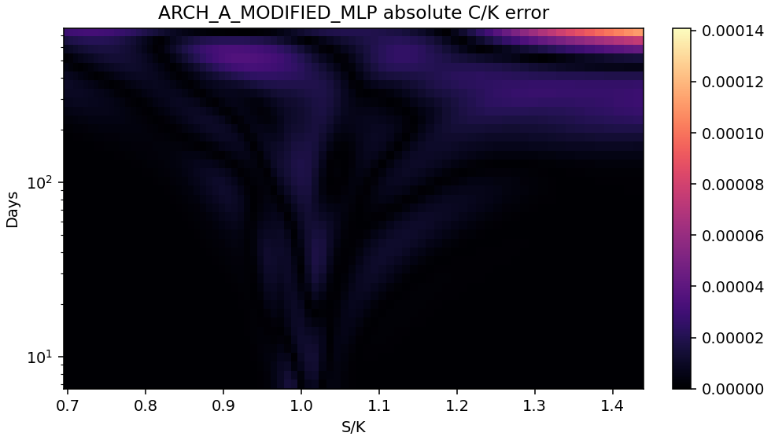

Every tested arm has its own curves/surfaces on the same axes and error scale.
Relative error uses max(|exact price|,1e-8) as denominator; near-zero wing prices
can make relative errors large. Price, derivative, edge and terminal violations
are not removed from the plots. BS appears only as a qualitative shape reference.

## 10. Reproduction, preservation and interpretation

The code is under `experiments/pinn_architecture_v6/`; the published-core implementation
is `src/mentor_dh_pinn/research_modified_pinn.py`. The audit came first, then
diagnostics, a hashed predeclared protocol, ordered A/B/C training, selection,
and one-time fresh fidelity. Optional methods retain their declared trigger rules.
All previous experiments and unsuccessful candidates remain unchanged.

Run modules `diagnose`, `train initialize`, `train train --arm NAME --seed SEED`,
`evaluate development`, `curves`, `evaluate select`, `evaluate fidelity`,
`figures`, and `report` in a separate copy with a new output directory. Existing
training directories and final-test opening refuse overwrite. Source SHA-256
manifests are authoritative because this checkout has no project-local Git
commit; the enclosing home-directory repository is not claimed as provenance.

This study tests numerical improvements within a highly accurate existing
solver. A method that lowers price error while worsening PDE, IV, region-level
error or efficiency is a trade-off, not an unqualified improvement. The table
above identifies exactly which additions help and which do not. Market-model
mismatch and ten-parameter calibration remain separate problems.

## Reporting-only final checks

Common-IV comparison uses the same 3785 valid quotes in both arms:
baseline 0.11983258, selected
0.11794912 volatility points. This prevents a
change in inversion coverage from being mistaken for an accuracy gain.

Fresh regional diagnostics (not used to revise selection):

| bucket | quotes | baseline_RMSE | selected_RMSE | improvement_percent |
| --- | --- | --- | --- | --- |
| 7–30d | 1282 | 6.88845e-06 | 7.00359e-06 | -1.67149 |
| 30–90d | 969 | 8.97877e-06 | 8.59027e-06 | 4.32681 |
| 90–365d | 1234 | 1.1081e-05 | 1.05048e-05 | 5.20012 |
| 365–730d | 611 | 1.66172e-05 | 1.32781e-05 | 20.0941 |
| ATM |x|≤.02 | 228 | 1.34367e-05 | 1.23367e-05 | 8.18637 |
| wings |x|>.15 | 2388 | 9.44095e-06 | 8.43549e-06 | 10.6499 |

The fixed published-state curve grid has zero detected monotonicity/convexity
violations in all tested arms, but this is not a domain-wide guarantee. On the
fresh PDE diagnostic states, the selected model still has mean per-seed convexity
violation rate 1.66016% and monotonicity violation
rate 0.195312%, at the separately documented tolerances.

Run the reporting-only `deliver` module after `report` to reproduce this summary,
common-IV/region checks and the parallel-branch architecture schematic. It does
not change the frozen selection, training code, metric thresholds or checkpoints.
