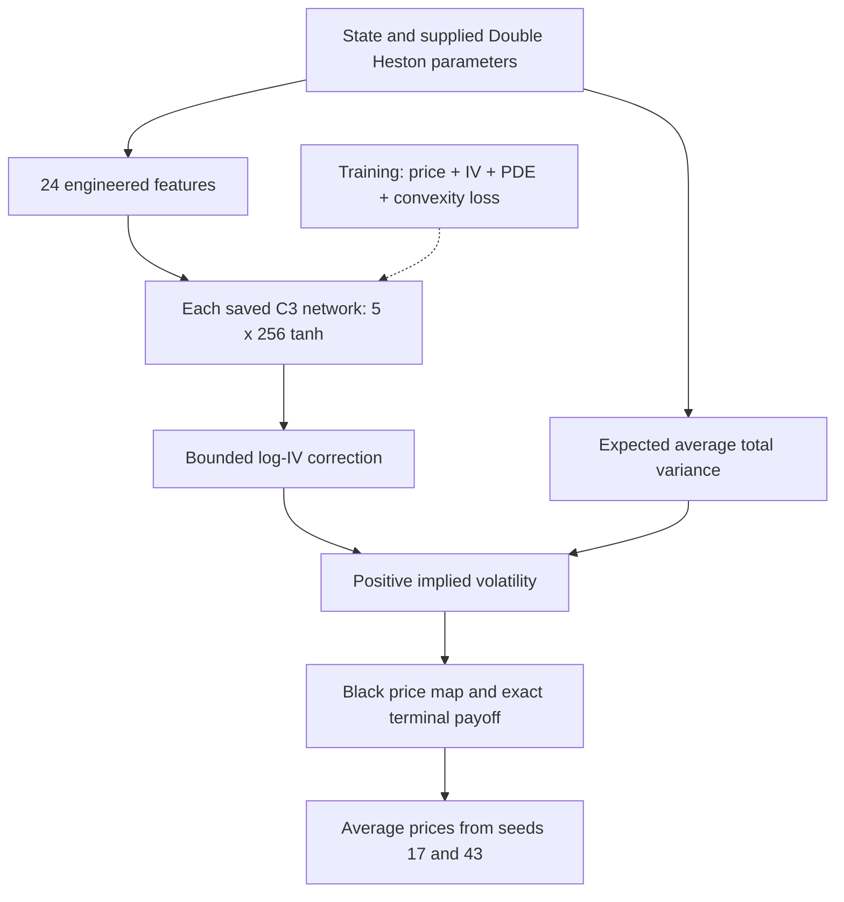

# Research findings and handoff — 20 September 2026

This update preserves successful checks, failed candidates and data-integrity
caveats. It does not promote the experimental dual PINN or revise frozen market
results to make a preferred model win.

## 1. Existing v4 C3 pricing curves

[Full visualization report](figures/bs_pinn_curve_validation/PLOT_REPORT.md)
includes 21 figures, plotting code, configuration, source CSVs and checksums.

These are synthetic Double Heston prices with K=100, r=q=0, not historical NSE
quotes. Across the illustrated 121 x 121 grid, the frozen two-seed C3 PINN had
zero detected stock-price monotonicity/convexity violations at tolerance 1e-7;
the ATM maturity slice had no decreasing intervals. Price bounds passed.
The terminal payoff is enforced by construction. Against exact Double Heston,
RMSE was 0.00244455 and maximum error 0.0138084 in illustrative price units.

The valid research claim is shape consistency and reference-price fidelity
on this configuration and domain. It is NOT universal arbitrage freedom,
recovery of all ten parameters, market forecasting accuracy, or proof of
superiority to Black-Scholes. Double Heston prices need not equal constant-vol
Black-Scholes prices. Black-Scholes is the shape reference, not the DH teacher.



The ten model quantities are inputs to this forward surrogate, not ten predicted
parameters. The current C3 is not the early proposed Fourier/Softplus network.

## 2. Existing Bitcoin comparison, with newly discovered caveat

[Audited results and explanation](../experiments/portable_dual_pinn_v1/deliverables/REPORT.md)
and [audit evidence](../experiments/portable_dual_pinn_v1/btc_audit/audit.json).

All 400 existing score rows were reproduced; 72 raw archive hashes and the
original/BS-amendment manifests were checked. The correct BS comparison is the
per-expiry BS_EXPIRY arm, not the flawed BS_TERM implementation.

Stored shock/held-out-expiry median IV RMSE: BS 8.133, SH 2.496, DH 1.857
volatility points. However, preprocessing reconstructs expiry forwards from
option price/IV information before creating quote holdouts. A controlled
in-memory perturbation confirmed that held-out targets influence covariates.
The original ranking is reproducible but NOT certified leakage-free. Its
effect on the ranking is unquantified. These were exact-model calibrations,
not PINN forecasts. Obtain independent forward/settlement inputs before a new
target-independent market evaluation.

## 3. New portable maturity-dual PINN: not promoted

[Implementation](../src/mentor_dh_pinn/maturity_dual_pinn.py),
[protocol](../experiments/portable_dual_pinn_v1/PROTOCOL.md),
[extended protocol](../experiments/portable_dual_pinn_v1/EXTENDED_PROTOCOL.md),
[pre-training correction](../experiments/portable_dual_pinn_v1/EXTENDED_AMENDMENT_01.md).

Two 3 x 64 tanh maturity experts blend smoothly. A 3 x 96 single-branch PINN
is the matched-budget control; BOTH solve Double Heston. The adapter supports
arbitrary European call/put quote geometry and currency scaling, not American
or exotic payoffs or unlimited out-of-distribution use.

The extended run uses 24,576 training labels, 18,000 collocation points,
6,144 development labels from 64 separate parameter cases, and seeds 17/43.
Mean dual-branch price error improved 2.72% and IV error improved 5.62%, but
scaled PDE error rose from 2.991 to 7.427, with more convexity violations.
It FAILS the declared promotion rule. Existing selected C3 checkpoints remain
unchanged. No claim of improved Bitcoin-market accuracy or parameter recovery.

The original pilot and its failures are retained. The first extended attempt
was stopped before training to correct a case-grouped fine-tuning subset.
The exact training implementation is archived; the later shared-input broadcast
fix leaves all 30,720 saved batched predictions bitwise unchanged.

## Verification and reproduction

Focused suite: 33 passing tests, including the independent raw-price PDE check,
both-branch gradient flow, payoff, parity, scaling, input rejection, stratified
fine-tuning coverage, and existing BTC/BS-correction tests.

```bash
python -m pytest tests/test_maturity_dual_pinn.py tests/test_regular_pinn_torch_physics.py tests/test_regular_pinn_data.py experiments/portable_dual_pinn_v1/test_extended.py experiments/btc_multifactor_v1/test_btc.py experiments/btc_multifactor_v1/test_amend01.py -q
python experiments/portable_dual_pinn_v1/verify_saved_compatibility.py
```

Small checkpoints, synthetic arrays, predictions and histories for both new
runs are included so teammates need not retrain to inspect the results.
Training manifests refer to the archived training source; consult the report
for the disclosed post-training broadcast fix. Training scripts refuse to
overwrite existing runs. Use a separate reproduction output location.
