# Current Double-Heston PINN — option-price curve visualization

**Network category: Double-Heston PINN, not a Black-Scholes PINN.** This is visualization only; no retraining, tuning, changed splits, changed model parameters or opening of untouched final data.

## Model recovered from the repository

v4 C3, arithmetic mean of seeds 17 and 43; exact paths and hashes in PLOT_CONFIGURATION.json.

The previously selected C3 is 5 hidden tanh layers ×256 units, 24 engineered inputs and 269,825 parameters per seed. Existing selection/lock/checkpoint hashes match. C1/C2 are not silently substituted. v3 was rejected on development and is not the displayed model. All existing experiment source hashes were verified.

## Price convention and common configuration

K=100, r=q=0, BS σ=√0.0255=0.1596871942, slow (κ,θ,σ,ρ,v₀)=(0.9491,0.0257,0.0517,0.7009,0.0003), fast=(10.7526,0.033,0.3613,−0.8916,0.0252).

The strike of 100 is an illustrative unit scale, not a historical NSE strike or observed price. No market quotes are used in these new curves. The BASE representative parameter vector is unchanged. BS matches the initial total volatility only; its constant σ does not make it mathematically equivalent to stocDouble/Single-heston-v1hastic volatility.

F=S exp((r−q)τ), D=exp(−rτ), x=ln(F/K), τ in years. Here r=q=0, hence F=S and D=1. Coordinates are [x,v_slow,v_fast,τ], plus structural [κ,θ,σ,ρ] for each factor. `net.price` returns C/(D K), whereas the reused `run.neural` returns C/(D F). **All new price curves multiply that output by D F.** Calling `net.forward` directly would return IV, not price; we do not do that.

The input features use x/0.36, volatility-scaled moneyness, log-scaled τ and variance/parameter transforms. The network learns a bounded log-IV correction to expected average variance: IV=√v̄·exp(1.8 tanh(head)); total implied variance=τ·IV², then the analytic Black call map produces price. This construction ensures payoff at zero maturity but does not alone guarantee global convexity. The slow/fast ordering is preserved.

S range [69.767633, 143.332941] corresponds to x∈[−0.36,0.36]. This uses the valid model domain rather than extrapolating to S/K=0.5. Main τ range is 7/365–2 years. Curves use 401 points; surfaces 121×121; all PNGs are 300 DPI. Full 3D price range is [0, 47.494932].

## What “follows” means here

**Shape reference:** Black-Scholes. **Numerical target:** the exact same Double Heston model. PINN−DH is approximation error. Exact DH−BS is a model difference. PINN−BS combines both; it must not be called pure PINN error. These are diagnostic plots, not proof of universal accuracy, market fit or ten-parameter recovery.

## Numerical results on the new illustrative grid

| price_RMSE | price_MAE | price_P95 | price_max | max_BS_DH_model_difference | grid_points |
|---|---|---|---|---|---|
| 0.00244455 | 0.00163066 | 0.00458607 | 0.0138084 | 3.16746 | 14641 |

All units in this grid table are illustrative K=100 price units. These values do not replace the frozen evaluation metrics.

## “Following the curve” checks

| sample | model | derivative | tested_locations | negative_beyond_tolerance | violation_percent | minimum |
|---|---|---|---|---|---|---|
| S_slice_90d | C_BS | first | 400 | 0 | 0 | 3.67044e-06 |
| S_slice_90d | C_BS | second | 399 | 0 | 0 | 1.05663e-06 |
| S_slice_90d | C_exact_DH | first | 400 | 0 | 0 | 2.18519e-08 |
| S_slice_90d | C_exact_DH | second | 399 | 0 | 0 | 3.49261e-08 |
| S_slice_90d | C_PINN | first | 400 | 0 | 0 | 9.17749e-09 |
| S_slice_90d | C_PINN | second | 399 | 0 | 0 | 1.60004e-08 |
| tau_slice_ATM | C_BS | first | 400 | 0 | 0 | 2.23944 |
| tau_slice_ATM | C_exact_DH | first | 400 | 0 | 0 | 3.53448 |
| tau_slice_ATM | C_PINN | first | 400 | 0 | 0 | 3.52584 |
| whole_surface_S_direction | C_BS | first | 14520 | 0 | 0 | 7.78349e-58 |
| whole_surface_S_direction | C_BS | second | 14399 | 0 | 0 | -1.22891e-13 |
| whole_surface_S_direction | C_exact_DH | first | 14520 | 0 | 0 | -2.8511e-10 |
| whole_surface_S_direction | C_exact_DH | second | 14399 | 0 | 0 | -1.68659e-08 |
| whole_surface_S_direction | C_PINN | first | 14520 | 0 | 0 | -3.34225e-11 |
| whole_surface_S_direction | C_PINN | second | 14399 | 0 | 0 | -1.34382e-11 |

First differences use adjacent-pair secants; second differences use centered three-point stencils. The S grid is uniform. Derivative tolerance is 1e−7 in the corresponding units. Negative maturity second derivatives are not violations: maturity convexity is not required. No violations are repaired. Grid tests are finite-domain evidence, not a proof of global arbitrage freedom.

The network and BS functions are analytically smooth for strictly positive maturity inside the domain. Full finite-difference values are saved, so local irregularities are inspectable. Maturity-monotonicity counts above apply to the controlled r=q=0 setup, not arbitrary dividend settings.

## Price bounds and terminal condition

| model | below_intrinsic_beyond_tolerance | above_spot_beyond_tolerance | minimum_time_value |
|---|---|---|---|
| C_BS | 0 | 0 | -1.06581e-14 |
| C_exact_DH | 0 | 0 | -3.42354e-09 |
| C_PINN | 0 | 0 | 5.8975e-13 |

Bounds use tolerance 1e−7 price units. Reference roundoff is retained. At τ=0, all three prices agree with max(S−K,0) to within 1e−11 for S=80,100,120. For positive sub-7-day maturities, Figure 19 and its CSV report extrapolation explicitly. Endpoint agreement is hard-coded mathematical construction, not validation on short-dated data.

## Figure-by-figure interpretation

### 1. Black-Scholes C vs S

401 stock prices; τ=90/365 years. This is the smooth constant-volatility shape reference, not a DH numerical target.

**Parameters:** K=100, r=q=0, BS σ=√0.0255=0.1596871942, slow (κ,θ,σ,ρ,v₀)=(0.9491,0.0257,0.0517,0.7009,0.0003), fast=(10.7526,0.033,0.3613,−0.8916,0.0252).

**Checkpoint:** v4 C3, arithmetic mean of seeds 17 and 43; exact paths and hashes in PLOT_CONFIGURATION.json.

**Functions:** Black-Scholes: existing literature_exact.black (forward-normalized analytical formula), converted with D·F. Exact reference: literature_exact.exact, with its unchanged adaptive Fourier fallback. PINN: run.nets/run.neural → TorchRegularVariancePINN.price.

**Interpretation:** Analytical shape reference only; agreement with the PINN is not required. The monotonicity/convexity checks for BS show zero violations on the reported stock-price grids.

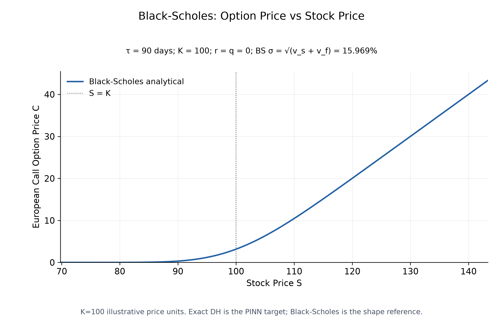

### 2. Current PINN C vs S

Identical S grid and fixed 90-day maturity. The neural curve is denormalized into K=100 price units. Check its shape violations below rather than assuming arbitrage freedom.

**Parameters:** K=100, r=q=0, BS σ=√0.0255=0.1596871942, slow (κ,θ,σ,ρ,v₀)=(0.9491,0.0257,0.0517,0.7009,0.0003), fast=(10.7526,0.033,0.3613,−0.8916,0.0252).

**Checkpoint:** v4 C3, arithmetic mean of seeds 17 and 43; exact paths and hashes in PLOT_CONFIGURATION.json.

**Functions:** Black-Scholes: existing literature_exact.black (forward-normalized analytical formula), converted with D·F. Exact reference: literature_exact.exact, with its unchanged adaptive Fourier fallback. PINN: run.nets/run.neural → TorchRegularVariancePINN.price.

**Interpretation:** Observed PINN–exact DH RMSE 0.000606689, maximum absolute deviation 0.00182068 price units. This is approximation error; the separate BS–DH gap is a model difference. The PINN increases and is convex in S at every tested stencil (zero violations at tolerance 1e−7).

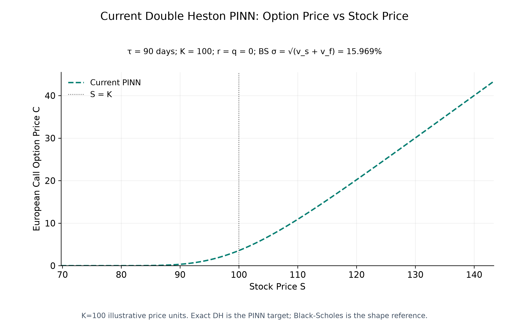

### 3. Stock-price overlay

All three curves use identical S and carry. Orange/teal separation is approximation error; blue/orange separation is a legitimate difference between the fixed-volatility and stochastic-volatility models.

**Parameters:** K=100, r=q=0, BS σ=√0.0255=0.1596871942, slow (κ,θ,σ,ρ,v₀)=(0.9491,0.0257,0.0517,0.7009,0.0003), fast=(10.7526,0.033,0.3613,−0.8916,0.0252).

**Checkpoint:** v4 C3, arithmetic mean of seeds 17 and 43; exact paths and hashes in PLOT_CONFIGURATION.json.

**Functions:** Black-Scholes: existing literature_exact.black (forward-normalized analytical formula), converted with D·F. Exact reference: literature_exact.exact, with its unchanged adaptive Fourier fallback. PINN: run.nets/run.neural → TorchRegularVariancePINN.price.

**Interpretation:** Observed PINN–exact DH RMSE 0.000606689, maximum absolute deviation 0.00182068 price units. This is approximation error; the separate BS–DH gap is a model difference. The PINN increases and is convex in S at every tested stencil (zero violations at tolerance 1e−7).

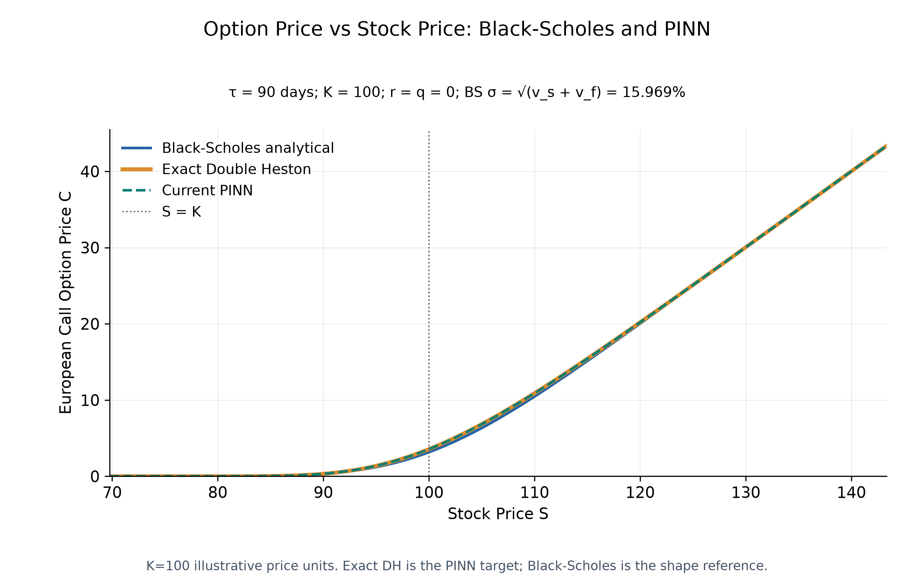

### 4. Stock-price error

Signed and absolute PINN-minus-exact-DH errors at 90 days. These show deviations hidden by overlapping price curves; BS differences are not used as errors.

**Parameters:** K=100, r=q=0, BS σ=√0.0255=0.1596871942, slow (κ,θ,σ,ρ,v₀)=(0.9491,0.0257,0.0517,0.7009,0.0003), fast=(10.7526,0.033,0.3613,−0.8916,0.0252).

**Checkpoint:** v4 C3, arithmetic mean of seeds 17 and 43; exact paths and hashes in PLOT_CONFIGURATION.json.

**Functions:** Black-Scholes: existing literature_exact.black (forward-normalized analytical formula), converted with D·F. Exact reference: literature_exact.exact, with its unchanged adaptive Fourier fallback. PINN: run.nets/run.neural → TorchRegularVariancePINN.price.

**Interpretation:** Observed PINN–exact DH RMSE 0.000606689, maximum absolute deviation 0.00182068 price units. This is approximation error; the separate BS–DH gap is a model difference. The PINN increases and is convex in S at every tested stencil (zero violations at tolerance 1e−7).

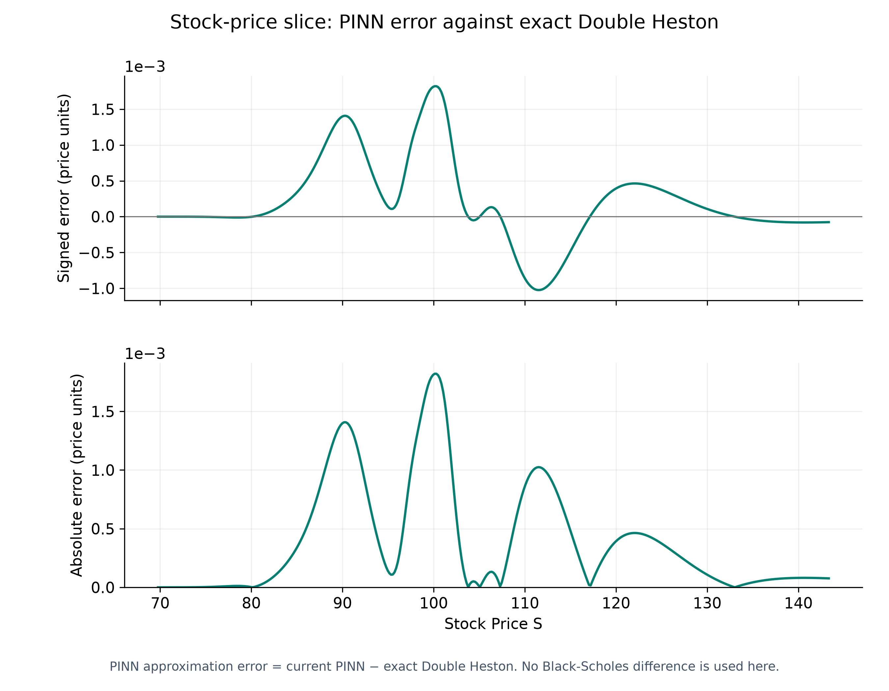

### 5. Black-Scholes C vs τ

401 maturities, S=K=100. Volatility is one constant, not each point’s own implied volatility. With r=q=0 the call gains time value.

**Parameters:** K=100, r=q=0, BS σ=√0.0255=0.1596871942, slow (κ,θ,σ,ρ,v₀)=(0.9491,0.0257,0.0517,0.7009,0.0003), fast=(10.7526,0.033,0.3613,−0.8916,0.0252).

**Checkpoint:** v4 C3, arithmetic mean of seeds 17 and 43; exact paths and hashes in PLOT_CONFIGURATION.json.

**Functions:** Black-Scholes: existing literature_exact.black (forward-normalized analytical formula), converted with D·F. Exact reference: literature_exact.exact, with its unchanged adaptive Fourier fallback. PINN: run.nets/run.neural → TorchRegularVariancePINN.price.

**Interpretation:** Analytical shape reference only; agreement with the PINN is not required. The monotonicity/convexity checks for BS show zero violations on the reported stock-price grids.

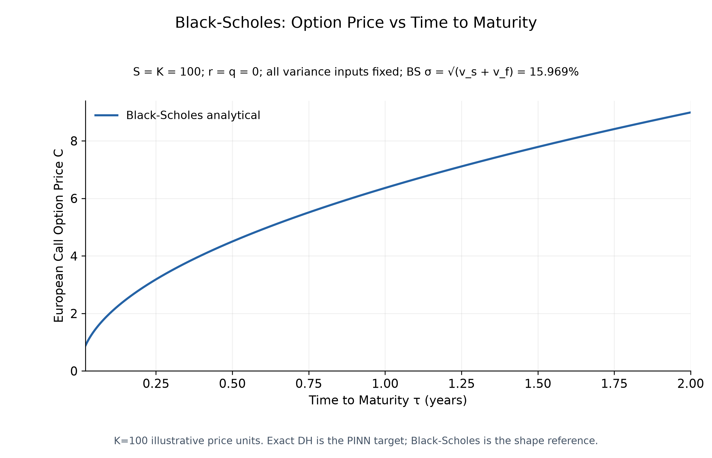

### 6. Current PINN C vs τ

Identical maturities and fixed S, variance states and structural coefficients. This is a maturity sweep, not a forecast of future market dates.

**Parameters:** K=100, r=q=0, BS σ=√0.0255=0.1596871942, slow (κ,θ,σ,ρ,v₀)=(0.9491,0.0257,0.0517,0.7009,0.0003), fast=(10.7526,0.033,0.3613,−0.8916,0.0252).

**Checkpoint:** v4 C3, arithmetic mean of seeds 17 and 43; exact paths and hashes in PLOT_CONFIGURATION.json.

**Functions:** Black-Scholes: existing literature_exact.black (forward-normalized analytical formula), converted with D·F. Exact reference: literature_exact.exact, with its unchanged adaptive Fourier fallback. PINN: run.nets/run.neural → TorchRegularVariancePINN.price.

**Interpretation:** Observed PINN–exact DH RMSE 0.00208194, maximum absolute deviation 0.00311096 price units. This is approximation error; the separate BS–DH gap is a model difference. The PINN has zero detected decreasing-maturity intervals in this r=q=0 setup.

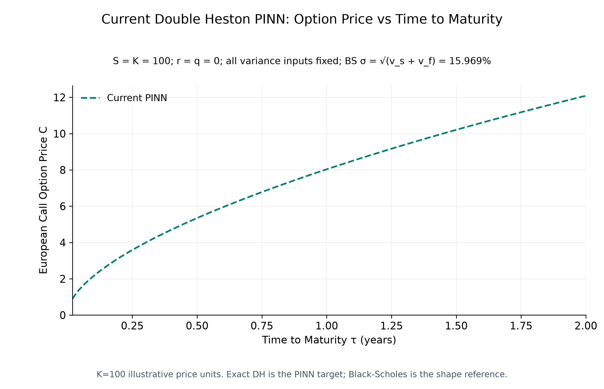

### 7. Maturity overlay

All three maturity curves share the exact grid. The DH expected variance changes with horizon, so departure from the constant-vol BS curve is not evidence of PINN failure.

**Parameters:** K=100, r=q=0, BS σ=√0.0255=0.1596871942, slow (κ,θ,σ,ρ,v₀)=(0.9491,0.0257,0.0517,0.7009,0.0003), fast=(10.7526,0.033,0.3613,−0.8916,0.0252).

**Checkpoint:** v4 C3, arithmetic mean of seeds 17 and 43; exact paths and hashes in PLOT_CONFIGURATION.json.

**Functions:** Black-Scholes: existing literature_exact.black (forward-normalized analytical formula), converted with D·F. Exact reference: literature_exact.exact, with its unchanged adaptive Fourier fallback. PINN: run.nets/run.neural → TorchRegularVariancePINN.price.

**Interpretation:** Observed PINN–exact DH RMSE 0.00208194, maximum absolute deviation 0.00311096 price units. This is approximation error; the separate BS–DH gap is a model difference. The PINN has zero detected decreasing-maturity intervals in this r=q=0 setup.

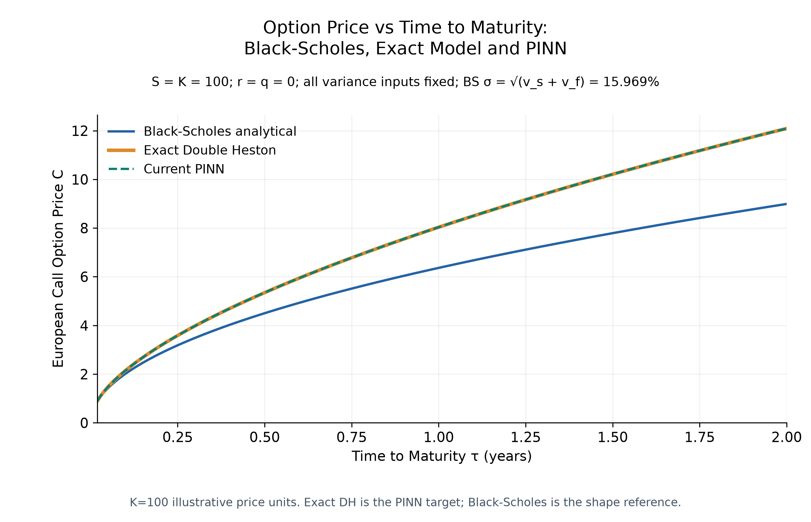

### 8. Maturity error

Signed/absolute PINN-minus-DH errors reveal maturity-localized approximation deviations at S=100. No model is refitted along the curve.

**Parameters:** K=100, r=q=0, BS σ=√0.0255=0.1596871942, slow (κ,θ,σ,ρ,v₀)=(0.9491,0.0257,0.0517,0.7009,0.0003), fast=(10.7526,0.033,0.3613,−0.8916,0.0252).

**Checkpoint:** v4 C3, arithmetic mean of seeds 17 and 43; exact paths and hashes in PLOT_CONFIGURATION.json.

**Functions:** Black-Scholes: existing literature_exact.black (forward-normalized analytical formula), converted with D·F. Exact reference: literature_exact.exact, with its unchanged adaptive Fourier fallback. PINN: run.nets/run.neural → TorchRegularVariancePINN.price.

**Interpretation:** Observed PINN–exact DH RMSE 0.00208194, maximum absolute deviation 0.00311096 price units. This is approximation error; the separate BS–DH gap is a model difference. The PINN has zero detected decreasing-maturity intervals in this r=q=0 setup.

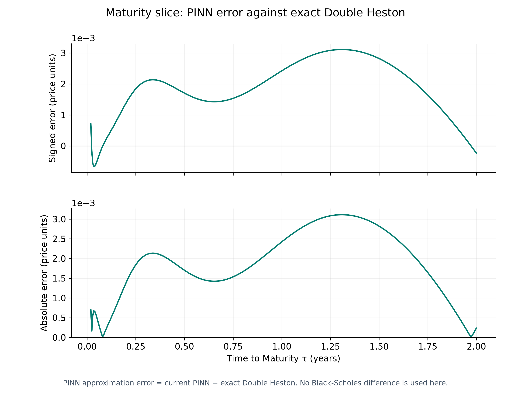

### 9. Black-Scholes surface

121×121 genuine computed mesh. The full common spot/maturity/price limits and camera are used, not normalized outputs mislabeled as prices.

**Parameters:** K=100, r=q=0, BS σ=√0.0255=0.1596871942, slow (κ,θ,σ,ρ,v₀)=(0.9491,0.0257,0.0517,0.7009,0.0003), fast=(10.7526,0.033,0.3613,−0.8916,0.0252).

**Checkpoint:** v4 C3, arithmetic mean of seeds 17 and 43; exact paths and hashes in PLOT_CONFIGURATION.json.

**Functions:** Black-Scholes: existing literature_exact.black (forward-normalized analytical formula), converted with D·F. Exact reference: literature_exact.exact, with its unchanged adaptive Fourier fallback. PINN: run.nets/run.neural → TorchRegularVariancePINN.price.

**Interpretation:** Analytical shape reference only; agreement with the PINN is not required. The monotonicity/convexity checks for BS show zero violations on the reported stock-price grids.

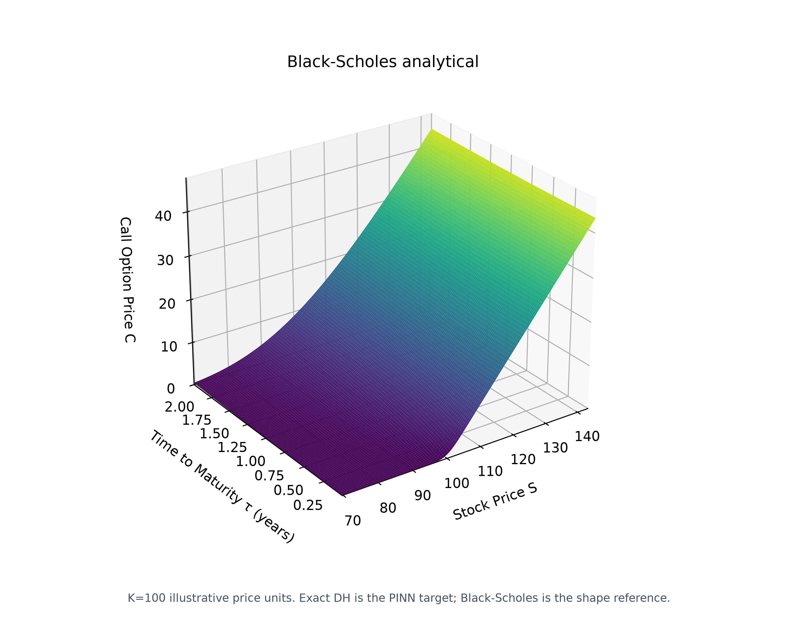

### 10. Current PINN surface

The exact same mesh, color range, camera and axes as Figures 9 and 11. Shape resemblance to BS is appropriate; numerical equality to BS is not required.

**Parameters:** K=100, r=q=0, BS σ=√0.0255=0.1596871942, slow (κ,θ,σ,ρ,v₀)=(0.9491,0.0257,0.0517,0.7009,0.0003), fast=(10.7526,0.033,0.3613,−0.8916,0.0252).

**Checkpoint:** v4 C3, arithmetic mean of seeds 17 and 43; exact paths and hashes in PLOT_CONFIGURATION.json.

**Functions:** Black-Scholes: existing literature_exact.black (forward-normalized analytical formula), converted with D·F. Exact reference: literature_exact.exact, with its unchanged adaptive Fourier fallback. PINN: run.nets/run.neural → TorchRegularVariancePINN.price.

**Interpretation:** Observed PINN–exact DH RMSE 0.00244455, maximum absolute deviation 0.0138084 price units. This is approximation error; the separate BS–DH gap is a model difference. Over the surface, no tested S-monotonicity or S-convexity stencils violate the tolerance; finite-grid checks are not a global proof.

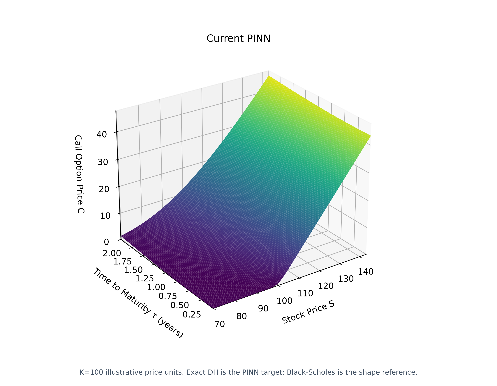

### 11. Exact DH surface and identical-axis comparison

Exact numerical Fourier pricing at the same parameters as the network. The additional side-by-side figure makes all three directly comparable, with the same price limits.

**Parameters:** K=100, r=q=0, BS σ=√0.0255=0.1596871942, slow (κ,θ,σ,ρ,v₀)=(0.9491,0.0257,0.0517,0.7009,0.0003), fast=(10.7526,0.033,0.3613,−0.8916,0.0252).

**Checkpoint:** v4 C3, arithmetic mean of seeds 17 and 43; exact paths and hashes in PLOT_CONFIGURATION.json.

**Functions:** Black-Scholes: existing literature_exact.black (forward-normalized analytical formula), converted with D·F. Exact reference: literature_exact.exact, with its unchanged adaptive Fourier fallback. PINN: run.nets/run.neural → TorchRegularVariancePINN.price.

**Interpretation:** Observed PINN–exact DH RMSE 0.00244455, maximum absolute deviation 0.0138084 price units. This is approximation error; the separate BS–DH gap is a model difference. Over the surface, no tested S-monotonicity or S-convexity stencils violate the tolerance; finite-grid checks are not a global proof.

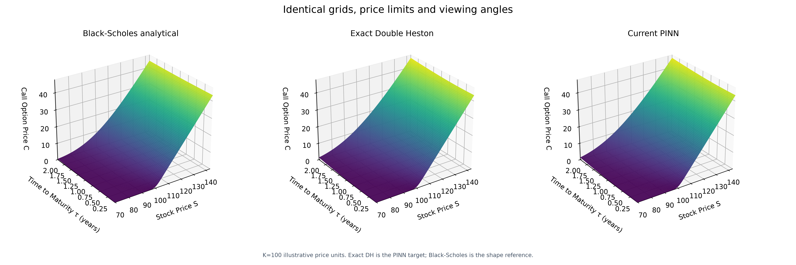

### 12. Absolute error surface and heatmap

Each value is |PINN−exact DH| in K=100 price units. The heatmap uses the same complete grid; maximum errors are neither clipped nor removed.

**Parameters:** K=100, r=q=0, BS σ=√0.0255=0.1596871942, slow (κ,θ,σ,ρ,v₀)=(0.9491,0.0257,0.0517,0.7009,0.0003), fast=(10.7526,0.033,0.3613,−0.8916,0.0252).

**Checkpoint:** v4 C3, arithmetic mean of seeds 17 and 43; exact paths and hashes in PLOT_CONFIGURATION.json.

**Functions:** Black-Scholes: existing literature_exact.black (forward-normalized analytical formula), converted with D·F. Exact reference: literature_exact.exact, with its unchanged adaptive Fourier fallback. PINN: run.nets/run.neural → TorchRegularVariancePINN.price.

**Interpretation:** Observed PINN–exact DH RMSE 0.00244455, maximum absolute deviation 0.0138084 price units. This is approximation error; the separate BS–DH gap is a model difference. Over the surface, no tested S-monotonicity or S-convexity stencils violate the tolerance; finite-grid checks are not a global proof.

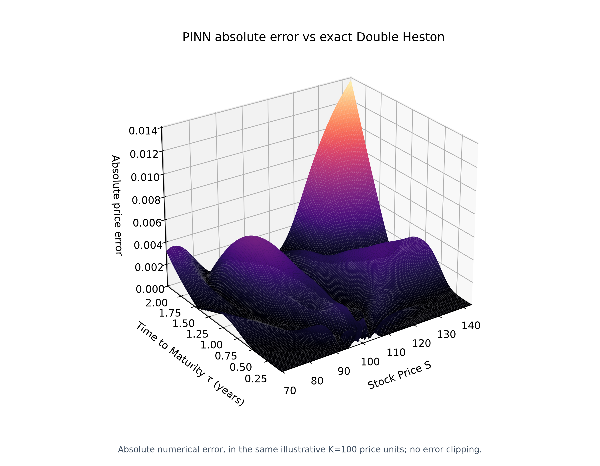

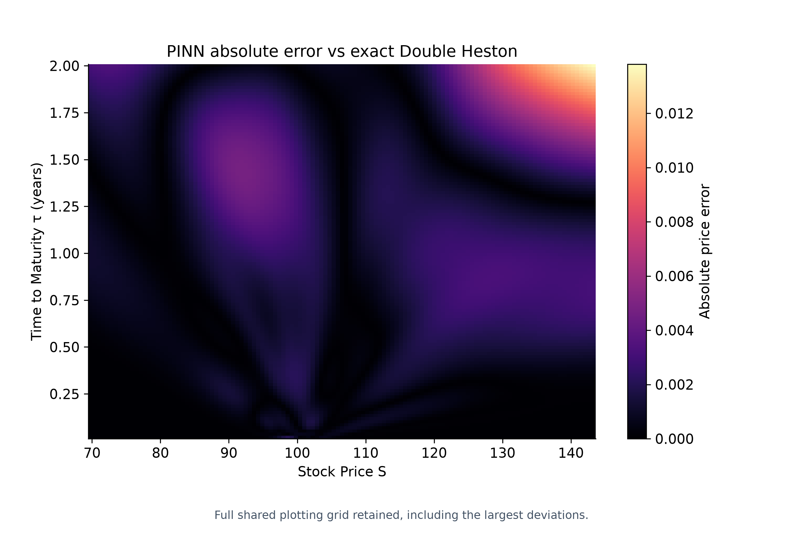

### 13. PINN vs BS parity

All 14,641 points pair the same (S,τ). The diagonal y=x is fixed, not a fitted regression. This is a model-difference diagnostic, not PINN fidelity.

**Parameters:** K=100, r=q=0, BS σ=√0.0255=0.1596871942, slow (κ,θ,σ,ρ,v₀)=(0.9491,0.0257,0.0517,0.7009,0.0003), fast=(10.7526,0.033,0.3613,−0.8916,0.0252).

**Checkpoint:** v4 C3, arithmetic mean of seeds 17 and 43; exact paths and hashes in PLOT_CONFIGURATION.json.

**Functions:** Black-Scholes: existing literature_exact.black (forward-normalized analytical formula), converted with D·F. Exact reference: literature_exact.exact, with its unchanged adaptive Fourier fallback. PINN: run.nets/run.neural → TorchRegularVariancePINN.price.

**Interpretation:** Observed PINN–exact DH RMSE 0.00244455, maximum absolute deviation 0.0138084 price units. This is approximation error; the separate BS–DH gap is a model difference. Over the surface, no tested S-monotonicity or S-convexity stencils violate the tolerance; finite-grid checks are not a global proof.

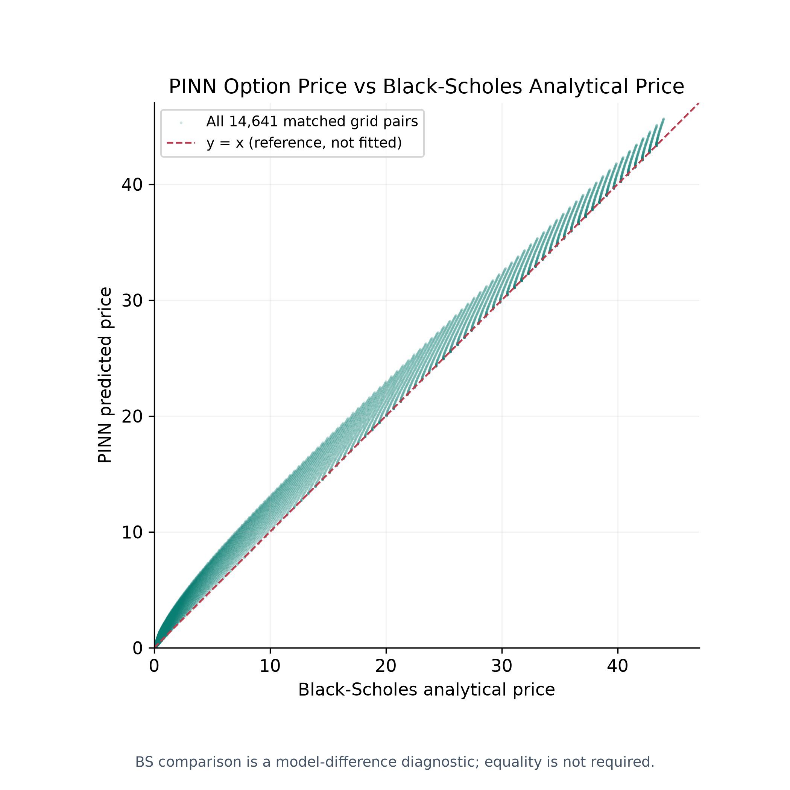

### 14. PINN vs exact DH parity

Same paired grid with the correct numerical target. Nearly coincident points should be interpreted together with Figure 12 because the full price scale can obscure small errors.

**Parameters:** K=100, r=q=0, BS σ=√0.0255=0.1596871942, slow (κ,θ,σ,ρ,v₀)=(0.9491,0.0257,0.0517,0.7009,0.0003), fast=(10.7526,0.033,0.3613,−0.8916,0.0252).

**Checkpoint:** v4 C3, arithmetic mean of seeds 17 and 43; exact paths and hashes in PLOT_CONFIGURATION.json.

**Functions:** Black-Scholes: existing literature_exact.black (forward-normalized analytical formula), converted with D·F. Exact reference: literature_exact.exact, with its unchanged adaptive Fourier fallback. PINN: run.nets/run.neural → TorchRegularVariancePINN.price.

**Interpretation:** Observed PINN–exact DH RMSE 0.00244455, maximum absolute deviation 0.0138084 price units. This is approximation error; the separate BS–DH gap is a model difference. Over the surface, no tested S-monotonicity or S-convexity stencils violate the tolerance; finite-grid checks are not a global proof.

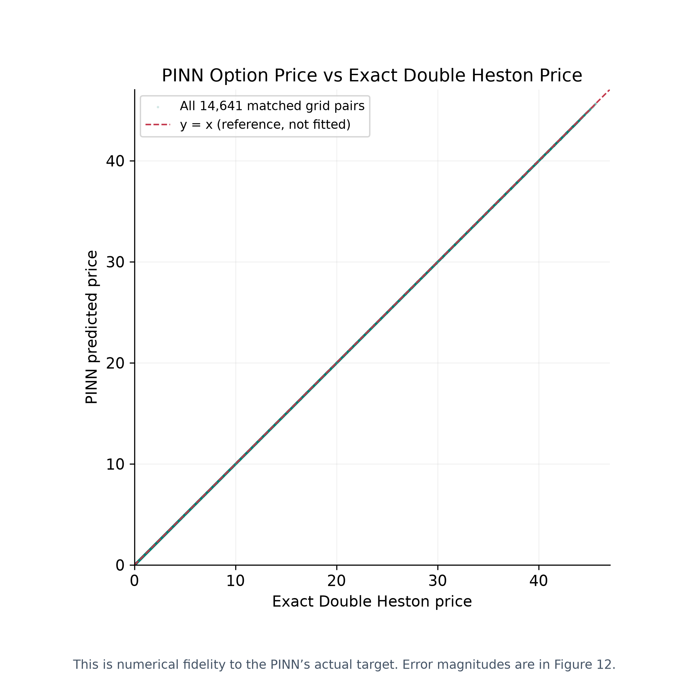

### 15. Multiple maturity stock-price slices

30, 90, 180 and 365 days, each using the same 401 stock prices. Only maturity changes between panels; all parameters stay fixed.

**Parameters:** K=100, r=q=0, BS σ=√0.0255=0.1596871942, slow (κ,θ,σ,ρ,v₀)=(0.9491,0.0257,0.0517,0.7009,0.0003), fast=(10.7526,0.033,0.3613,−0.8916,0.0252).

**Checkpoint:** v4 C3, arithmetic mean of seeds 17 and 43; exact paths and hashes in PLOT_CONFIGURATION.json.

**Functions:** Black-Scholes: existing literature_exact.black (forward-normalized analytical formula), converted with D·F. Exact reference: literature_exact.exact, with its unchanged adaptive Fourier fallback. PINN: run.nets/run.neural → TorchRegularVariancePINN.price.

**Interpretation:** 30 days: Observed PINN–exact DH RMSE 0.000401239, maximum absolute deviation 0.00158566 price units. This is approximation error; the separate BS–DH gap is a model difference. 90 days: Observed PINN–exact DH RMSE 0.000606689, maximum absolute deviation 0.00182068 price units. This is approximation error; the separate BS–DH gap is a model difference. 180 days: Observed PINN–exact DH RMSE 0.00114195, maximum absolute deviation 0.001847 price units. This is approximation error; the separate BS–DH gap is a model difference. 365 days: Observed PINN–exact DH RMSE 0.00210678, maximum absolute deviation 0.0029534 price units. This is approximation error; the separate BS–DH gap is a model difference.

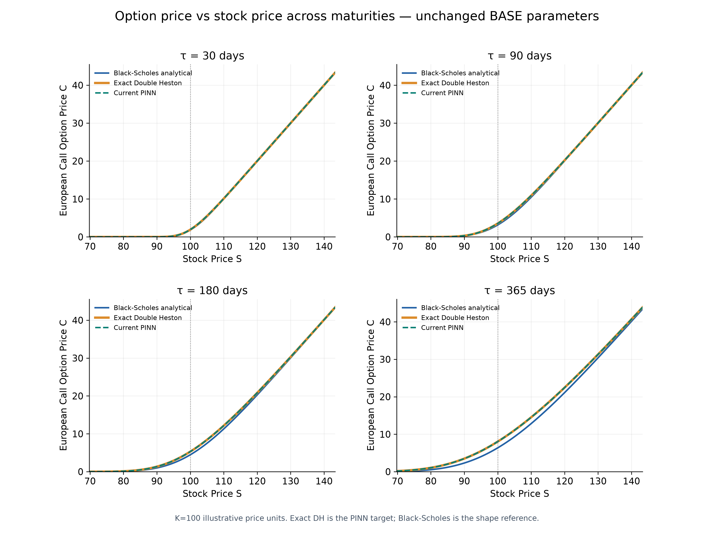

### 16. OTM/ATM/ITM maturity slices

S/K=0.8, 1 and 1.2; all non-spot inputs fixed. All three models use exactly the same maturity values in each panel.

**Parameters:** K=100, r=q=0, BS σ=√0.0255=0.1596871942, slow (κ,θ,σ,ρ,v₀)=(0.9491,0.0257,0.0517,0.7009,0.0003), fast=(10.7526,0.033,0.3613,−0.8916,0.0252).

**Checkpoint:** v4 C3, arithmetic mean of seeds 17 and 43; exact paths and hashes in PLOT_CONFIGURATION.json.

**Functions:** Black-Scholes: existing literature_exact.black (forward-normalized analytical formula), converted with D·F. Exact reference: literature_exact.exact, with its unchanged adaptive Fourier fallback. PINN: run.nets/run.neural → TorchRegularVariancePINN.price.

**Interpretation:** S/K=0.8: Observed PINN–exact DH RMSE 0.00045492, maximum absolute deviation 0.00189945 price units. This is approximation error; the separate BS–DH gap is a model difference. S/K=1: Observed PINN–exact DH RMSE 0.00208194, maximum absolute deviation 0.00311096 price units. This is approximation error; the separate BS–DH gap is a model difference. S/K=1.2: Observed PINN–exact DH RMSE 0.0017561, maximum absolute deviation 0.00267223 price units. This is approximation error; the separate BS–DH gap is a model difference.

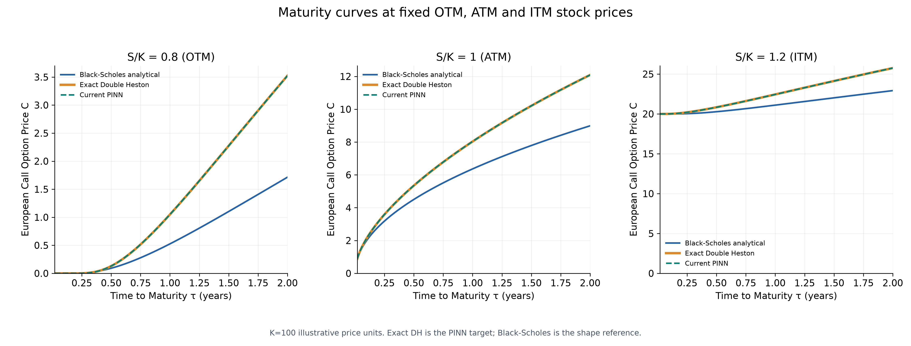

### 17. Existing evaluation metrics

Only already saved scores: 40 independent controlled surfaces with 1,006 held-out cells each. RMSE/MAE/P95/IV bars average per-surface values; max is the worst across surfaces. These are normalized benchmark errors, not K=100 plot-grid scores. BS here is its previously selected fitted baseline, not the constant-vol shape comparator.

**Parameters:** Parameter sets and states vary across the 40 previously frozen surfaces; full teacher values are in data/17_existing_case_parameters.json and calibrated SH/BS values in data/17_existing_baselines.json. No new common BASE is asserted for this existing benchmark.

**Checkpoint:** v4 C3, arithmetic mean of seeds 17 and 43; exact paths and hashes in PLOT_CONFIGURATION.json.

**Functions:** Replots existing controlled_metrics.csv, generated by the frozen run.metrics/exact/bs_predict/neural workflow; no new scoring or calibration.

**Interpretation:** The saved controlled scores rank DH-PINN below recalibrated SH and selected BS on the displayed aggregates. That is a DH-generated synthetic benchmark result, not market superiority or equality with Black-Scholes.

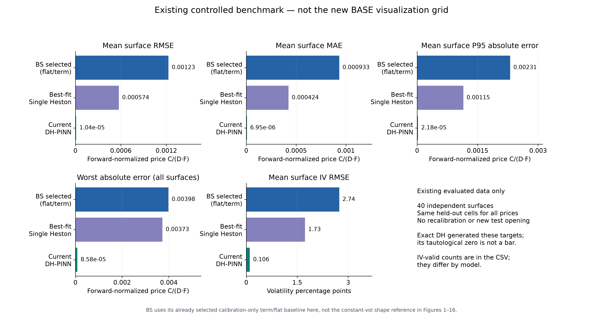

### 18. Full error distribution

Histogram and ECDF retain every new diagnostic-grid absolute error. This is descriptive shape/fidelity evidence, not an independent final-test result.

**Parameters:** K=100, r=q=0, BS σ=√0.0255=0.1596871942, slow (κ,θ,σ,ρ,v₀)=(0.9491,0.0257,0.0517,0.7009,0.0003), fast=(10.7526,0.033,0.3613,−0.8916,0.0252).

**Checkpoint:** v4 C3, arithmetic mean of seeds 17 and 43; exact paths and hashes in PLOT_CONFIGURATION.json.

**Functions:** Black-Scholes: existing literature_exact.black (forward-normalized analytical formula), converted with D·F. Exact reference: literature_exact.exact, with its unchanged adaptive Fourier fallback. PINN: run.nets/run.neural → TorchRegularVariancePINN.price.

**Interpretation:** Observed PINN–exact DH RMSE 0.00244455, maximum absolute deviation 0.0138084 price units. This is approximation error; the separate BS–DH gap is a model difference. Over the surface, no tested S-monotonicity or S-convexity stencils violate the tolerance; finite-grid checks are not a global proof.

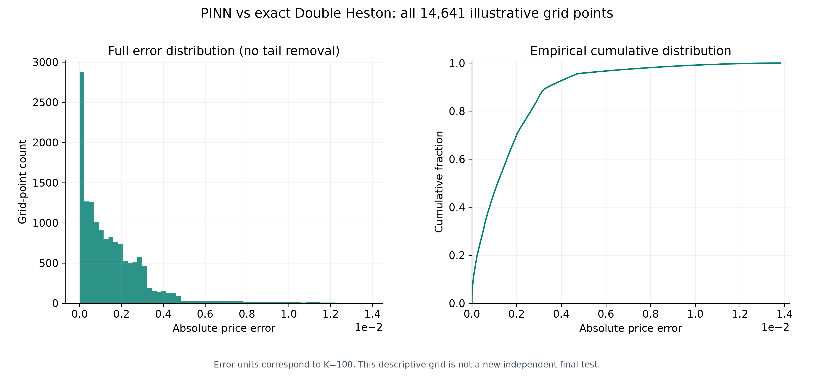

### 19. Terminal payoff diagnostic

At τ=0 the existing network explicitly enforces payoff. Positive τ below 7/365 lies outside training and is labelled extrapolation, not proof of learned short-expiry accuracy.

**Parameters:** K=100, r=q=0, BS σ=√0.0255=0.1596871942, slow (κ,θ,σ,ρ,v₀)=(0.9491,0.0257,0.0517,0.7009,0.0003), fast=(10.7526,0.033,0.3613,−0.8916,0.0252).

**Checkpoint:** v4 C3, arithmetic mean of seeds 17 and 43; exact paths and hashes in PLOT_CONFIGURATION.json.

**Functions:** Existing literature_exact.adaptive for exact DH at tiny τ; run.neural and the model’s hard terminal branch; analytical BS with explicit τ=0 payoff.

**Interpretation:** All three endpoint payoffs match within 1e−11. Nonzero sub-7-day values are explicit extrapolation and are retained without repair; exact endpoint matching is built into the architecture.

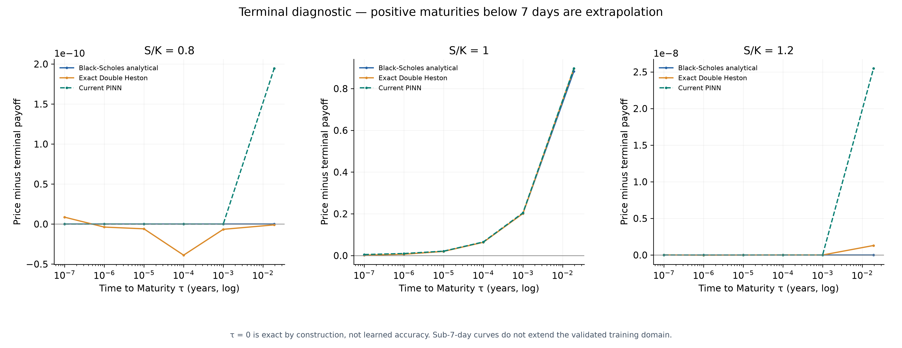

## Provenance, source data and reproduction

PLOT_CONFIGURATION.json contains parameters, checkpoint identities and source hashes. data/numerical_checks.json contains the numerical checks. All figure data are saved as CSVs; the shared surface/parity CSV contains every matched point and both seed predictions. DATA is illustrative model output except Figure 17, which explicitly reuses already evaluated controlled results. No observed option data are fabricated.

Run `python code/generate_plots.py` from this directory using the existing project environment. It writes only this visualization directory. Existing frozen sources are verified before and after generation. The original scientific experiment, checkpoints and results remain untouched. The plotting script follows the Ponytail skill by reusing the existing model loader and exact/Black pricing functions instead of implementing a new model.

## Limitations

One pre-existing representative configuration is visualized, not all possible parameters. Farther tails outside the trained x range are not tested. Close-looking price curves can hide small numerical errors; residual plots disclose them. New dense grids are explicitly post-training diagnostics, not independent final-test evidence. The archive’s controlled results use a DH-generated target, not neutral market truth. Existing IV metrics have model-specific valid-inversion counts, included in the source CSV.
