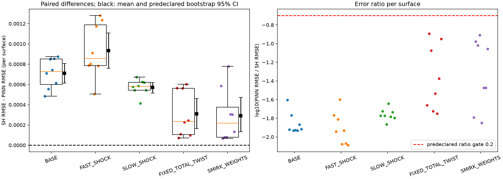
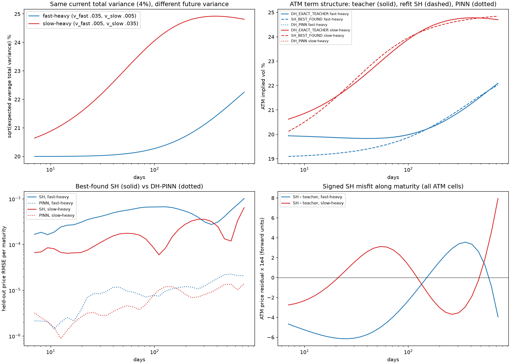
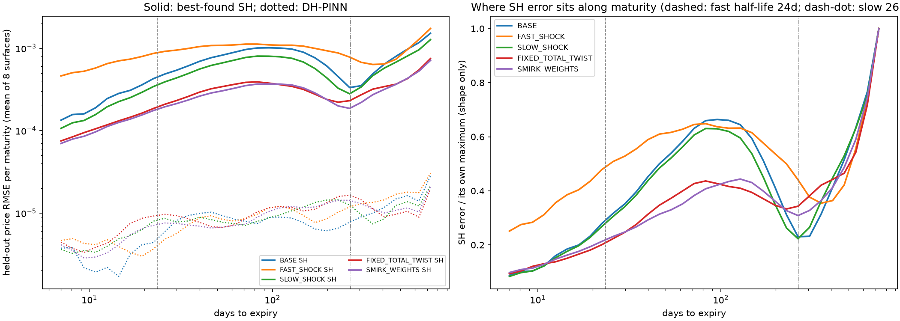
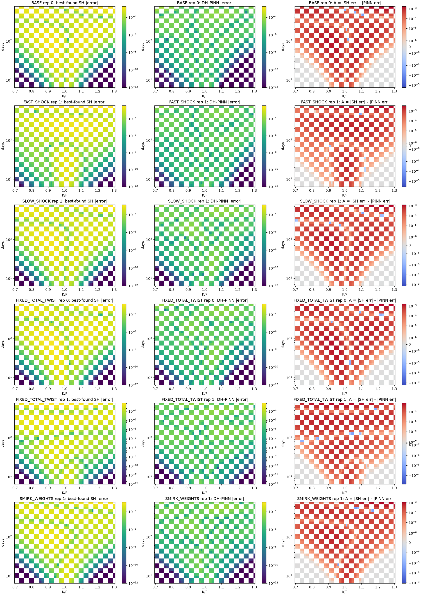
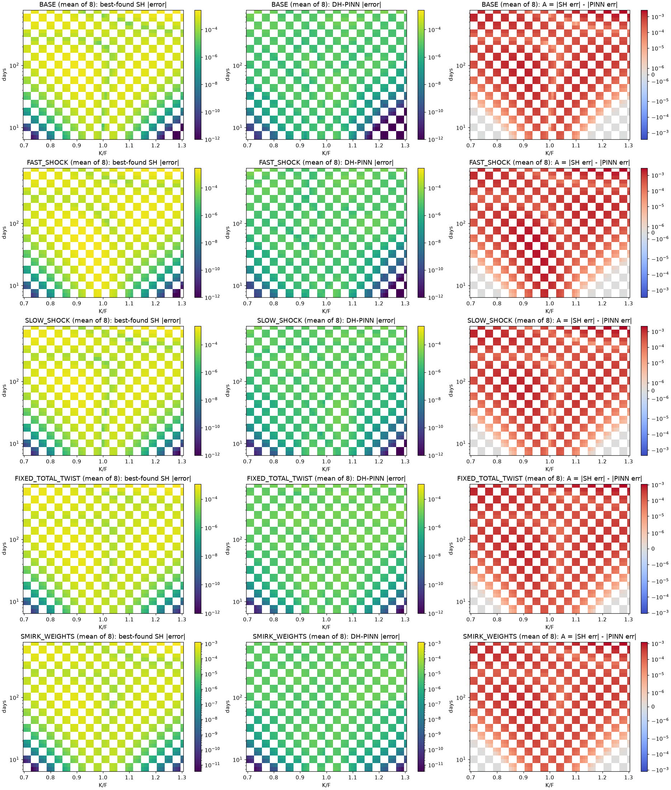
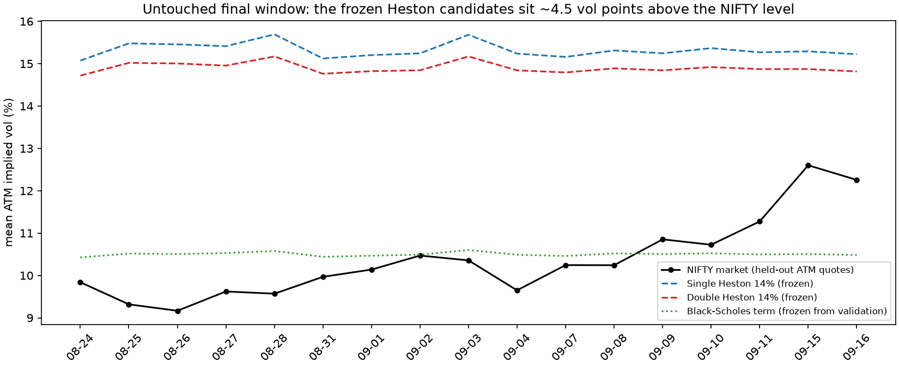

# Double Heston PINN vs optimally recalibrated Single Heston vs Black-Scholes

**Experiment:** `nifty_multifactor_v4` (literature_exact convention) · **Date:** 2026-09-17
**Protocol manifest:** `5653b3d7…59321e87` · **Final-test freeze manifest:** `b95bce21…4b2587` (39 components, verified before and after opening)

This report answers two questions that must not be mixed.

1. **Controlled (synthetic).** Can a properly trained Double-Heston PINN reproduce surfaces generated by genuinely separated fast and slow variance factors that an *optimally recalibrated* one-factor Heston model cannot reproduce as accurately?
2. **Market (NIFTY).** Do the frozen, validation-selected parameterizations price untouched NIFTY options accurately?

## Answers

**Controlled: yes, under the predeclared literature regimes.**
- **All five families meet the stringent predeclared claim gate.** The PINN reproduces the exact Double-Heston teacher with held-out price RMSE **1.10e-5** (IV RMSE 0.10 vol pts). After full five-parameter recalibration (a global search plus 12 local starts, all converging), best-fit Single Heston retains held-out RMSE **3.0e-4 to 9.5e-4** (IV RMSE **0.9 to 2.7 vol pts**).
- **The ordering holds on every surface.** DH-PINN < SH < BS in held-out error on **40 of 40** independent surfaces, with PINN error **29–84× smaller** than SH error.
- **The residual Single-Heston error is structural and visible.** It shows most clearly as a mismatch in **short-dated smirk slope**, and as systematic term-structure misfits when identical total variance is allocated differently between the fast and slow factors.

**Market: no.**
- **Both Heston models price the untouched test poorly.** On 967 held-out quotes over 17 dates:
  - fixed Double Heston (exact) has RMSE **107.6 index points** and fixed Single Heston **119.7**. Double beats Single on 17/17 dates.
  - the frozen term-structure Black-Scholes has **22.4**, beating both on 17/17 dates.
- **The failure is not neural.** PINN approximation error is **0.19 index points**.
- **It is not one-vs-two factors either:** the two Heston models differ by about 12 points.
- **The cause is the parameter level.** Even the lowest predeclared candidate (14% initial vol, literature long-run levels) implies about **14.9% ATM vol** against NIFTY's **10.4%**, overpricing 86% of quotes.

A controlled structural advantage is **not** evidence of market superiority.

---

## Part 1 — Numerical solver validity (exact DH vs DH-PINN)

### 1.1 Exact teacher

- **Exact-pricer tests:** 19 of 19 pass (v4 rerun).
- **Teacher data:** 100,000 train, 4,096 development and 18,000 collocation points, with zero rejected points, zero duplicates and zero overlap between splits.
- **Where the reference is weak, it was replaced and checked.**
  - **2,391 points needed the fallback reference.** 2,389 are 128-vs-96-node disagreements above 1e-8 and 567 are bound triggers.
  - **All fallbacks occur at 7–30 days**, and the largest pre-fallback gap was 2.07e-4.
  - **1,000 accepted points agree with an independent adaptive integral to 2.6e-11.** 121 fallback points re-integrated at 10× tighter tolerance agree to 1.8e-12.
- **No invalid prices, one explicitly retained roundoff effect.**
  - There are no NaN/inf prices and no bound breaches beyond 1e-9. 5,332 roundoff dips below intrinsic value are retained, never clipped; the worst is −9.4e-10.
  - The 50 controlled surfaces have zero strike, convexity or calendar arbitrage violations.
- **Coverage:** all 50 controlled scenarios lie inside the teacher domain.
- **Caveat:** 7,274 points have no valid implied vol, and 55 of them are unexplained. They sit mostly in short-dated wings and carry price loss only.
- **Evidence:** `artifacts/teacher_quality/`, verdict `TEACHER_ACCEPTED_FOR_TRAINING`.

### 1.2 How the accepted PINN was reached

This is a preserved audit trail.

| version / candidate | change | development price RMSE | P95 | max | IV RMSE | verdict |
|---|---|---:|---:|---:|---:|---|
| v3 | frozen v3 recipe | 1.33e-4 | 2.94e-4 | 9.62e-4 | 0.200 | fail, all 4 gates; never locked or evaluated |
| v4 C1 | loss rescaled to acceptance tolerances | 3.33e-5 | 6.82e-5 | 2.55e-4 | 0.258 | fail, all 4 |
| v4 C2 | C1 with 40k Adam steps | 1.80e-5 | 3.68e-5 | 2.50e-4 | 0.164 | fail, max gate only (1 of 4,096 points) |
| **v4 C3** | C2 with width 256, depth 5 | **1.07e-5** | **2.25e-5** | **1.25e-4** | **0.117** | **pass, all 4; locked** |

Frozen gates: RMSE ≤ 2e-5, P95 ≤ 5e-5, max ≤ 2e-4, IV RMSE ≤ 0.2 vol pts.

- **v3 was underfitting because of its loss scaling, not overfitting.** Training error matched development error. The price term was only 1.5–2% of the objective, because its normaliser (1e-3) was 50× looser than the acceptance gate.
- **The v4 fix and ladder were set before any v4 result** (`AMENDMENT.md`). v4 rescaled each supervised term to its acceptance tolerance and declared C1→C2→C3 with a stop-at-first-pass rule.
- **C2's single failing point was a network error, not a teacher error.** The teacher at C2's 25 worst points agrees with the adaptive reference to 4.9e-14.

### 1.3 Table A — DH-PINN fidelity on the untouched held-out set

These are 8,192 continuous points (seed 93104) plus 2,048 PDE points (seed 93105), generated only inside the frozen `evaluate()` after lock.

| model | price RMSE | MAE | P95 | max | IV RMSE (vol pts) |
|---|---:|---:|---:|---:|---:|
| **DH-PINN, two-seed mean** | **1.10e-5** | 7.0e-6 | 2.31e-5 | 1.09e-4 | **0.103** |
| seed 17 | 1.13e-5 | 7.3e-6 | 2.37e-5 | 1.06e-4 | 0.103 |
| seed 43 | 1.38e-5 | 8.8e-6 | 2.97e-5 | 1.12e-4 | 0.115 |

**All frozen gates pass.** Fresh scaled PDE residual RMSE is 0.038 (seed 17) and 0.043 (seed 43).

| bucket | price RMSE | IV RMSE | | bucket | price RMSE | IV RMSE |
|---|---:|---:|---|---|---:|---:|
| 7–30 d | 7.4e-6 | 0.193 | | K/F < 0.90 | 9.7e-6 | 0.152 |
| 30–90 d | 9.4e-6 | 0.051 | | 0.90–0.98 | 1.15e-5 | 0.029 |
| 90–365 d | 1.15e-5 | 0.016 | | 0.98–1.02 | 1.35e-5 | 0.012 |
| 365–730 d | 1.68e-5 | 0.005 | | 1.02–1.10 | 1.49e-5 | 0.034 |
| fast-heavy states | 1.05e-5 | 0.115 | | K/F ≥ 1.10 | 1.02e-5 | 0.076 |
| slow-heavy states | 1.17e-5 | 0.079 | | | | |

The same model on the controlled surfaces (held-out cells, 8 independent surfaces per family):

| family | BASE | FAST_SHOCK | SLOW_SHOCK | FIXED_TOTAL_TWIST | SMIRK_WEIGHTS |
|---|---:|---:|---:|---:|---:|
| PINN price RMSE | 9.9e-6 | 1.15e-5 | 1.01e-5 | 1.07e-5 | 1.04e-5 |
| PINN IV RMSE (vol pts) | 0.164 | 0.153 | 0.082 | 0.069 | 0.071 |

**The essential condition E_PINN ≪ E_SH\* holds on every surface.** The median per-surface PINN/SH error ratio is 0.012–0.061 by family, the worst single surface is 0.128, and all 40 are at or below the predeclared 0.2.

---

## Part 2 — Structural controlled experiment

**Design:**
- **Anchor:** the published ordinary Double-Heston calibration (Chang, Wang & Zhang 2021, Table 1), with κ_fast = 10.7526 and κ_slow = 0.9491 (ratio ≈ 11.3), ρ_fast = −0.8916 and ρ_slow = +0.7009, in the separable four-shock convention (`CONTRACT_AUDIT.md`).
- **Scenarios:** 10 predeclared representative surfaces plus 40 independent draws, 8 per family.
- **Grid:** 61 strikes (K/F 0.70–1.30) × 33 maturities (7–730 days) = 2,013 quotes per surface, split into alternating calibration and held-out blocks.
- **Single Heston:** all five parameters recalibrated to each surface's calibration cells using differential evolution plus 12 local starts. 600 of 600 starts succeeded, all 12 converged near-best on every surface, and no best solution sits at a bound.
- **Black-Scholes:** flat or term structure, selected on an inner calibration split. The term version was selected on all 50 surfaces. No held-out quote's IV prices itself.

### Table B — Controlled benchmark, all 40 independent surfaces (held-out cells)

| model | mean price RMSE | median | mean MAE | mean IV RMSE (vol pts) |
|---|---:|---:|---:|---:|
| Black-Scholes (selected) | 1.23e-3 | 1.31e-3 | 9.33e-4 | 2.74 |
| **best-fit Single Heston** | **5.74e-4** | 5.90e-4 | 4.24e-4 | **1.73** |
| **Double-Heston PINN** | **1.04e-5** | 1.04e-5 | 6.95e-6 | **0.106** |
| exact Double Heston | 0 | 0 | 0 | 0 |

The exact-DH row is zero because it generated the target. It is a sanity check, not a result.

### Table C — By regime (mean over 8 independent surfaces)

| regime | BS RMSE | SH RMSE | PINN RMSE | BS IV | SH IV | PINN IV | SH/PINN | BS/SH |
|---|---:|---:|---:|---:|---:|---:|---:|---:|
| BASE | 1.58e-3 | 7.21e-4 | 9.9e-6 | 3.63 | 2.37 | 0.164 | 73 | 2.2 |
| FAST_SHOCK | 1.48e-3 | 9.46e-4 | 1.13e-5 | 3.46 | 2.72 | 0.150 | 84 | 1.6 |
| SLOW_SHOCK | 1.34e-3 | 5.82e-4 | 1.01e-5 | 2.92 | 1.78 | 0.079 | 58 | 2.3 |
| FIXED_TOTAL_TWIST | 8.47e-4 | 3.20e-4 | 1.06e-5 | 1.78 | 0.88 | 0.067 | 30 | 2.7 |
| SMIRK_WEIGHTS | 8.86e-4 | 3.02e-4 | 1.03e-5 | 1.91 | 0.89 | 0.070 | 29 | 2.9 |

Ratios are descriptive.

**Primary predeclared inference** (paired difference D = SH RMSE − PINN RMSE; bootstrap over surfaces, 5,000 replicates, seed 93119):

| regime | mean D | median D | PINN wins | 95% CI | 99% Bonferroni CI | pooled PINN/SH | reliable advantage |
|---|---:|---:|---:|---|---|---:|---|
| BASE | 7.11e-4 | 7.27e-4 | 8/8 | [6.14e-4, 8.07e-4] | [5.90e-4, 8.27e-4] | 0.014 | **yes** |
| FAST_SHOCK | 9.35e-4 | 8.57e-4 | 8/8 | [7.61e-4, 1.11e-3] | [7.15e-4, 1.16e-3] | 0.012 | **yes** |
| SLOW_SHOCK | 5.72e-4 | 5.81e-4 | 8/8 | [5.16e-4, 6.19e-4] | [4.99e-4, 6.29e-4] | 0.017 | **yes** |
| FIXED_TOTAL_TWIST | 3.09e-4 | 2.35e-4 | 8/8 | [1.63e-4, 4.61e-4] | [1.28e-4, 4.96e-4] | 0.028 | **yes** |
| SMIRK_WEIGHTS | 2.91e-4 | 2.18e-4 | 8/8 | [1.34e-4, 4.72e-4] | [1.04e-4, 5.31e-4] | 0.027 | **yes** |

"Reliable advantage" is the predeclared gate: fidelity passes, pooled PINN/SH ≤ 0.2, and the bootstrap lower bound is above 0.

**Secondary (descriptive), SH vs BS:** BS − SH is positive on **40/40** surfaces, with bootstrap 95% [5.9e-4, 7.2e-4] over all 40.

**Hierarchy DH-PINN < SH < BS holds on 100% of surfaces in every regime.**



---

## Part 3 — Why the difference occurs

### 3.1 Fixed total variance, different fast/slow allocation (central diagnostic)

**Setup.**
- **Fast-heavy** (v_fast, v_slow) = (0.035, 0.005) and **slow-heavy** (0.005, 0.035) both start at total variance 0.04, i.e. 20% instantaneous vol.
- **Single Heston is refit to each surface separately**, which is a stronger test than assigning it the same current variance.



| allocation | SH RMSE ≤30d | 30–90d | 90–365d | >365d | PINN RMSE ≤30d → >365d | best-fit SH κ, θ, σ, ρ, v0 |
|---|---:|---:|---:|---:|---|---|
| fast-heavy | 2.80e-4 | 5.68e-4 | 5.45e-4 | 6.65e-4 | 4.6e-6 → 2.1e-5 | 1.70, 0.055, 0.148, −0.39, 0.0362 |
| slow-heavy | 7.8e-5 | 1.59e-4 | 2.52e-4 | 3.51e-4 | 2.4e-6 → 1.3e-5 | **21.15**, 0.063, **0.595**, −0.19, 0.0362 |

- **The two surfaces have different futures.** Identical current total variance leads to different expected-variance paths: the slow-heavy path rises quickly, as the fast factor refills toward its level within weeks, while the fast-heavy path rises slowly.
- **Single Heston can only follow one timescale per fit.** It finds the same v0 (0.0362) in both cases but must distort its structure (κ 1.7 vs 21.2, σ 0.15 vs 0.60).
- **It still misses at every maturity.** The signed ATM misfit crosses zero 2–3 times along maturity in opposite patterns, which marks a systematic shape error rather than noise.
- **Largest single misses:** the fast-heavy short-end ATM vol is 0.85 vol pts too low at 7 days, and the slow-heavy one 0.50 too low.
- **The PINN stays within 0.01 vol pts of the teacher.**

**Across the 8 independent twist surfaces**, SH error is lowest near a fast share of about 0.3 (8.2e-5) and rises steeply above 0.5 (5.7–6.1e-4 at shares 0.69–0.76). PINN error stays at 0.7–1.3e-5 throughout.

### 3.2 Smirk level vs slope

Post-hoc descriptive, `POSTHOC_smirk_level_slope_diagnostic.csv`. The slope is the IV change across K/F 0.9→1.1, in vol pts per unit K/F.

| surface, 7-day smile | teacher slope | SH slope error | PINN slope error | SH ATM error (vol pts) |
|---|---:|---:|---:|---:|
| BASE | −44.5 | +33.9 | +0.4 | +0.06 |
| TWIST fast-heavy | −31.3 | +23.9 | +0.01 | −0.85 |
| TWIST slow-heavy | −2.9 | −7.5 | −0.8 | −0.50 |
| SMIRK fast-weight | −37.6 | +27.2 | −0.2 | +0.26 |
| SMIRK slow-weight | −4.2 | −6.1 | −1.0 | +0.29 |

- **The published correlations have opposite signs.** ρ_fast = −0.89 generates a steep negative short-dated skew that decays on the fast factor's 23.5-day half-life; ρ_slow = +0.70 flattens it.
- **Factor allocation therefore sets short-dated skew steepness independently of total variance:** −31 vs −3 at equal 20% vol.
- **Single Heston cannot follow that.** With one ρ and one κ it fits the smirk too flat when the fast factor dominates and too steep when it doesn't.
- **By one year every model's slope error is near zero.** This is the smirk level/slope separation motivating multifactor SV (Christoffersen, Heston & Jacobs 2009).

### 3.3 Maturity structure of the Single-Heston residual

These tests are secondary, with directions fixed before results. They compare the share of SH held-out squared error in each maturity range against BASE (one-sided Mann–Whitney, 8 vs 8).

| hypothesis | regime metric | regime median | BASE median | p | result |
|---|---|---:|---:|---:|---|
| H2: fast shocks concentrate SH error at short maturity | share ≤30d | 21.9% | 6.8% | **0.0009** | **supported** |
| H2 corollary | share >90d | 50.6% | 65.2% | **0.0015** | **supported** |
| H3: slow shocks push SH error to longer maturity | share >90d | 66.0% | 65.2% | 0.36 | **not supported** |

- **For fast shocks, the error shifts toward short maturity rather than peaking there.**
  - **Absolute SH error still rises with maturity** (7.2e-4 at ≤30 d, 1.14e-3 beyond one year).
  - **Relative to BASE, three times as much of it sits at short maturity.**
  - **The SH/PINN ratio is largest at short maturity** (161× vs 55× beyond one year).
- **For slow shocks, SH error stays material at medium and long maturities** (6.7e-4 at 30–90 d, 8.9e-4 beyond one year). It is **not more concentrated there than BASE**, because the literature BASE state (v_slow = 0.0003, far below its long-run level) already carries a strong slow-factor term structure.



### 3.4 Advantage maps

A(K,T) = |SH_best − DH_exact| − |DH_PINN − DH_exact| on held-out cells. A > 0 means the PINN is closer to the two-factor truth. Absolute-error maps are shown alongside, on a shared log scale.

| map | held-out cells with A > 0 | mean |SH error| | mean |PINN error| |
|---|---:|---:|---:|
| BASE representative | 91.6% | 3.40e-4 | 6.9e-6 |
| FAST_SHOCK representative (0.06) | 98.7% | 6.08e-4 | 9.0e-6 |
| SLOW_SHOCK representative (0.01) | 94.8% | 2.42e-4 | 6.7e-6 |
| TWIST fast-heavy | 94.7% | 3.56e-4 | 7.2e-6 |
| TWIST slow-heavy | 96.5% | 1.45e-4 | 5.1e-6 |
| SMIRK equal weights | 93.8% | 1.74e-4 | 5.4e-6 |
| family means (8 independent surfaces each) | 98.6–100% | 2.2e-4 to 6.9e-4 | 6.1e-6 to 7.6e-6 |

Cells with A ≤ 0 are almost all deep short-dated wings, where both errors are around 1e-12. All 50 per-surface three-panel maps are in `artifacts/figures/`.





---

## Part 4 — Real-market NIFTY experiment

**Protocol.**
- **Sources:** official NSE F&O bhavcopies after the local archive cutoff. Validation used 2026-08-04 to 08-21 (14 dates); the final interval is 2026-08-24 to 09-16.
- **Quote filters** (frozen `nifty_fixed_crisis.prepare`): actual expiries, 7–100 days, |log(F/K)| ≤ 0.35, anchor-only parity, IV 0.03–2.5, a vega floor, and held-out strikes disjoint from anchors.
- **Frozen selections:** Single Heston 14%, Double Heston 14% and BS term-structure, selected on validation before the final interval existed locally.

### Table D — Validation (the selection sample, NOT out-of-sample)

800 held-out quotes on 14 dates. The Heston candidates were chosen from four candidates each on these quotes, and the BS term volatilities were *fitted* on them.

| model | RMSE (index pts) | MAE | fwd-normalised RMSE | IV RMSE |
|---|---:|---:|---:|---:|
| Single Heston 14% | 116.7 | 90.8 | 0.00482 | 4.43 |
| Double Heston 14% (exact) | 104.8 | 82.0 | 0.00432 | 4.12 |
| DH-PINN | 104.9 | 82.1 | 0.00433 | 4.12 |
| BS term (fitted here) | 16.6 | 12.6 | 0.00068 | 2.95 |

### Table E — Untouched final test, strict fixed parameters

967 identical quotes for every model, on 17 dates (2026-09-14: HTTP 404, disclosed and not replaced).

| model | RMSE (index pts) | MAE | fwd-normalised RMSE | IV RMSE |
|---|---:|---:|---:|---:|
| Single Heston 14% (exact) | 119.7 | 92.3 | 0.00506 | 4.65 |
| Double Heston 14% (exact) | 107.6 | 83.0 | 0.00454 | 4.33 |
| **DH-PINN** | **107.7** | 83.1 | 0.00455 | 4.33 |
| BS term (frozen) | **22.4** | 16.0 | 0.00095 | 3.00 |

| bucket (eligible quotes) | SH | DH exact | DH-PINN | BS |
|---|---:|---:|---:|---:|
| ≤30 d (509) | 64.0 | 59.5 | 59.5 | 16.0 |
| 30–90 d (458) | 160.3 | 143.2 | 143.4 | 27.8 |
| ATM, abs(K/F − 1) ≤ 0.02 (407) | 154.5 | 139.5 | 139.7 | 25.9 |
| K/F 0.90–0.98 (206) | 98.6 | 88.1 | 88.2 | 26.2 |
| K/F 1.02–1.10 (303) | 84.1 | 74.4 | 74.3 | 15.0 |
| wings, K/F < 0.9 or > 1.1 (51) | 4.14 | 4.08 | 4.08 | **6.33** |

Price RMSE in index points. There are no final quotes beyond 90 days (maturity range 7–88 days).

**Date-level paired results** (Wilcoxon and sign test):
- **Double Heston < Single Heston on 17/17 dates** (p = 1.5e-5, mean 12.5 index points).
- **BS < Double Heston on 17/17 dates** (mean 89 points).
- **Heston beats BS only in the wings.**

### Table F — Error decomposition (index points, identical quotes)

| protocol | component | RMSE | MAE | max |
|---|---|---:|---:|---:|
| fixed | **neural approximation** = DH-PINN − exact DH | **0.19** | 0.14 | 0.52 |
| fixed | **model/parameter** = exact DH − market | **107.6** | 83.0 | 279.7 |
| fixed | total = DH-PINN − market | 107.7 | 83.1 | 280.2 |
| fixed | Single Heston model/parameter = exact SH − market | 119.7 | 92.3 | 308.8 |

The components are signed and additive pointwise; their RMSEs are not additive.

**Why the fixed models fail:**
- **Level mismatch.** NIFTY held-out ATM implied vol averaged **10.4%** (9.2–12.6%). The frozen candidates imply **14.9%** (DH) and **15.3%** (SH). DH overprices **86%** of final quotes.
- **The long-run levels make it worse.** The literature long-run levels, scaled to 14% initial vol, reach 21.2% total (DH) and 18.1% (SH), so mean reversion pushes model vol further up with maturity. That is why the 30–90-day error is larger.
- **Black-Scholes has no structural advantage here.** It wins because its term volatilities (10.2–11.0%) were fitted directly on validation levels, which the four-level Heston bank could not do.
- **The level bank was not searched after results.** Its lowest candidate was simply above this market's level.



---

## Part 5 — `STATE_ADAPTIVE_DIAGNOSTIC_NOT_FIXED_PARAMETER_PRIMARY`

**Setup.**
- **Single Heston** has κ, θ, σ and ρ frozen, with **Double Heston**'s eight structural coefficients frozen likewise.
- **Only the current variance states are refit**, per date: v0 for Single Heston, (v_slow, v_fast) for Double Heston, using same-date anchor quotes.
- **Scoring uses the disjoint held-out quotes**, and no held-out option prices itself.

### Table G

| model | quotes | RMSE (index pts) | MAE | IV RMSE |
|---|---:|---:|---:|---:|
| Single Heston, state-adaptive | 967 | 47.8 | 33.5 | 3.74 |
| Double Heston, state-adaptive (exact) | 967 | 42.8 | 30.5 | 3.71 |
| DH-PINN, state-adaptive | **212 only** | 31.4 | 24.2 | 5.00 |
| BS, flat vol refit per date | 967 | 13.6 | 10.6 | 2.78 |
| BS, term vol refit per date | 967 | 12.8 | 10.0 | 2.78 |

- **Updating only the states cuts Heston error by 60%** (SH 119.7 → 47.8, DH 107.6 → 42.8), and Double Heston stays below Single Heston on 17/17 dates.
- **But the fitted states hit the lower bound 1.5e-4.**
  - This happens for the DH slow state on all 17 dates, the DH fast state on 11 dates and the SH v0 on 14 dates.
  - **The market wants less variance than the fixed long-run levels allow**, confirming that the binding misspecification is θ, not the current state.
- **Neural approximation error stays tiny (0.20 index points) on the covered quotes.**
- **The DH-PINN row covers 212 quotes only.** On the other 755, the fitted fast state fell below the network's trained domain (0.001), so those predictions were flagged and not extrapolated. That row is not comparable to the others.

---

## Limitations and threats to validity

- **The synthetic truth is Double Heston by design.** Part 2 shows structural expressiveness under literature-anchored regimes, not market superiority.
- **The controlled advantage depends on the literature parameters**, especially the opposite-signed correlations (ρ_slow = +0.70, ρ_fast = −0.89). They are valid in the four-shock SDE but excluded by the repository's canonical ρ_s² + ρ_f² < 1 restriction. The canonical-project variant was not tested here.
- **Single Heston is strong but bounded.**
  - Strict Feller and finite bounds apply (κ ≤ 40, η ≤ 0.999).
  - Twelve convergent starts do not prove a global optimum.
  - DE reports "success" false because it reached its iteration cap. Every local start converged regardless.
- **Sample sizes are modest:** 8 independent surfaces per family, one grid geometry, and two PINN seeds.
- **The PINN architecture was selected from a predeclared three-candidate ladder on the development split.** Only the held-out fidelity set is independent evidence of fidelity.
- **Some secondary analyses were computed after results and are labelled as such:** smirk slope, SH vs BS paired tests, market paired tests and the ATM level figure. H3 was not supported.
- **The market window is short and calm:** 17 dates, with ATM vol around 10%.
  - **Prices are daily closes, not synchronized bid/ask quotes**, so no spread-based metrics are possible.
  - **Black-Scholes had level-fitting freedom the Heston bank lacked.**
  - **External exposure of these dates by teammates cannot be certified.**
- **A reporting bug was found and fixed before the final test.** My `market_tables.py` excluded 36 validation quotes at exactly 7 days (floating-point domain check). The flawed outputs are preserved with a note; the frozen evaluation code was unaffected.

## Audit trail and reproducibility

| version | outcome | preserved at |
|---|---|---|
| v1 | exact short-time test failed (adaptive quadrature limit at T = 1e-7) | `../nifty_multifactor_v1/` |
| v2 | passed; PINN state domain missed analytic scenario extremes | `../nifty_multifactor_v2/` |
| v3 | domain widened; teacher and baselines generated; PINN failed development gates (loss scaling) | `../nifty_multifactor_v3/` (not locked or evaluated) |
| **v4** | objective fix + predeclared C1→C2→C3 ladder; C3 locked; full evaluation | this directory |

**Key records:**
- `AMENDMENT.md`
- `artifacts/manifest.json` (per-file SHA-256 of 130 inherited v3 artifacts)
- `artifacts/analysis_plan_predeclaration.json`
- `artifacts/pinn_selection.json`
- `artifacts/candidates/ladder_record_C1_C2.json`
- `artifacts/evaluation_lock.json`
- `artifacts/controlled_results.json`
- `artifacts/final_test_freeze_manifest.json`
- `artifacts/final_test_opened.json`
- `artifacts/integrity_final.json`
- `artifacts/pre_final_reports/` (reports as they stood before the final interval was opened)
- `artifacts/market_tables/superseded_validation_float_domain_bug/`

**Reproduce from this directory:**
```
python run.py inherit && python run.py validate
python teacher_quality.py
python run.py train --seed 17 --candidate C1   # likewise --seed 43, and C2, C3, following the ladder
python run.py select-candidate && python pinn_development_check.py && python run.py lock && python run.py evaluate
python controlled_analysis.py && python market_tables.py --stage validation
python final_freeze.py create && python final_freeze.py verify
python run.py fetch-final && python final_freeze.py verify && python final_freeze.py record-opening
python run.py market-final && python run.py report && python supplement.py audit && python supplement.py report
python market_tables.py --stage final
```
