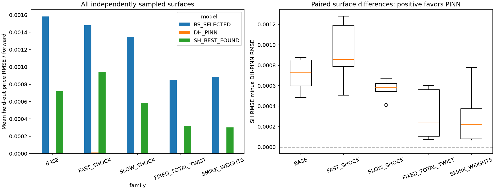

# Predeclared NIFTY/multifactor experiment — v4

v1 stopped at the exact-pricer short-time test before any fitting. v2 passed but its PINN domain missed analytic scenario extremes; v3 widened only that domain. v3's PINN then failed the predeclared development-split fidelity gates because its loss normalisation made price accuracy invisible to the optimizer, so v3 was never locked or evaluated. v4 changes only the PINN objective normalisation, with a predeclared budget/width ladder, and inherits every other v3 artifact byte-identically. All failed records are preserved; see `../AMENDMENT.md`.

## Outcome

Neural fidelity gates passed. Families meeting the predeclared stringent advantage gate: BASE, FAST_SHOCK, SLOW_SHOCK, FIXED_TOTAL_TWIST, SMIRK_WEIGHTS.

This is not parameter recovery. Model coefficients are supplied to a teacher-assisted,
network-side PDE PINN; the network approximates prices. Single Heston's five
parameters are recalibrated separately to each controlled surface's calibration
portion. The exact DH teacher has zero target error by construction, not by a
fair contest against independently observed market truth.

## Correlation contract and literature

Read [CONTRACT_AUDIT.md](../CONTRACT_AUDIT.md). The existing CF and PDE are
the separable four-shock model. Individual correlation bounds suffice. The
canonical disk restriction is preserved untouched; published parameters are used
only through the isolated `literature_exact` adapter. Slow-first order swaps the
paper's factor labels but changes no numbers. The radius-.95 projected analogue
is a diagnostic, never described as published or selected for market fit.

Source: [Chang, Wang & Zhang (2021), Table 1](https://onlinelibrary.wiley.com/doi/10.1155/2021/6634779),
ordinary Heston comparators, not the fractional extension. Its reported MSEs are
DJIA ETF calibration results, not NIFTY results. We have not reproduced that
market dataset or imported those MSEs as our evidence.
[Christoffersen–Heston–Jacobs (2009), section 3](https://pure.au.dk/ws/files/17142435/rp09_34.pdf)
supplies the four-shock model and motivation for independent smirk level/slope movement.

## Scenarios and frozen protocol

Manifest SHA-256: `5653b3d74da7389de20bf4f22bbfe907f6b1d343ce109f07861688dd59321e87`.
All sources are hashed and copied into `frozen_sources/`; all previous results
remain development evidence. The complete configuration, hypotheses H1–H5,
sampling seeds and limits are in `manifest.json` and `scenario_bank.json`.
The four market candidates per model target 14%, 18%, 22%, 28% initial volatility.
Theta and v0 scale by s; sigma by sqrt(s); kappa/rho stay fixed. Single uses its
own original total variance denominator .0244, Double .0255, for equal target
volatility levels. This preserves each CIR Feller ratio exactly.

| id | initial_vol | parameters_slow_first |
|---|---|---|
| double_14 | 0.14 | [0.9491, 0.01975372549019608, 0.045326114188743126, 0.7009, 0.00023058823529411763, 10.7526, 0.025364705882352945, 0.31675677091669036, -0.8916, 0.019369411764705885] |
| double_18 | 0.18 | [0.9491, 0.03265411764705882, 0.05827643252838401, 0.7009, 0.00038117647058823526, 10.7526, 0.04192941176470588, 0.40725870546431614, -0.8916, 0.032018823529411766] |
| double_22 | 0.22 | [0.9491, 0.04877960784313726, 0.07122675086802491, 0.7009, 0.0005694117647058823, 10.7526, 0.06263529411764705, 0.4977606400119419, -0.8916, 0.04783058823529412] |
| double_28 | 0.28 | [0.9491, 0.07901490196078433, 0.09065222837748625, 0.7009, 0.0009223529411764705, 10.7526, 0.10145882352941178, 0.6335135418333807, -0.8916, 0.07747764705882354] |
| single_14 | 0.14 | [8.9814, 0.03285409836065574, 0.26618867338049074, -0.9621, 0.019600000000000003] |
| single_18 | 0.18 | [8.9814, 0.05430983606557377, 0.3422425800606309, -0.9621, 0.0324] |
| single_22 | 0.22 | [8.9814, 0.0811295081967213, 0.4182964867407711, -0.9621, 0.0484] |
| single_28 | 0.28 | [8.9814, 0.13141639344262296, 0.5323773467609815, -0.9621, 0.07840000000000001] |

The controlled set has 10 predeclared representative surfaces plus 40 independent
draws (8 per family), all retained. Each surface has 61 strikes K/F=.70–1.30 and
33 geometrically spaced maturities from 7 to 730 days: 2,013 quotes. Half-sized
alternating 3-strike x 2-maturity blocks form the calibration/held-out partition.
Continuous random states/scales come from the distributions in the manifest.
The representative surfaces are excluded from bootstrap estimates.

## Fair baselines and optimization

Single Heston: differential evolution (population 30, 25 generations), then 12
local starts per surface, maximum 400 evaluations each. All solutions, failures,
statuses and bound contacts are retained. Bounds: kappa .05–40, theta .0001–.5,
v0 .00001–.5, rho +/-.995, sigma=eta*sqrt(2*kappa*theta), eta .01–.999.
These impose strict Feller; conclusions are conditional on this constraint and
finite search. **Best found is not a mathematical proof of a global optimum.**

Optimization summary: `{"surfaces": 50, "total_local_starts": 600, "successful_local_starts": 600, "surfaces_two_successful_near_best": 50, "best_near_bound": 0, "global_optimum_proven": false}`.
Surfaces without repeated near-best convergence require extra caution, not removal.
Calibration minimizes forward-normalized price MSE over all calibration quotes.
BS_FLAT fits one volatility; BS_TERM fits maturity-specific volatilities with
linear total-variance interpolation and constant-volatility endpoint extrapolation.
Their family is selected on an inner calibration-only split, then refitted on
the complete calibration portion. No held-out option's IV prices itself.

## Actual PINN training and fidelity

Two fresh seeds (17,43), smooth tanh architecture, depth 5, width 256 (candidate C3: first candidate in the predeclared order whose two-seed mean passes all development gates), float64,
100,000 synthetic labels, 18,000 PDE collocation points, 40,000 Adam steps with
a predeclared cosine learning-rate schedule, then up to 300 L-BFGS iterations.
Final-checkpoint prices are averaged; no best seed or final-test-driven retraining.
Training spans both variance states and a continuous parameter-scale domain,
not the final controlled surfaces. The teacher sees no market labels.
The positive total-variance price ansatz enforces terminal payoff analytically.
Loss (v4): price MSE/(2e-5)² + valid IV MSE/(0.002)² + .1 scaled PDE MSE/.01²
+ .1 negative-convexity penalty. The existing PDE includes all x/variance mixed
and variance second derivatives. Initial states vary as inputs, not learned truth labels.
IVs that cannot be resolved numerically are excluded only from IV loss/metrics;
their prices remain in price loss and all headline price evaluations.

Held-out numerical fidelity (8,192 continuous points):

```
{
  "price_RMSE": 1.0954322643362347e-05,
  "price_MAE": 6.997937058190269e-06,
  "price_P95": 2.3078885053630365e-05,
  "price_max": 0.00010918580178487236,
  "forward_normalized_price_RMSE": 1.0954322643362347e-05,
  "IV_RMSE_volatility_points": 0.10307332285799904,
  "IV_valid_quotes": 7579,
  "quotes": 8192,
  "pass": true,
  "seed_metrics": [
    {
      "price_RMSE": 1.1328189822095777e-05,
      "price_MAE": 7.277582319541867e-06,
      "price_P95": 2.3665300842403562e-05,
      "price_max": 0.00010624797452729595,
      "forward_normalized_price_RMSE": 1.1328189822095777e-05,
      "IV_RMSE_volatility_points": 0.10302937593714948,
      "IV_valid_quotes": 7578,
      "quotes": 8192
    },
    {
      "price_RMSE": 1.3811465381873504e-05,
      "price_MAE": 8.833578462669836e-06,
      "price_P95": 2.9703024211409973e-05,
      "price_max": 0.00011212362904239326,
      "forward_normalized_price_RMSE": 1.3811465381873504e-05,
      "IV_RMSE_volatility_points": 0.11466616239200501,
      "IV_valid_quotes": 7575,
      "quotes": 8192
    }
  ],
  "teacher_numerics": {
    "fallback_count": 214,
    "pre_fallback_max_96_128_difference": 8.857612460399955e-05,
    "roundoff_bound_count": 446
  },
  "fresh_scaled_PDE_RMSE_by_seed": [
    0.037899640710212235,
    0.04301492862960495
  ]
}
```

Absolute synthetic prices use F=1,D=1, so price errors equal forward-normalized
errors. They are not NIFTY index points. IV errors are in volatility percentage
points (100 x decimal-IV RMSE). Every per-quote prediction/residual and invalid-IV
count is retained. Phase A exact-pricer validation output is `exact_tests.txt`.
Cross-order Fourier checks and adaptive fallbacks are recorded; no teacher price
clipping. Tiny sub-tolerance negative/time-value roundoff may occur and is disclosed.

## Controlled held-out comparison

Means below are across the 8 independent surfaces per family, not pooled market data.

| family | model | price_RMSE | price_MAE | IV_RMSE_volatility_points |
|---|---|---|---|---|
| BASE | DH_EXACT_TEACHER | 0 | 0 | 0 |
| BASE | DH_PINN | 9.85119e-06 | 6.05322e-06 | 0.16353 |
| BASE | SH_BEST_FOUND | 0.000720655 | 0.000530998 | 2.37072 |
| BASE | BS_FLAT | 0.00382606 | 0.00270649 | 4.8693 |
| BASE | BS_TERM | 0.00158289 | 0.00119485 | 3.62653 |
| BASE | BS_SELECTED | 0.00158289 | 0.00119485 | 3.62653 |
| FAST_SHOCK | DH_EXACT_TEACHER | 0 | 0 | 0 |
| FAST_SHOCK | DH_PINN | 1.13196e-05 | 7.2921e-06 | 0.150202 |
| FAST_SHOCK | SH_BEST_FOUND | 0.000946152 | 0.000693921 | 2.71707 |
| FAST_SHOCK | BS_FLAT | 0.00243579 | 0.00170145 | 3.70754 |
| FAST_SHOCK | BS_TERM | 0.00148023 | 0.00112801 | 3.45733 |
| FAST_SHOCK | BS_SELECTED | 0.00148023 | 0.00112801 | 3.45733 |
| SLOW_SHOCK | DH_EXACT_TEACHER | 0 | 0 | 0 |
| SLOW_SHOCK | DH_PINN | 1.0055e-05 | 6.7253e-06 | 0.0790814 |
| SLOW_SHOCK | SH_BEST_FOUND | 0.000582274 | 0.000433782 | 1.78266 |
| SLOW_SHOCK | BS_FLAT | 0.00310298 | 0.00223507 | 3.8657 |
| SLOW_SHOCK | BS_TERM | 0.00134437 | 0.00102498 | 2.91828 |
| SLOW_SHOCK | BS_SELECTED | 0.00134437 | 0.00102498 | 2.91828 |
| FIXED_TOTAL_TWIST | DH_EXACT_TEACHER | 0 | 0 | 0 |
| FIXED_TOTAL_TWIST | DH_PINN | 1.05781e-05 | 7.56522e-06 | 0.0669568 |
| FIXED_TOTAL_TWIST | SH_BEST_FOUND | 0.000319935 | 0.000237961 | 0.882556 |
| FIXED_TOTAL_TWIST | BS_FLAT | 0.0018328 | 0.00134741 | 2.55135 |
| FIXED_TOTAL_TWIST | BS_TERM | 0.00084748 | 0.000647294 | 1.77735 |
| FIXED_TOTAL_TWIST | BS_SELECTED | 0.00084748 | 0.000647294 | 1.77735 |
| SMIRK_WEIGHTS | DH_EXACT_TEACHER | 0 | 0 | 0 |
| SMIRK_WEIGHTS | DH_PINN | 1.02579e-05 | 7.13817e-06 | 0.0698947 |
| SMIRK_WEIGHTS | SH_BEST_FOUND | 0.000301505 | 0.000221501 | 0.889829 |
| SMIRK_WEIGHTS | BS_FLAT | 0.00211874 | 0.00153873 | 2.99579 |
| SMIRK_WEIGHTS | BS_TERM | 0.000886345 | 0.000668216 | 1.91204 |
| SMIRK_WEIGHTS | BS_SELECTED | 0.000886345 | 0.000668216 | 1.91204 |

Paired statistics:

| family | surfaces | mean_advantage | median_advantage | DH_win_fraction | hierarchy_DH_SH_BS_fraction | DH_over_SH_pooled_RMSE | reliable_structural_advantage |
|---|---|---|---|---|---|---|---|
| BASE | 8 | 0.000710804 | 0.000727276 | 1 | 1 | 0.0135214 | True |
| FAST_SHOCK | 8 | 0.000934832 | 0.000856616 | 1 | 1 | 0.0117207 | True |
| SLOW_SHOCK | 8 | 0.000572219 | 0.000581348 | 1 | 1 | 0.0172446 | True |
| FIXED_TOTAL_TWIST | 8 | 0.000309357 | 0.000235256 | 1 | 1 | 0.0277839 | True |
| SMIRK_WEIGHTS | 8 | 0.000291247 | 0.000217882 | 1 | 1 | 0.0265654 | True |

Full 95% descriptive and 99% Bonferroni intervals are in `paired_statistics.csv`.
The sampling unit is the independent surface, not each strike as an independent
observation. Eight surfaces per family is a bounded initial study, not exhaustive
coverage. Strong claims require fidelity pass, DH error <=20% of SH error and
positive paired advantage lower bound. Negative/failed results are retained.

## Plots and interpretation



Interpretation: lower bars mean smaller held-out error. A positive paired
difference favors the PINN; negative differences favor recalibrated Single Heston.
Consult the fidelity gate before turning any ranking into a model claim.

Every one of the 50 surfaces has a three-panel error map in `figures/`:
SH absolute error, DH-PINN absolute error on the same color scale, and their
difference. Red/positive advantage means PINN is closer; blue/negative favors SH.
Blank cells are calibration cells, not removed difficult held-out quotes.
Representatives also have smiles, ATM term structures and 3D surfaces. The
representatives were fixed before fitting, not chosen for attractive outcomes.
All summary scores exclude calibration cells, even where the shape plots show both.

Hypotheses concern price-surface flexibility, not guaranteed ordering. Fast-state
shocks decay with exp(-10.7526*T); slow-state shocks with exp(-.9491*T).
This variance-state fact alone does not prove that the *pricing advantage* will
have the same maturity pattern. Bucket scores in `bucket_metrics.csv` test that.
Fixed-total twist cases have equal current variance but distinct future variance
curves; because SH is separately refitted, this is a stronger approximation test
than merely assigning SH the same current total variance. Factor weights/correlations
are never tuned after outcomes. These experiments do not establish universal superiority.

## Real-market fixed-parameter / state-adaptive legs

| model | dates | quotes | RMSE_index_points | equal_date_forward_RMSE | IV_RMSE_volatility_points | omitted_nonfinite |
|---|---|---|---|---|---|---|
| single_fixed_exact | 17 | 967 | 119.721 | 0.00525143 | 4.64741 | 0 |
| double_fixed_exact | 17 | 967 | 107.61 | 0.00472665 | 4.32857 | 0 |
| double_fixed_PINN | 17 | 967 | 107.715 | 0.00473127 | 4.32703 | 0 |
| BS_fixed | 17 | 967 | 22.3698 | 0.000953803 | 2.99957 | 0 |
| single_state_exact | 17 | 967 | 47.7502 | 0.00208036 | 3.74109 | 0 |
| double_state_exact | 17 | 967 | 42.8188 | 0.0018629 | 3.71254 | 0 |
| double_state_PINN | 3 | 212 | 31.3978 | 0.00135272 | 4.99944 | 755 |
| BS_state_flat | 17 | 967 | 13.5799 | 0.000582125 | 2.77881 | 0 |
| BS_state_term | 17 | 967 | 12.8133 | 0.000547206 | 2.77628 | 0 |

Validation reserved 2026-08-04–21; final reserved 2026-08-24–09-16. Only fresh
official NSE ZIPs after the old archive cutoff are eligible. Download status is
recorded even for errors/404s. Missing data are not replaced by synthetic quotes.
Final quotes can be opened only after validation choices, networks and baselines
are frozen. Daily closes are not synchronized bid/ask midpoints; bhavcopies do
not support spread-normalized accuracy claims. Source hashes and URLs, actual
expiry dates, anchor-only forward/discount fits, identical liquidity/IV filters,
rejected quotes and groups are retained by the existing cleaner.

The strict fixed-parameter market result must be reported separately from
`STATE_ADAPTIVE_DIAGNOSTIC_NOT_FIXED_PARAMETER_PRIMARY`. That optional leg
fits only date-specific initial variance(s) on anchor quotes with validation-selected
structural parameters fixed; outer strikes never estimate states. Any neural
state-domain violations are flagged, never extrapolated silently. A market model
error is exact-model minus market; neural approximation error is PINN minus the
same exact model. These are signed additive residuals, not additive RMSEs.

## Reproduce / continue

Run from this experiment directory with the existing workspace Python environment:

```
python run.py inherit    # copies and hash-verifies the v3 bank, market data and selection, surfaces, baselines and teacher
python run.py validate
python run.py train --seed 17 --candidate C1
python run.py train --seed 43 --candidate C1
python run.py train --seed 17 --candidate C2    # predeclared ladder; C3 only if C1 and C2 both fail
python run.py train --seed 43 --candidate C2
python run.py select-candidate
python run.py lock
python run.py evaluate
python run.py fetch-final
python run.py market-final
python run.py report
```

Existing completed output directories must not be overwritten. `freeze` fails
if artifacts already exist. Continue pending steps only; a changed mathematical
protocol requires a new experiment version, not overwriting this manifest.
No GitHub push, Kaggle upload, old checkpoint replacement or canonical contract
change was performed. This directory imports the hashed repository modules;
their frozen copies are included for provenance and reconstruction.
