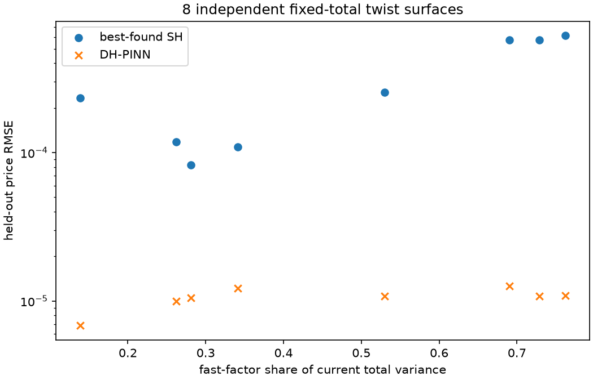

# Controlled structural analysis

Reporting only. Primary inference: the predeclared family-level paired bootstrap (Table C). Other tests are secondary and descriptive.

## Table A — DH-PINN fidelity (PINN vs exact Double Heston)

### A1. Held-out continuous fidelity set (8,192 points, seed 93104); frozen gates: RMSE<=2e-5, P95<=5e-5, max<=2e-4, IV RMSE<=0.2 vol pts

| model | price_RMSE | price_MAE | price_P95 | price_max | IV_RMSE_volatility_points | IV_valid_quotes | quotes | all_frozen_gates_pass |
|---|---|---|---|---|---|---|---|---|
| DH-PINN two-seed mean | 1.09543e-05 | 6.99794e-06 | 2.30789e-05 | 0.000109186 | 0.103073 | 7579 | 8192 | True |
| DH-PINN seed 17 | 1.13282e-05 | 7.27758e-06 | 2.36653e-05 | 0.000106248 | 0.103029 | 7578 | 8192 |  |
| DH-PINN seed 43 | 1.38115e-05 | 8.83358e-06 | 2.9703e-05 | 0.000112124 | 0.114666 | 7575 | 8192 |  |

Fresh PDE residual RMSE by seed: [0.037899640710212235, 0.04301492862960495]

### A2. By maturity, moneyness and state allocation (same held-out set)

| type | bucket | n | price_RMSE | price_MAE | price_P95 | price_max | IV_RMSE_vol_points | IV_valid |
|---|---|---|---|---|---|---|---|---|
| maturity | 7-30d | 2566 | 7.40009e-06 | 3.23722e-06 | 1.68831e-05 | 7.89429e-05 | 0.19312 | 2010 |
| maturity | 30-90d | 1936 | 9.3631e-06 | 5.9029e-06 | 2.0944e-05 | 4.68213e-05 | 0.0508638 | 1879 |
| maturity | 90-365d | 2468 | 1.14918e-05 | 8.85297e-06 | 2.27407e-05 | 6.76053e-05 | 0.0164006 | 2468 |
| maturity | 365-730d | 1222 | 1.68474e-05 | 1.28832e-05 | 3.25531e-05 | 0.000109186 | 0.00507222 | 1222 |
| moneyness | K/F<0.90 | 2897 | 9.67605e-06 | 5.7392e-06 | 1.88951e-05 | 0.000109186 | 0.151873 | 2776 |
| moneyness | 0.90-0.98 | 970 | 1.14838e-05 | 8.53844e-06 | 2.2714e-05 | 7.89429e-05 | 0.0291629 | 970 |
| moneyness | 0.98-1.02 | 455 | 1.34516e-05 | 1.05541e-05 | 2.6695e-05 | 4.2578e-05 | 0.0122492 | 455 |
| moneyness | 1.02-1.10 | 858 | 1.48528e-05 | 1.11295e-05 | 3.06937e-05 | 5.72051e-05 | 0.0337257 | 851 |
| moneyness | K/F>=1.10 | 3012 | 1.01818e-05 | 5.99837e-06 | 2.2705e-05 | 5.40374e-05 | 0.0760863 | 2527 |
| state allocation | fast-heavy (v_fast>v_slow) | 5292 | 1.0507e-05 | 6.54227e-06 | 2.2503e-05 | 8.07386e-05 | 0.114682 | 4823 |
| state allocation | slow-heavy (v_slow>=v_fast) | 2900 | 1.17267e-05 | 7.82946e-06 | 2.37348e-05 | 0.000109186 | 0.0787425 | 2756 |

### A3. On the controlled surfaces, held-out cells only, pooled per family and kind

| family | kind | surfaces | n | price_RMSE | price_MAE | price_P95 | price_max | IV_RMSE_vol_points | IV_valid |
|---|---|---|---|---|---|---|---|---|---|
| BASE | independent | 8 | 8048 | 9.92233e-06 | 6.05322e-06 | 2.05488e-05 | 8.51054e-05 | 0.164307 | 7573 |
| BASE | representative | 1 | 1006 | 1.24972e-05 | 6.92243e-06 | 2.52104e-05 | 8.55633e-05 | 0.148683 | 892 |
| FAST_SHOCK | independent | 8 | 8048 | 1.1479e-05 | 7.2921e-06 | 2.31082e-05 | 8.57919e-05 | 0.152639 | 7684 |
| FAST_SHOCK | representative | 2 | 2012 | 1.37804e-05 | 8.42289e-06 | 2.83581e-05 | 8.44783e-05 | 0.15736 | 1881 |
| FIXED_TOTAL_TWIST | independent | 8 | 8048 | 1.07033e-05 | 7.56522e-06 | 2.30947e-05 | 4.0381e-05 | 0.0685185 | 7914 |
| FIXED_TOTAL_TWIST | representative | 2 | 2012 | 9.72549e-06 | 6.15182e-06 | 2.17809e-05 | 5.84966e-05 | 0.0808935 | 1895 |
| SLOW_SHOCK | independent | 8 | 8048 | 1.01206e-05 | 6.7253e-06 | 2.29332e-05 | 6.06116e-05 | 0.0820492 | 7809 |
| SLOW_SHOCK | representative | 2 | 2012 | 1.1303e-05 | 6.97891e-06 | 2.64354e-05 | 5.90915e-05 | 0.0760965 | 1866 |
| SMIRK_WEIGHTS | independent | 8 | 8048 | 1.03677e-05 | 7.13817e-06 | 2.21475e-05 | 5.17262e-05 | 0.0710882 | 7808 |
| SMIRK_WEIGHTS | representative | 3 | 3018 | 1.01087e-05 | 6.15313e-06 | 2.19837e-05 | 7.40688e-05 | 0.0784131 | 2761 |

## Table B — Controlled structural benchmark, all 40 independent surfaces (held-out cells)

The exact DH teacher generated these surfaces, so its zero error is tautological, not a model-comparison victory. The meaningful comparison is DH-PINN vs best-found SH.

| model | surfaces | mean_price_RMSE | median_price_RMSE | mean_price_MAE | mean_IV_RMSE_vol_points | pooled_heldout_price_RMSE |
|---|---|---|---|---|---|---|
| BS_SELECTED | 40 | 0.00122826 | 0.00130872 | 0.000932672 | 2.7383 | 0.00130517 |
| SH_BEST_FOUND | 40 | 0.000574104 | 0.000590331 | 0.000423633 | 1.72857 | 0.000654649 |
| DH_PINN | 40 | 1.04124e-05 | 1.04314e-05 | 6.9548e-06 | 0.105933 | 1.05328e-05 |
| DH_EXACT_TEACHER | 40 | 0 | 0 | 0 | 0 | 0 |

## Table C — By regime

| family | model | mean_price_RMSE | mean_price_MAE | mean_IV_RMSE_vol_points | pooled_heldout_price_RMSE |
|---|---|---|---|---|---|
| BASE | BS_SELECTED | 0.00158289 | 0.00119485 | 3.62653 | 0.00160839 |
| BASE | SH_BEST_FOUND | 0.000720655 | 0.000530998 | 2.37072 | 0.000733825 |
| BASE | DH_PINN | 9.85119e-06 | 6.05322e-06 | 0.16353 | 9.92233e-06 |
| BASE | DH_EXACT_TEACHER | 0 | 0 | 0 | 0 |
| FAST_SHOCK | BS_SELECTED | 0.00148023 | 0.00112801 | 3.45733 | 0.00150237 |
| FAST_SHOCK | SH_BEST_FOUND | 0.000946152 | 0.000693921 | 2.71707 | 0.000979373 |
| FAST_SHOCK | DH_PINN | 1.13196e-05 | 7.2921e-06 | 0.150202 | 1.1479e-05 |
| FAST_SHOCK | DH_EXACT_TEACHER | 0 | 0 | 0 | 0 |
| SLOW_SHOCK | BS_SELECTED | 0.00134437 | 0.00102498 | 2.91828 | 0.00135343 |
| SLOW_SHOCK | SH_BEST_FOUND | 0.000582274 | 0.000433782 | 1.78266 | 0.000586889 |
| SLOW_SHOCK | DH_PINN | 1.0055e-05 | 6.7253e-06 | 0.0790814 | 1.01206e-05 |
| SLOW_SHOCK | DH_EXACT_TEACHER | 0 | 0 | 0 | 0 |
| FIXED_TOTAL_TWIST | BS_SELECTED | 0.00084748 | 0.000647294 | 1.77735 | 0.000931558 |
| FIXED_TOTAL_TWIST | SH_BEST_FOUND | 0.000319935 | 0.000237961 | 0.882556 | 0.000385233 |
| FIXED_TOTAL_TWIST | DH_PINN | 1.05781e-05 | 7.56522e-06 | 0.0669568 | 1.07033e-05 |
| FIXED_TOTAL_TWIST | DH_EXACT_TEACHER | 0 | 0 | 0 | 0 |
| SMIRK_WEIGHTS | BS_SELECTED | 0.000886345 | 0.000668216 | 1.91204 | 0.000986752 |
| SMIRK_WEIGHTS | SH_BEST_FOUND | 0.000301505 | 0.000221501 | 0.889829 | 0.000390273 |
| SMIRK_WEIGHTS | DH_PINN | 1.02579e-05 | 7.13817e-06 | 0.0698947 | 1.03677e-05 |
| SMIRK_WEIGHTS | DH_EXACT_TEACHER | 0 | 0 | 0 | 0 |

### C-primary. Predeclared paired statistics (positive advantage = SH RMSE minus PINN RMSE favours the PINN)

| family | surfaces | mean_advantage | median_advantage | DH_win_fraction | paired_bootstrap95 | paired_bootstrap99_bonferroni | DH_over_SH_pooled_RMSE | reliable_structural_advantage |
|---|---|---|---|---|---|---|---|---|
| BASE | 8 | 0.000710804 | 0.000727276 | 1 | [0.0006140242976537791, 0.0008071949960077895] | [0.0005900202045068001, 0.0008267752169480384] | 0.0135214 | True |
| FAST_SHOCK | 8 | 0.000934832 | 0.000856616 | 1 | [0.0007607378968176629, 0.0011071330408510664] | [0.000715413333568761, 0.0011598206576938286] | 0.0117207 | True |
| SLOW_SHOCK | 8 | 0.000572219 | 0.000581348 | 1 | [0.0005157131143088234, 0.0006185093185725052] | [0.0004993361375522568, 0.0006291699115107501] | 0.0172446 | True |
| FIXED_TOTAL_TWIST | 8 | 0.000309357 | 0.000235256 | 1 | [0.00016252511073591025, 0.00046098197254299385] | [0.00012752693303348143, 0.0004956846480436746] | 0.0277839 | True |
| SMIRK_WEIGHTS | 8 | 0.000291247 | 0.000217882 | 1 | [0.00013385204187054496, 0.00047197291972197325] | [0.00010403255718391264, 0.0005310237823536301] | 0.0265654 | True |

### Condition E_PINN->DH << E_SH*->DH, per surface

| family | surfaces | median_PINN_over_SH | max_PINN_over_SH | fraction_ratio_le_0_2 | PINN_beats_SH_fraction |
|---|---|---|---|---|---|
| BASE | 8 | 0.0120522 | 0.024827 | 1 | 1 |
| FAST_SHOCK | 8 | 0.0115545 | 0.0252332 | 1 | 1 |
| SLOW_SHOCK | 8 | 0.016874 | 0.0227881 | 1 | 1 |
| FIXED_TOTAL_TWIST | 8 | 0.0357512 | 0.127502 | 1 | 1 |
| SMIRK_WEIGHTS | 8 | 0.0606914 | 0.123157 | 1 | 1 |

Secondary, all 40 surfaces pooled: `{'surfaces': 40, 'mean_SH_minus_PINN': 0.000563691712088031, 'median': 0.000580998559615778, 'PINN_wins_fraction': 1.0, 'bootstrap95_SECONDARY_seed93120': [0.0004641151748163125, 0.0006597757244553528], 'median_PINN_over_SH': 0.017032408015285543}`

## Fast- and slow-shock maturity analysis (secondary)

Fast factor half-life ln2/10.7526 = 23.5 days; slow ln2/0.9491 = 267 days. The share of SH held-out squared error falling in each maturity range is compared with BASE (8 vs 8 surfaces, one-sided Mann-Whitney, directions fixed before results).

| family | metric | family_median | BASE_median | alternative | mann_whitney_p_one_sided | n |
|---|---|---|---|---|---|---|
| FAST_SHOCK | share_short_le30d | 0.219139 | 0.0676517 | greater | 0.000932401 | [8, 8] |
| SLOW_SHOCK | share_long_gt90d | 0.659963 | 0.652328 | greater | 0.360451 | [8, 8] |
| FAST_SHOCK | share_long_gt90d | 0.50576 | 0.652328 | less | 0.0014763 | [8, 8] |
| SLOW_SHOCK | share_short_le30d | 0.0659645 | 0.0676517 | less | 0.520435 | [8, 8] |

### Mean held-out price RMSE by bucket and regime (8 independent surfaces each)

| family | bucket | BS_SELECTED | DH_PINN | SH_BEST_FOUND | SH_over_PINN |
|---|---|---|---|---|---|
| BASE | ATM | 0.0003942 | 1.2237e-05 | 0.000358683 | 29.3114 |
| BASE | K/F_0.70_0.90 | 0.00181635 | 8.8904e-06 | 0.000745977 | 83.9082 |
| BASE | K/F_0.90_0.98 | 0.00160461 | 7.81358e-06 | 0.00088936 | 113.822 |
| BASE | K/F_0.98_1.02 | 0.000535717 | 1.1556e-05 | 0.00043076 | 37.2758 |
| BASE | K/F_1.02_1.10 | 0.00106213 | 1.35891e-05 | 0.000574171 | 42.2522 |
| BASE | K/F_1.10_1.30 | 0.00162983 | 8.90694e-06 | 0.000714444 | 80.212 |
| BASE | long | 0.00228216 | 8.18824e-06 | 0.000737954 | 90.1236 |
| BASE | medium | 0.00139386 | 9.03973e-06 | 0.000831897 | 92.0268 |
| BASE | short | 0.000474549 | 4.24835e-06 | 0.000327207 | 77.0198 |
| BASE | very_long | 0.00168133 | 1.81639e-05 | 0.00106334 | 58.5412 |
| BASE | wing | 0.00172871 | 8.92535e-06 | 0.000729908 | 81.7791 |
| FAST_SHOCK | ATM | 0.000375793 | 1.0559e-05 | 0.00115966 | 109.827 |
| FAST_SHOCK | K/F_0.70_0.90 | 0.00167025 | 1.09702e-05 | 0.000770796 | 70.2631 |
| FAST_SHOCK | K/F_0.90_0.98 | 0.00155097 | 7.91922e-06 | 0.00133431 | 168.49 |
| FAST_SHOCK | K/F_0.98_1.02 | 0.000512207 | 1.04278e-05 | 0.00122264 | 117.248 |
| FAST_SHOCK | K/F_1.02_1.10 | 0.00102136 | 1.39199e-05 | 0.000780626 | 56.0798 |
| FAST_SHOCK | K/F_1.10_1.30 | 0.00152615 | 1.15069e-05 | 0.00089425 | 77.7142 |
| FAST_SHOCK | long | 0.00210763 | 1.11652e-05 | 0.000943508 | 84.5046 |
| FAST_SHOCK | medium | 0.00132002 | 8.66635e-06 | 0.00107942 | 124.552 |
| FAST_SHOCK | short | 0.000455932 | 4.44475e-06 | 0.00071762 | 161.453 |
| FAST_SHOCK | very_long | 0.00161935 | 2.06885e-05 | 0.00114179 | 55.1897 |
| FAST_SHOCK | wing | 0.00160137 | 1.12773e-05 | 0.000836732 | 74.1963 |
| FIXED_TOTAL_TWIST | ATM | 0.000133473 | 1.09182e-05 | 0.000213263 | 19.5329 |
| FIXED_TOTAL_TWIST | K/F_0.70_0.90 | 0.00105597 | 7.38629e-06 | 0.000342546 | 46.3759 |
| FIXED_TOTAL_TWIST | K/F_0.90_0.98 | 0.000745917 | 1.18036e-05 | 0.000367033 | 31.0951 |
| FIXED_TOTAL_TWIST | K/F_0.98_1.02 | 0.000190787 | 1.11211e-05 | 0.000233835 | 21.0264 |
| FIXED_TOTAL_TWIST | K/F_1.02_1.10 | 0.000491241 | 1.31669e-05 | 0.00020615 | 15.6567 |
| FIXED_TOTAL_TWIST | K/F_1.10_1.30 | 0.000842936 | 1.12049e-05 | 0.000322763 | 28.8056 |
| FIXED_TOTAL_TWIST | long | 0.00123088 | 1.33256e-05 | 0.000311202 | 23.3537 |
| FIXED_TOTAL_TWIST | medium | 0.000766338 | 8.31257e-06 | 0.000339549 | 40.8476 |
| FIXED_TOTAL_TWIST | short | 0.000246947 | 6.85793e-06 | 0.000149758 | 21.8372 |
| FIXED_TOTAL_TWIST | very_long | 0.000850052 | 1.28774e-05 | 0.00050993 | 39.5988 |
| FIXED_TOTAL_TWIST | wing | 0.000958358 | 9.46696e-06 | 0.000334469 | 35.3301 |
| SLOW_SHOCK | ATM | 0.00027889 | 1.11883e-05 | 0.0002943 | 26.3042 |
| SLOW_SHOCK | K/F_0.70_0.90 | 0.00159553 | 8.20101e-06 | 0.000621155 | 75.7412 |
| SLOW_SHOCK | K/F_0.90_0.98 | 0.00129493 | 8.42225e-06 | 0.000697258 | 82.7876 |
| SLOW_SHOCK | K/F_0.98_1.02 | 0.0003894 | 1.08312e-05 | 0.000344384 | 31.7957 |
| SLOW_SHOCK | K/F_1.02_1.10 | 0.000845578 | 1.47295e-05 | 0.000430805 | 29.2478 |
| SLOW_SHOCK | K/F_1.10_1.30 | 0.00137037 | 9.71199e-06 | 0.000579856 | 59.7051 |
| SLOW_SHOCK | long | 0.00193794 | 1.16829e-05 | 0.000578109 | 49.4835 |
| SLOW_SHOCK | medium | 0.0012015 | 8.01981e-06 | 0.000667589 | 83.2425 |
| SLOW_SHOCK | short | 0.000406142 | 5.73268e-06 | 0.000263752 | 46.0086 |
| SLOW_SHOCK | very_long | 0.00140831 | 1.47151e-05 | 0.000889029 | 60.4159 |
| SLOW_SHOCK | wing | 0.00149065 | 8.99362e-06 | 0.000601261 | 66.8541 |
| SMIRK_WEIGHTS | ATM | 0.000154297 | 9.94466e-06 | 0.000199829 | 20.0941 |
| SMIRK_WEIGHTS | K/F_0.70_0.90 | 0.0010865 | 7.6494e-06 | 0.000301726 | 39.4445 |
| SMIRK_WEIGHTS | K/F_0.90_0.98 | 0.00081654 | 1.02378e-05 | 0.00034056 | 33.2649 |
| SMIRK_WEIGHTS | K/F_0.98_1.02 | 0.000219347 | 9.84368e-06 | 0.000216597 | 22.0037 |
| SMIRK_WEIGHTS | K/F_1.02_1.10 | 0.000541228 | 1.30824e-05 | 0.000224353 | 17.1492 |
| SMIRK_WEIGHTS | K/F_1.10_1.30 | 0.000882667 | 1.10973e-05 | 0.000317756 | 28.6337 |
| SMIRK_WEIGHTS | long | 0.00128829 | 1.2669e-05 | 0.000295899 | 23.3561 |
| SMIRK_WEIGHTS | medium | 0.000762896 | 7.44025e-06 | 0.000308153 | 41.417 |
| SMIRK_WEIGHTS | short | 0.000242248 | 5.39821e-06 | 0.000140043 | 25.9425 |
| SMIRK_WEIGHTS | very_long | 0.000935725 | 1.38943e-05 | 0.000490393 | 35.2945 |
| SMIRK_WEIGHTS | wing | 0.000992554 | 9.49818e-06 | 0.000312687 | 32.9207 |

## Fixed-total-variance twist (central diagnostic)

Both representatives start at total variance 0.04 (20% vol); only the fast/slow allocation differs. SH is refit separately to each.

| case | allocation | SH_RMSE_short | SH_RMSE_medium | SH_RMSE_long | SH_RMSE_very_long | PINN_RMSE_short | PINN_RMSE_medium | PINN_RMSE_long | PINN_RMSE_very_long | SH_kappa | SH_theta | SH_sigma | SH_rho | SH_v0 | SH_near_best_starts | ATM_SH_residual_sign_changes_along_maturity |
|---|---|---|---|---|---|---|---|---|---|---|---|---|---|---|---|---|
| FIXED_TOTAL_TWIST_representative_0 | fast-heavy (v_fast .035, v_slow .005) | 0.000280141 | 0.000567609 | 0.000545307 | 0.000665181 | 4.61628e-06 | 9.74197e-06 | 1.12344e-05 | 2.11125e-05 | 1.69579 | 0.0550271 | 0.147891 | -0.389818 | 0.0362048 | 12 | 2 |
| FIXED_TOTAL_TWIST_representative_1 | slow-heavy (v_fast .005, v_slow .035) | 7.81447e-05 | 0.0001592 | 0.000252115 | 0.000351119 | 2.43585e-06 | 4.06472e-06 | 9.38206e-06 | 1.26014e-05 | 21.1524 | 0.0626096 | 0.595071 | -0.186531 | 0.0362219 | 12 | 3 |

| case | fast_share | SH_BEST_FOUND | DH_PINN | PINN_over_SH |
|---|---|---|---|---|
| FIXED_TOTAL_TWIST_random_00 | 0.690551 | 0.000576408 | 1.25819e-05 | 0.021828 |
| FIXED_TOTAL_TWIST_random_01 | 0.280791 | 8.2425e-05 | 1.05094e-05 | 0.127502 |
| FIXED_TOTAL_TWIST_random_02 | 0.261967 | 0.000118397 | 9.98174e-06 | 0.0843075 |
| FIXED_TOTAL_TWIST_random_03 | 0.728788 | 0.000572036 | 1.08111e-05 | 0.0188994 |
| FIXED_TOTAL_TWIST_random_04 | 0.138791 | 0.000233984 | 6.83631e-06 | 0.0292169 |
| FIXED_TOTAL_TWIST_random_05 | 0.76205 | 0.000612957 | 1.09272e-05 | 0.017827 |
| FIXED_TOTAL_TWIST_random_06 | 0.530095 | 0.000254108 | 1.07451e-05 | 0.0422854 |
| FIXED_TOTAL_TWIST_random_07 | 0.341544 | 0.000109166 | 1.2232e-05 | 0.11205 |

## Advantage maps

A(K,T) = |SH_best - DH_exact| - |DH_PINN - DH_exact| on held-out cells; A>0 means the PINN is closer to the two-factor teacher. Absolute-error maps share one log colour scale per row.

| map | held_out_cells | fraction_A_positive | mean_A | mean_SH_abs_error | mean_PINN_abs_error |
|---|---|---|---|---|---|
| BASE_representative_0 | 1006 | 0.915507 | 0.000333114 | 0.000340036 | 6.92243e-06 |
| FAST_SHOCK_representative_1 | 1006 | 0.987078 | 0.000598958 | 0.000607971 | 9.01327e-06 |
| SLOW_SHOCK_representative_1 | 1006 | 0.94831 | 0.000235549 | 0.000242258 | 6.70939e-06 |
| FIXED_TOTAL_TWIST_representative_0 | 1006 | 0.947316 | 0.000349107 | 0.000356325 | 7.21814e-06 |
| FIXED_TOTAL_TWIST_representative_1 | 1006 | 0.965209 | 0.00013948 | 0.000144565 | 5.0855e-06 |
| SMIRK_WEIGHTS_representative_1 | 1006 | 0.93837 | 0.000168848 | 0.000174271 | 5.4231e-06 |
| BASE mean of 8 independent surfaces | 1006 | 0.986083 | 0.000524945 | 0.000530998 | 6.05322e-06 |
| FAST_SHOCK mean of 8 independent surfaces | 1006 | 0.996024 | 0.000686629 | 0.000693921 | 7.2921e-06 |
| SLOW_SHOCK mean of 8 independent surfaces | 1006 | 1 | 0.000427057 | 0.000433782 | 6.7253e-06 |
| FIXED_TOTAL_TWIST mean of 8 independent surfaces | 1006 | 1 | 0.000230396 | 0.000237961 | 7.56522e-06 |
| SMIRK_WEIGHTS mean of 8 independent surfaces | 1006 | 0.998012 | 0.000214363 | 0.000221501 | 7.13817e-06 |

## Paired robustness

## Single-Heston optimizer diagnostics (global search + 12 local starts per surface)

| family | min_near_best | at_bound | failed | kappa_min | kappa_max | rho_min | rho_max |
|---|---|---|---|---|---|---|---|
| BASE | 12 | 0 | 0 | 2.05735 | 2.09446 | -0.509832 | -0.480141 |
| FAST_SHOCK | 12 | 0 | 0 | 0.996561 | 22.8181 | -0.486981 | -0.381838 |
| FIXED_TOTAL_TWIST | 12 | 0 | 0 | 1.69579 | 21.1524 | -0.389818 | -0.186531 |
| SLOW_SHOCK | 12 | 0 | 0 | 2.14005 | 2.80264 | -0.476776 | -0.323831 |
| SMIRK_WEIGHTS | 12 | 0 | 0 | 2.11107 | 11.6573 | -0.44425 | -0.208102 |
