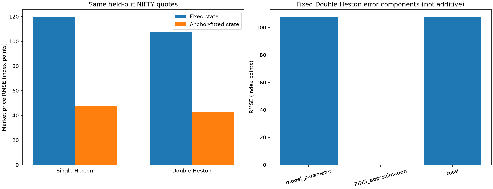

# Additional integrity checks and error decomposition

This is reporting-only code recorded before final evaluation. It does not change the frozen experiment, models, filters, parameter choices, thresholds or scores.

## Controlled hypotheses: descriptive bucket evidence

Mean errors across eight independently sampled surfaces per family. Positive SH_minus_DH favors the PINN. These bucket summaries are descriptive; the five predeclared family-level confidence intervals remain the inferential tests.

| family | bucket | DH_PINN | SH_BEST_FOUND | BS_SELECTED | SH_minus_DH |
|---|---|---|---|---|---|
| BASE | long | 8.18824e-06 | 0.000737954 | 0.00228216 | 0.000729766 |
| BASE | medium | 9.03973e-06 | 0.000831897 | 0.00139386 | 0.000822857 |
| BASE | short | 4.24835e-06 | 0.000327207 | 0.000474549 | 0.000322958 |
| BASE | very_long | 1.81639e-05 | 0.00106334 | 0.00168133 | 0.00104517 |
| FAST_SHOCK | long | 1.11652e-05 | 0.000943508 | 0.00210763 | 0.000932343 |
| FAST_SHOCK | medium | 8.66635e-06 | 0.00107942 | 0.00132002 | 0.00107075 |
| FAST_SHOCK | short | 4.44475e-06 | 0.00071762 | 0.000455932 | 0.000713175 |
| FAST_SHOCK | very_long | 2.06885e-05 | 0.00114179 | 0.00161935 | 0.0011211 |
| FIXED_TOTAL_TWIST | long | 1.33256e-05 | 0.000311202 | 0.00123088 | 0.000297876 |
| FIXED_TOTAL_TWIST | medium | 8.31257e-06 | 0.000339549 | 0.000766338 | 0.000331236 |
| FIXED_TOTAL_TWIST | short | 6.85793e-06 | 0.000149758 | 0.000246947 | 0.0001429 |
| FIXED_TOTAL_TWIST | very_long | 1.28774e-05 | 0.00050993 | 0.000850052 | 0.000497053 |
| SLOW_SHOCK | long | 1.16829e-05 | 0.000578109 | 0.00193794 | 0.000566426 |
| SLOW_SHOCK | medium | 8.01981e-06 | 0.000667589 | 0.0012015 | 0.000659569 |
| SLOW_SHOCK | short | 5.73268e-06 | 0.000263752 | 0.000406142 | 0.00025802 |
| SLOW_SHOCK | very_long | 1.47151e-05 | 0.000889029 | 0.00140831 | 0.000874314 |
| SMIRK_WEIGHTS | long | 1.2669e-05 | 0.000295899 | 0.00128829 | 0.00028323 |
| SMIRK_WEIGHTS | medium | 7.44025e-06 | 0.000308153 | 0.000762896 | 0.000300713 |
| SMIRK_WEIGHTS | short | 5.39821e-06 | 0.000140043 | 0.000242248 | 0.000134645 |
| SMIRK_WEIGHTS | very_long | 1.38943e-05 | 0.000490393 | 0.000935725 | 0.000476498 |

The representative_teacher_shapes.csv file contains ATM IV levels and smirk slopes for all representative scenarios and maturities. It can establish different surface shapes, not prove unique recovery of ten structural parameters.

## Integrity

Verified frozen source/manifest/selection/checkpoint/baseline hashes, all downloaded official source hashes, no duplicate quote keys, ACT/365 using actual expiries, disjoint anchor/held-out contracts and chronological validation/final intervals. Exact training/development/collocation overlaps are zero. This is evidence of the checks performed, not a guarantee against every possible bias or unknown external exposure.

## Strict fixed-parameter market results

| model | dates | quotes | RMSE_index_points | MAE_index_points | equal_date_forward_RMSE | IV_RMSE_volatility_points | omitted_nonfinite |
|---|---|---|---|---|---|---|---|
| single_fixed_exact | 17 | 967 | 119.721 | 92.307 | 0.00525143 | 4.64741 | 0 |
| double_fixed_exact | 17 | 967 | 107.61 | 83.032 | 0.00472665 | 4.32857 | 0 |
| double_fixed_PINN | 17 | 967 | 107.715 | 83.0928 | 0.00473127 | 4.32703 | 0 |
| BS_fixed | 17 | 967 | 22.3698 | 16.0288 | 0.000953803 | 2.99957 | 0 |

## Separate state-adaptive diagnostic

| model | dates | quotes | RMSE_index_points | MAE_index_points | equal_date_forward_RMSE | IV_RMSE_volatility_points | omitted_nonfinite |
|---|---|---|---|---|---|---|---|
| single_state_exact | 17 | 967 | 47.7502 | 33.5375 | 0.00208036 | 3.74109 | 0 |
| double_state_exact | 17 | 967 | 42.8188 | 30.5089 | 0.0018629 | 3.71254 | 0 |
| double_state_PINN | 3 | 212 | 31.3978 | 24.1498 | 0.00135272 | 4.99944 | 755 |
| BS_state_flat | 17 | 967 | 13.5799 | 10.6259 | 0.000582125 | 2.77881 | 0 |
| BS_state_term | 17 | 967 | 12.8133 | 9.9991 | 0.000547206 | 2.77628 | 0 |

State-adaptive PINN rows may cover fewer quotes when fitted states are outside the trained domain. They must not be compared as if their sample were identical; exact-model fixed/state comparisons below use all eligible quotes.

## Signed error decomposition

| protocol | component | common_quotes | omitted_PINN_domain | RMSE_index_points | MAE_index_points |
|---|---|---|---|---|---|
| fixed | model_parameter | 967 | 0 | 107.61 | 83.032 |
| fixed | PINN_approximation | 967 | 0 | 0.187591 | 0.141752 |
| fixed | total | 967 | 0 | 107.715 | 83.0928 |
| state | model_parameter | 212 | 755 | 31.3567 | 24.1317 |
| state | PINN_approximation | 212 | 755 | 0.195823 | 0.140899 |
| state | total | 212 | 755 | 31.3978 | 24.1498 |

Pointwise total error = approximation error + exact-model error. RMSE components are NOT additive because the errors can reinforce or cancel each other.

## What changing the current variance state accomplished

| model | fixed_RMSE | state_adaptive_RMSE | relative_RMSE_reduction_percent |
|---|---|---|---|
| single | 119.721 | 47.7502 | 60.1153 |
| double | 107.61 | 42.8188 | 60.2094 |

These are measured reductions from changing only initial variance states while retaining the selected structural coefficients and the same eligible test quotes. They are a within-protocol comparison, not a causal estimate that all remaining error comes from any one source. States are fitted on same-date anchor quotes; this is surface reconstruction, not future-date forecasting.

No ten-parameter recovery is claimed. The continuous coefficients originated in the cited DJIA study; the chosen NIFTY scaling was selected on validation, not on final dates.

Interpretation: the left panel isolates the improvement from updating initial states. The right panel distinguishes mathematical-model mismatch from neural approximation. A small total error can partly reflect cancellation; inspect both components.

## Limits of this experiment

The synthetic truth is Double Heston by design. It is a controlled approximation test, not neutral evidence of market superiority. Single Heston searches impose strict Feller and finite parameter bounds; results are conditional on those bounds. Twelve convergent starts do not prove global optimality. Only eight independent surfaces per family enter confidence intervals. Two training seeds are not a broad seed sensitivity study. The new market interval is short and is not the previously examined COVID/war periods. The fixed validation candidates may all be misspecified for the final market. No spread-based claims are possible from closing bhavcopies.
