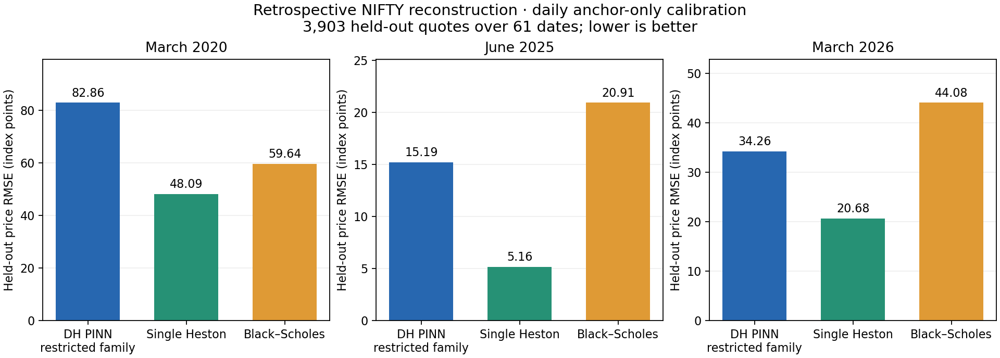

# Double Heston: tested improvement, no superiority guarantee

The requested guarantee is not supported. The selected residual extension improves
fresh synthetic price RMSE by **0.396%**, but calibrated Single Heston
beats the restricted Double-Heston PINN in each of the three market windows.
The PINN beats the selected Black–Scholes baseline in June 2025 and March 2026,
and loses in March 2020. These are retrospective cross-sectional results, not
forecasts, trading returns, or proof that the full Double Heston class is inferior.

## Market evidence

Price RMSE in index points, on **3,903 held-out quotes across 61 dates**:

| Window | DH PINN | Single Heston | Black–Scholes |
| --- | --- | --- | --- |
| March 2020 | 82.86 | 48.09 | 59.64 |
| June 2025 | 15.19 | 5.16 | 20.91 |
| March 2026 | 34.26 | 20.68 | 44.08 |

The primary equally weighted daily normalized RMSE gives the same ordering.
Values below are percentages of discounted forward, not implied volatility:

| Window | DH_PINN | SH | BS |
| --- | --- | --- | --- |
| March 2020 | 1.0596% | 0.5787% | 0.7253% |
| June 2025 | 0.0602% | 0.0205% | 0.0829% |
| March 2026 | 0.1496% | 0.0917% | 0.1945% |

Each date was fitted using anchor strikes only; held-out entire strike pairs
never entered calibration. Carry was inherited from anchor-only parity.
Single Heston fits all five parameters with differential evolution plus four
local starts. BS selects flat or per-expiry volatility on an inner anchor split.
The PINN fits a common variance scale and two initial variance states (three
parameters) inside its trained domain. Its kappa and rho values remain fixed
at the literature anchor. **This is not an unrestricted ten-parameter DH fit.**
Both Heston families retain the repository's strict Feller restriction.

All best local solutions report convergence; this does not establish a global
optimum. All **61/61 PINN fits are at or near a domain boundary** (within 0.5%
of the log-parameter range). Exact DH prices at the
PINN-fitted parameters have RMSE 82.91, 15.14 and 34.22 points, respectively.
The corresponding neural approximation errors are only 0.154, 0.185 and 0.290
points. The evidence therefore points to the restricted parameter family/domain
as a material bottleneck; adding network depth cannot be assumed to fix it.

PINN beats SH on 0/21, 0/21 and 1/19 dates. PINN beats BS on 8/21, 19/21 and
19/19 dates. Five-date moving-block bootstrap intervals, including a Bonferroni
adjustment across six comparisons, are saved in `artifacts/market/comparisons.json`.
They support worse PINN performance than SH in all three windows and better PINN
performance than BS in the latter two. The corrected March-2020 comparison to BS
crosses zero. These short, exposed historical windows support only conditional,
retrospective inference. They do not establish an event's causal effect.

## What changed and what the ablation found

The implementation in `src/mentor_dh_pinn/multiscale_pinn.py` extends the existing
width-256, five-layer pricing PINN with three width-32 residual expert branches
and exact factor-decay features. Zero-initialized output heads preserve the
inherited function. The parent weights remain frozen. Expiry payoff and call
bounds are preserved; convexity is not guaranteed.

The MULTISCALE variant uses smooth maturity gates at 30 and 90 days. SHARED
uses the identical branches with equal weights. Both used the same batches,
parameter counts, seeds 17/43, 800 Adam steps and 60 L-BFGS iterations with
synthetic price, IV, PDE and convexity losses. No market labels update weights.
The protocol was written and hashed before running these experiments.

SHARED was selected on the inherited development split, before fresh test data
were generated. Its development price improvement was just 0.022%; no claim of
a major architecture breakthrough is justified. MULTISCALE was not selected.
On 4,096 fresh continuous points, with both seeds averaged:

| arm | price_RMSE | price_P95 | price_max | IV_RMSE_volatility_points |
| --- | --- | --- | --- | --- |
| FROZEN | 1.0589802e-05 | 2.2687462e-05 | 0.00012342243 | 0.093064441 |
| SHARED | 1.054784e-05 | 2.2424524e-05 | 0.00011971457 | 0.092539638 |
| MULTISCALE | 1.0562942e-05 | 2.2391308e-05 | 0.00011887478 | 0.092107917 |

Price errors use forward-normalized call units. IV errors use volatility points.
All prices contribute to price metrics; IV metrics use 3,785 jointly invertible
teacher/prediction pairs, with coverage explicitly recorded. The selected model's
worst price error falls by 3.00%. Fresh mean per-seed scaled PDE RMSE changes
from 0.032585 to 0.032454. Negative convexity remains at 7/512 and 4/512 points
for the two seeds; this is not an arbitrage-free certification. Two seeds and a
small gain do not establish broad architectural superiority.

## Appropriate timescales and synthetic evidence

[Christoffersen, Heston and Jacobs (2009)](https://pure.au.dk/ws/files/17142435/rp09_34.pdf)
motivate two volatility factors by changing smile level/slope and distinct
persistence, rather than particular crisis dates. Their study uses S&P500 data
from 1990–2004; this repository's NIFTY panel cannot reproduce that experiment.
The current literature anchor has fast and slow variance half-lives of about
23.5 and 266.6 days. We therefore report 7–30, 30–90, 90–365 and 365–730 days.
Real archived quotes support only 7–100 days; the longer horizons below are
synthetic evidence only.

The selected extension beats recalibrated SH and inner-selected BS on every one
of 40 independent synthetic surfaces in every maturity bucket:

| bucket | PINN wins vs both | surfaces |
| --- | --- | --- |
| 30-90d | 40 | 40 |
| 365-730d | 40 | 40 |
| 7-30d | 40 | 40 |
| 90-365d | 40 | 40 |
| all | 40 | 40 |

These are reused v4 surfaces, explicitly a descriptive diagnostic. Their targets
are generated by Double Heston and their structural parameters are supplied to
the PINN; SH and BS approximate those surfaces using calibration cells. This
demonstrates approximation capability conditional on known DH parameters,
not successful inverse recovery or market superiority. Full maturity/family
tables are in `artifacts/reused_controlled_maturity.csv`.

The loss-scaling and multiscale motivation draws on
[Wang, Teng and Perdikaris (2021)](https://arxiv.org/abs/2001.04536) and
[Wang et al. (2023)](https://arxiv.org/abs/2308.08468).
The maturity-gated design here is our proposed adaptation. We have not
implemented every published PINN method or shown that any method guarantees wins.

## Verification, provenance and limits

- 24 targeted tests passed; one MLX parity test was skipped. Checks cover smooth
  gate derivatives, an independent raw-price PDE, coordinate/parameter gradients,
  terminal payoff, bounds, split isolation, and existing pricing/data code.
- Four trained extensions preserve all parent weights bit for bit. The original
  v4 frozen source manifest still verifies. Fresh test inputs are disjoint from
  inherited train and development inputs.
- 48 adaptive-integral checks at calibrated market parameters agree with scored
  exact prices to at most 8.29e-11 in forward units. No price clipping was used.
- The cleaned-panel SHA-256 matches the retained original audit. The 61 raw NSE
  archives were not found at the checked local locations; their original audit
  is retained, but fresh raw-file verification/recleaning was not performed.
- Historical close prices are not synchronous executable bid/ask quotes. Missing
  or uninvertible IV values are counted; primary price errors retain every quote.
- The old market tests have already been seen. This work does not restore their
  status as prospectively unseen data. No dates were removed for poor model fit.

The next defensible development step is a broader parameter-domain surrogate,
including variable correlations and reversion speeds, followed by a matched
calibration comparison on newly reserved dates. It would require new teacher
validation and new testing; it cannot be called a guaranteed improvement.
The current selected extension and all failed/secondary alternatives remain
available for inspection, without overwriting the prior experiment.

## Reproduction

Use `python -m experiments.nifty_multiscale_v5.run` with `freeze`, `train`,
`select` and `evaluate`; train each SHARED/MULTISCALE arm with `--seed 17` and
`--seed 43`. Use `python -m experiments.nifty_multiscale_v5.market` with
`baseline`, `pinn`, and `report`; then run the `controlled` and `report` modules.
`freeze` and training refuse existing output directories. Reproduce in a copy
with a fresh v5 artifacts directory, preserving the completed results here.
The Python environment is recorded in `artifacts/environment.json`.
See [PROTOCOL.md](PROTOCOL.md), `artifacts/manifest.json`, `selection.json`,
`fresh_test/`, `market/`, and `final_integrity.json` for the full evidence.
