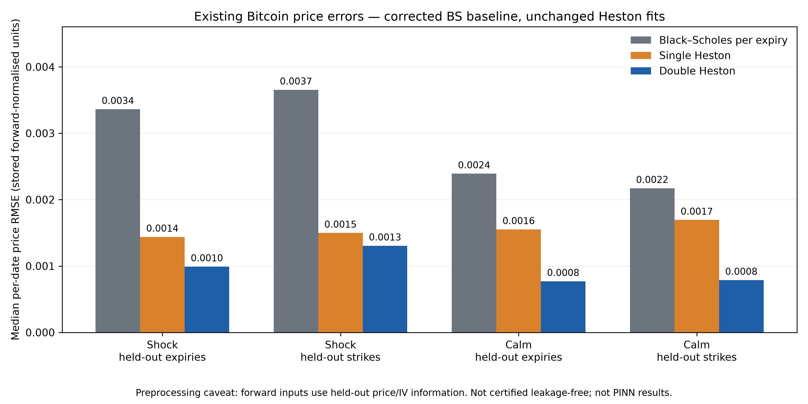
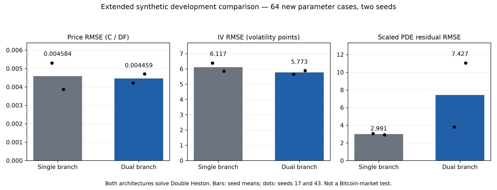

# Bitcoin comparison and portable dual-PINN research handoff

## Bottom line

The existing numerical BTC comparison was found and reproduced. It is NOT a
PINN comparison and is NOT certified leakage-free. A new dual-maturity PINN
was implemented and trained separately on synthetic data. Existing production
checkpoints, original BTC results, Kaggle and GitHub were not changed.

## Existing Bitcoin experiment

Sources: ../btc_multifactor_v1/REPORT.md, amended test_scores.csv, raw archives.
Verified 72 raw archive hashes and both protocol manifests;
reproduced all 400 stored metric rows. The displayed BS arm is the corrected
per-expiry version, not the flawed per-quote-volatility BS_TERM arm.
The market comparison has 29 shock dates and 21 calm dates, two holdout designs.
On the primary shock/held-out-expiry cell, median IV RMSE is BS 8.133,
SH 2.496, DH 1.857 volatility percentage points. These are cross-sectional
held-out option errors, NOT forecasts of future dates or parameter truth.

### Important data dependence

data.clean reconstructs each expiry's forward from trade price and exchange IV
before splitting. Thus held-out targets affect covariates, put-call conversion
and filters. An in-memory +5% perturbation of held-out prices at fixed IV changed
the inferred forwards by up to 0.380% on
2022-02-21. This proves dependency, not the magnitude or direction of
its effect on the model ranking. No raw file was changed. The inspected archive
contains index_price but no independent underlying_price/expiry forward field.
Need independently timestamped forward data and verified settlement conversion
for a target-independent market rerun. The old p-values do not remove this issue.

Official convention references for a future adapter audit:
- https://support.deribit.com/hc/en-us/articles/31424939096093-Inverse-Options
- https://support.deribit.com/hc/en-us/articles/25944775983133-USD-Order-Options

Interpretation: DH has the lowest stored median error, subject to the dependency
caveat above. This is not evidence that the NEW PINN beats these models.

## Architecture implemented

src/mentor_dh_pinn/maturity_dual_pinn.py:
- PortableVariancePINN: 3 x 96 tanh, 21,121 weights/biases, control architecture.
- MaturityDualPINN: two 3 x 64 tanh experts, 19,970 weights/biases total.
- 24 dimensionless features include log-forward moneyness, maturity,
  relative variance, mean-reversion horizons, skew and Feller-ratio quantities.
- Smooth short/long gate g = sigmoid(2 log(tau / (90/365))).
- Bounded log-IV correction delta = 1.8 tanh((1-g) h_short + g h_long).
- IV = sqrt(expected average total variance) exp(delta).
- w = tau IV²; Black price map returns C/(D K), then the adapter restores C.
- The same audited AD Double Heston PDE differentiates BOTH experts and gate.
- Loss: price MSE/.01² + IV MSE/.05² + .01 scaled PDE MSE
  + .01 negative-convexity squared penalty. Exact terminal payoff.
- No dropout, ReLU, fixed expiry grid, joint correlation-disk constraint or
  forced Feller constraint. No exact-pricer inference or ten-parameter output.

This adapts the maturity-specialist idea from the legacy dual inverse network,
not its fixed 27-short/18-long quote layout or structural restrictions.

## Data and fair comparison

Both controls are DOUBLE HESTON PINNs. “Single branch” does not mean Single Heston.
Extended training: 256 cases, 24576 labels;
development: 64 disjoint new cases, 6144 labels;
18,000 collocation points. New development cases are disjoint from both old
pilot splits and new training. All exact price targets are retained.
Undefined IVs are excluded from IV loss/metric only: train 3543,
development 887. Thus IV metrics do not cover every
price point. Independent adaptive quadrature fallbacks: training 311,
development 96. Price bounds/nonfinites fail closed.

Domain: log(F/K) [-1,1], tau 3/365 to 2 years; theta,v0 .005–1.5;
slow kappa .3–3, fast = slow + gap 2–15; rho -.9 to .9;
sigma = eta sqrt(2 kappa theta), eta .15–2. LHS; positive quantities
sampled logarithmically except rho. All ten quantities vary across cases.

Both seeds 17/43: 4,000 Adam steps then max 100 L-BFGS iterations.
Identical loss, minibatch sequence, data and budgets; no development early stop.
L-BFGS uses two labels per training case, 512 labels spanning all 256 cases.

## Development results (NOT market results)

| Architecture | Seed | Price RMSE C/DF | IV RMSE vol points | Scaled PDE RMSE | Convexity violations |
|---|---:|---:|---:|---:|---:|
| single_branch | 17 | 0.005296 | 6.382 | 3.061 | 6 |
| dual_branch | 17 | 0.004212 | 5.656 | 3.811 | 13 |
| single_branch | 43 | 0.003872 | 5.853 | 2.921 | 4 |
| dual_branch | 43 | 0.004706 | 5.891 | 11.043 | 22 |

Mean-seed changes versus the matched single-branch control: price error
2.72% reduction, IV error
5.62% reduction, PDE error
-148.32% reduction (negative means worse).
Predeclared development criterion passed: **False**.
This is not a statistical significance test; there are only two training seeds.
Convexity is a sampled diagnostic at tolerance 1e-7, not a global guarantee.

Interpretation: compare approximation to the synthetic exact DH teacher, not
market pricing ability. Neither candidate recovers parameters in this test.

## Retained failures and limitations

The original pilot reduced mean price RMSE by 43.77% but slightly worsened IV
RMSE (8.844 to 8.930 points), so its promotion criterion failed. Its L-BFGS
prefix covered only six parameter cases, later identified as unintended.
The first extended attempt was stopped during data generation before training;
its manifest is preserved under extended/. EXTENDED_AMENDMENT_01.md corrected
the label subset before the corrected training began. No result was hidden.

A post-training unit check exposed a feature-broadcast bug when one unbatched
structural parameter set was shared across quotes. Adding an explicit zero
broadcast fixes that input path. Training used batched parameters, so no run
was affected. The exact original source is retained as model_training_snapshot.py
and matches both training manifests. Regression checks require bitwise identical
batched prices under the original and corrected implementations, and compare
the dual residual with an independently differentiated raw price PDE.

The new adapter accepts arbitrary quote counts, strikes, expiry dates converted
to year fractions, calls/puts, forwards and discount factors. It requires
independent forward inputs and prices in a consistent currency. It rejects
non-European exercise and out-of-domain maturity/moneyness. Supplied parameters
must also be inside the trained distribution: mathematical admissibility alone
does not certify coverage. BTC/ETH/indices are not interchangeable without
checking volatility coverage, carry and settlement conventions. No claim of
support for American, barrier, Asian or other exotic payoffs.

## Reproduction and continuation

Run from repository root using ../.venv/bin/python:

    -m pytest tests/test_maturity_dual_pinn.py experiments/portable_dual_pinn_v1/test_extended.py
    experiments/portable_dual_pinn_v1/run_pilot.py
    experiments/portable_dual_pinn_v1/audit_btc.py
    experiments/portable_dual_pinn_v1/run_extended.py
    experiments/portable_dual_pinn_v1/build_report.py

Scripts refuse to overwrite output directories. Reproduce in a separate checkout
or choose a NEW declared output directory; do not delete or overwrite evidence.
Manifests hash code and protocols before training. NPZs contain coords, params,
price, IV, case IDs; checkpoints, per-seed histories and metrics are retained.

Next justified step: independently sourced forward/settlement data, a fresh
frozen market protocol, parameter-domain/teacher-fidelity checks, and equal
calibration budgets for BS/SH/exact DH/PINN DH on only calibration quotes.
Do not tune on the old 50 Bitcoin test dates and call them untouched.
Do not interpret a better surrogate architecture as removing Heston model bias.
