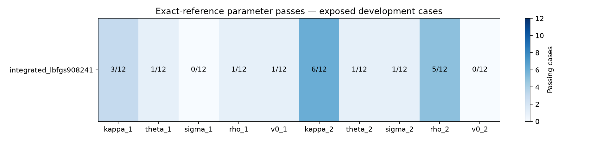
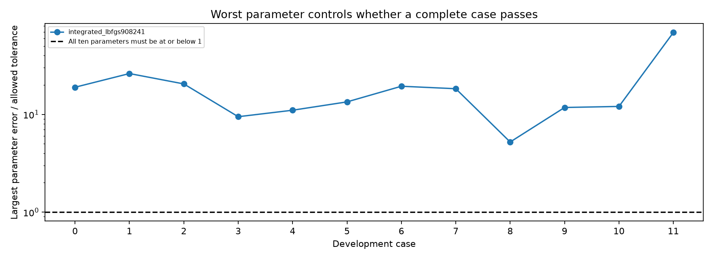

# Factor-structured PINN: development evidence

This is a separately approved Riccati/factor architecture, not the regular price-PDE PINN.
All cases here have been exposed during development. These results do not establish generalization.

| Training checkpoint | Individual parameters | All ten, by case | Joint price + parameter gates |
|---|---:|---:|---:|
| integrated_lbfgs908241 | 19/120 | 0/12 | 0/12 |

The preserved regular-PINN baseline passes 48/120 individual parameters and 0/12 complete cases. All twelve truths, sixty blind starting vectors and holdout masks match. Regenerated reference IV differs by at most 2.91e-14; spot-normalized price differs by at most 3.89e-16. These are not bit-identical quote files. Architectures and training supervision differ; this is a development benchmark, not a matched generalization study.

Interpretation: darker cells mean more development cases passed that parameter. Separate parameter passes cannot be combined across cases to claim full recovery.

Interpretation: a point above the dashed line fails at least one parameter. Lines connect case identifiers for readability; they are not time-series forecasts. Missing fits are failures, not omitted successes.

## Data and safeguards

Each case has 126 clean synthetic quotes: 21 strike/forward ratios from 0.8 to 1.2 at 30, 60, 90, 180, 365 and 730 days, divided by 365. Every third strike is withheld (42 quotes); 84 quotes enter calibration. These maturities are synthetic experimental coverage, not a claim about NSE contract availability.

Eight positive parameters must each be within 5% relative error; both correlations within 0.05 absolute. Canonical storage is slow factor first, fast factor second. Joint success also requires held-out neural and independent exact-repriced price RMSE <=1e-5 of spot and valid quadrature.

Calibration uses frozen learned coefficients, automatic parameter derivatives and blind multistart optimization. Exact references generate the observations and independently reprice the final estimate; they are not trial-price calls inside inverse fitting. Structural coefficient labels are used during synthetic neural training, which must be disclosed in comparisons with price-only training.

This is a two-stage PINN-surrogate method: train a parameter-conditioned coefficient network, then freeze its weights and optimize the ten unknown parameter inputs through its learned prices. It is not a network that directly outputs ten parameters, and it is not simultaneous per-case optimization of both neural weights and model parameters.

The report recomputed parameter gates, counts, minimum-SSE start selection and quote counts; verified unchanged truths/quotes across runs; checked checkpoint/data hashes and recorded source snapshots; and checked finite training labels, unique sampled states and no exact state overlap between splits. This is a bounded integrity audit, not a guarantee against every possible form of leakage or overfitting.

Coefficient-validation RMSE is not parameter error. The independent-output and derivative-linked variants use different coefficient-loss normalizations, so those RMSE values are not directly comparable.

## What still needs work

Any failed complete-case gate remains unresolved. A fresh sealed case set, sensitivity/stability testing and a disclosed matched Single-Heston comparison are still needed before claiming reliable superiority.

[Per-case parameter estimates for the final listed stage](PARAMETERS.md). Full-precision values and every start remain in the source assessment JSON.
