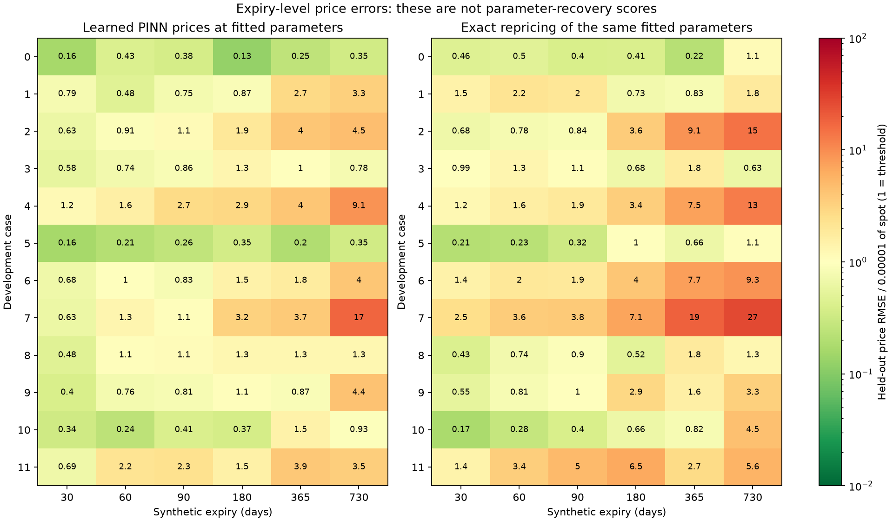

# Post-fit expiry-level price audit

Interpretation: each cell is held-out price RMSE divided by 0.00001 of spot. Values at or below 1 meet that price threshold for the expiry; above 1 fail. The left panel uses learned prices; the right independently prices the SAME fitted parameters with the canonical Double Heston reference. Neither panel establishes correct parameter recovery. These per-expiry diagnostics do not replace or change the predeclared aggregate price gate.

Colors saturate below 0.01 and above 100; cell labels and JSON values are not clipped. Zeros are labelled 0, failed cases remain labelled failed. These are clean synthetic, previously exposed development cases, not NSE observations or unseen evidence.

The audit re-evaluated every fitted case without optimization and exactly reproduced its archived price/IV metrics. It also checked physical parameter decoding, reference quotes, source and checkpoint hashes. This verifies artifact consistency, not a second independent implementation of all pricing mathematics.
