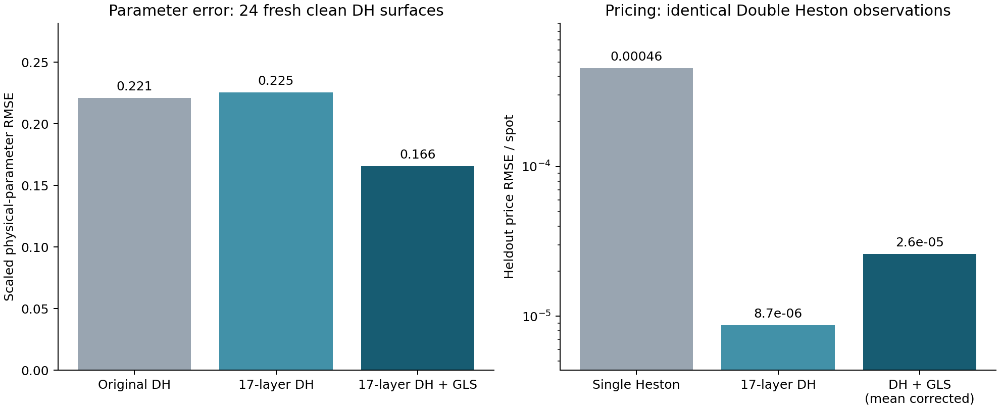

# Implemented PINN improvements and measured results

The 17-layer model with training-error GLS reduces clean Double Heston parameter RMSE by 24.9% versus the original five-layer Double Heston PINN. The uncorrected 17-layer model reduces heldout price RMSE by 98.09% versus Single Heston on the same Double Heston-generated observations. These are separate configurations and objectives.

**Full parameter recovery remains unsolved.** Single Heston recovers its own five parameters in 22/24 clean cases; the 17-layer Double Heston plus GLS recovers all ten in 2/24. The original Double Heston passes 1/24. The unchanged gate is 5% relative error for positive parameters and 0.05 absolute error for correlations.



## What was implemented

- One 17-layer residual pricing PINN (847,745 parameters), with parameter and strike/maturity derivative supervision. No ensemble or exact-pricer refinement.
- Calibration can now use frozen training-error mean/covariance, eigenvalue regularization and observation uncertainty. The same whitening transforms residuals and their analytic Jacobian. Statistics are restricted to their exact quote geometry; assessment verifies the checkpoint hash.
- Recovery-sensitive training uses exact training Jacobians to penalize pricing errors that imply large local physical-parameter shifts. Its preconditioner now uses the same 84 quote positions as calibration. This is a local linear proxy, not an actual recovery loss.
- Two additional 4,000-update training trials used weights 0.01 and 0.001. Their fixed four-case development recovery scores did not beat the original 17-layer candidate, so they were not promoted. Both trials and their checkpoints are retained.

## Independent assessment

Seed 910831 supplies 24 new truths per generating model, reused for clean/noisy comparisons. Each surface has 126 quotes: 84 calibration and 42 heldout. Every fit receives five identical seeded starts and a 400-evaluation limit per start. Candidate networks, covariance statistics and floors were fixed before assessment. The 11-layer GLS candidate had the better four-case development recovery score; both predeclared GLS candidates are reported. No assessment-based retraining was performed.

| Condition / model | DH parameter RMSE | All-ten pass | Raw neural price RMSE | Exact post-fit reprice RMSE |
|---|---:|---:|---:|---:|
| Clean: Single Heston | N/A | N/A | 0.000455412 | 0.000461847 |
| Clean: Original Double Heston | 0.22081 | 1/24 | 1.20911e-05 | 4.54863e-05 |
| Clean: 17-layer Double Heston | 0.22543 | 0/24 | 8.71113e-06 | 5.48022e-05 |
| Clean: 11-layer Double Heston + GLS | 0.16593 | 0/24 | 3.56451e-05 | 3.90305e-05 |
| Clean: 17-layer Double Heston + GLS | 0.16578 | 2/24 | 6.37901e-05 | 3.68378e-05 |
| Noisy: Single Heston | N/A | N/A | 0.000485249 | 0.000489755 |
| Noisy: Original Double Heston | 0.61865 | 0/24 | 0.000197045 | 0.00019552 |
| Noisy: 17-layer Double Heston | 0.65091 | 0/24 | 0.000200671 | 0.000218028 |
| Noisy: 11-layer Double Heston + GLS | 0.65643 | 0/24 | 0.000195883 | 0.000206515 |
| Noisy: 17-layer Double Heston + GLS | 0.78746 | 0/24 | 0.000196473 | 0.000196526 |

Pricing errors are normalized by spot and scored against clean generating prices. Exact repricing happens only after fitting. GLS can trade raw neural price error for better physical parameters; its mean-corrected clean heldout price RMSE is 2.60552e-05. Single Heston on Double Heston data has no matching ten-parameter truth, so its parameter score is N/A.

**Noise limitation:** GLS did not improve noisy parameter recovery. The 17-layer GLS error rose to 0.787 versus 0.619 for the original Double Heston, and every Double Heston configuration passed 0/24 noisy cases. Do not treat the clean result as a robustness result.

**Sampling uncertainty:** the predeclared 11-layer GLS recovery candidate also reduced clean average parameter error by about 25%; its paired bootstrap 95% reduction interval is 5.5%–49.3%. The 17-layer GLS interval is −16.4%–52.7%, which includes no improvement. The 17-layer result alone does not establish a population-wide recovery advantage.

Noise is independent Gaussian at 1% of option time value. GLS adds a delta-method IV observation covariance estimated from observed quotes and the specified noise level. There is no clipping or resampling.

## Why recovery is still difficult

The tolerance-scaled teacher Jacobians of 1,024 training surfaces have median condition number about 5,238, rising above two million. Small pricing errors can therefore produce large parameter errors. More depth alone did not improve recovery on this fresh sample. Error-aware calibration helps average recovery but does not remove weak identification.

The covariance model uses 512 separate synthetic training surfaces. Their 128-versus-96-node price discrepancy is at most 2.36e-14. Fresh assessment prices also pass the 1e-9 quadrature check. This remains evidence for central-domain synthetic surfaces on a fixed grid, not market-data validation or a global identifiability guarantee.

30 scoped tests passed, including extra-layer gradients, MLX/Torch weight parity, teacher derivatives, holdout isolation, whitening algebra and the prohibition on exact pricing inside calibration. All 288 clean/noisy fits and 1,440 starts are retained. See `audit.json` for artifact checks and paired bootstrap intervals.

## Reproduce

```bash
.venv/bin/python scripts/mentor_dh_pinn/evaluate_recovery_improvements.py \
  --spec outputs/deeper_pinn/recovery_comparison_spec.json \
  --out outputs/deeper_pinn/NEW_UNUSED_DIRECTORY --seed 910831 --cases 24
# Add --noise .01 for the noisy comparison.
```

- [Frozen candidate specification](../recovery_comparison_spec.json)
- [Clean metrics and parameter errors](../recovery_clean_910831/metrics.json)
- [Clean fits and all starts](../recovery_clean_910831/fits.json)
- [Noisy results](../recovery_noise_910831/summary.json)
- [Earlier depth/derivative comparison](../report/REPORT.md)
