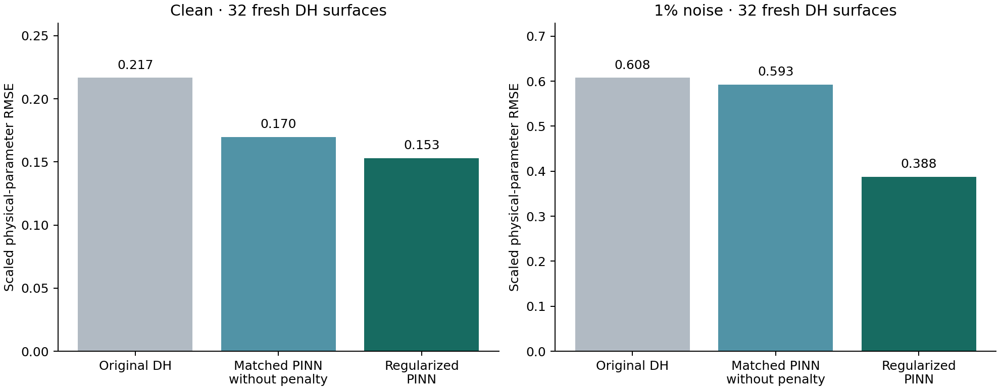

# More stable neural-only Double Heston recovery

**Measured improvement:** the new regularized calibration lowers average physical-parameter error on both clean and noisy fresh synthetic data. It uses one frozen pricing PINN per fit, with no exact-pricer refinement.



| Condition | Original DH | Same PINN without penalty | Regularized PINN | Reduction vs original |
|---|---:|---:|---:|---:|
| Clean | 0.21675 | 0.16989 | 0.15307 | 29.4% |
| 1% noise | 0.60777 | 0.59276 | 0.38781 | 36.2% |
| Boundary clean | 0.44466 | 0.44048 | 0.44271 | 0.4% |
| Boundary 1% noise | 1.47712 | 1.30685 | 1.01535 | 31.3% |

The matched comparison isolates the added midpoint penalty; the original comparison includes the earlier network and covariance changes. Clean and noisy scenarios use the same generating parameters, with noise added only to observations.

The strongest new evidence is the noisy matched comparison: 34.6% lower parameter RMSE, with a paired bootstrap 95% reduction interval of 10.8%–49.9%. The clean matched reduction is 9.9%, but its interval includes zero. Near the boundary, clean recovery is slightly worse than the same PINN without the penalty (0.443 versus 0.440), while noisy recovery improves on average. Thus the penalty is not a universal clean-data improvement.

## What changed and why

The inverse fit now minimizes `||W (IV_network(u) - training_bias - IV_observed)||² + lambda ||u - 0.5||²`, with bounded unit parameters. `W` comes from frozen training-error covariance plus supplied observation uncertainty. The added term discourages large movements in directions poorly constrained by the prices. It introduces a midpoint bias; it does not create information or prove identifiability.

A development sweep evaluated lambda = 0, 0.1, 1, 10 and 100 for the existing 11- and 17-layer networks on 12 previously exposed surfaces, under clean/noisy observations. Lambda 10 won both conditions. The clean profile selected the 17-layer network; the noisy profile selected the 11-layer network. Both are single networks; there is no ensemble. All choices were frozen before the new assessment.

The network weights were not retrained in this iteration. The improvement comes from the calibration objective. Prior attempts at locally recovery-sensitive training failed to improve development recovery and remain preserved.

The fit now records separate raw IV error, data objective, prior penalty, total objective, all starts, data-Jacobian singular values and the number of local directions dominated by regularization. These are local diagnostics, not certified parameter confidence intervals.

## Pricing and strict recovery

| Condition / model | Heldout neural price RMSE | Mean-corrected price RMSE | Exact post-fit price RMSE | All own-model parameters pass |
|---|---:|---:|---:|---:|
| Clean: Single Heston | 0.000472945 | — | 0.000481256 | N/A on DH data |
| Clean: Original Double Heston | 9.50727e-06 | — | 5.198e-05 | 0/32 |
| Clean: 17-layer Double Heston | 7.46149e-06 | — | 7.57845e-05 | 0/32 |
| Clean: Selected regularized PINN | 6.26561e-05 | 2.87813e-05 | 4.75849e-05 | 1/32 |
| 1% noise: Single Heston | 0.000497438 | — | 0.000502953 | N/A on DH data |
| 1% noise: Original Double Heston | 0.000226327 | — | 0.0002453 | 0/32 |
| 1% noise: 17-layer Double Heston | 0.000226472 | — | 0.000231938 | 0/32 |
| 1% noise: Selected regularized PINN | 0.000180845 | 0.000179449 | 0.000178068 | 0/32 |

**All-ten recovery is still not solved.** Regularized Double Heston passes 1/32 clean and 0/32 noisy cases. Single Heston on its own generated data passes 28/32 clean and 9/32 noisy. The gate remains 5% relative error for positive parameters and 0.05 absolute error for correlations. Single Heston on DH-generated data has no matching ten-parameter truth.

Price errors are normalized by spot and evaluated on 42 withheld quotes against clean generating prices. Calibration sees only the other 84 quotes. Exact repricing is evaluated after fitting and never changes parameters. The recovery profile makes a pricing/recovery tradeoff; the separate unregularized 17-layer pricing network remains preferable when pricing error alone is the objective.

## Verification and scope

Assessment seed 911831 supplies 32 new truths per model family. A separate stress test uses seed 911931 and 16 truths per family, each with two unit parameters fixed near the boundaries at 0.02 and 0.98. Neither set is used to select the penalty. Each fit uses five starts and at most 400 evaluations per start. Price references pass a 128-versus-96-node quadrature check. Input hashes and source snapshots are retained.

The domain is synthetic, with 21 strikes and maturities 30/60/90/180/365/730 days. Noise is Gaussian at 1% of option time value; the noisy profile receives that noise level. Do not silently apply the noisy profile to a different uncertainty level, arbitrary quote grid, or market-data distribution. Its performance in those settings is unverified.

31 scoped tests pass, including finite-difference validation of the regularized residual Jacobian, objective accounting, masked-quote invariance, and forbidden exact-pricer calls during optimization. A real CLI smoke test also completed with withheld IV values set to null.

| Condition | Reduction vs matched PINN | Paired wins | Bootstrap 95% reduction interval |
|---|---:|---:|---:|
| Clean | 9.9% | 18/32 | -1.3% to 26.0% |
| 1% noise | 34.6% | 27/32 | 10.8% to 49.9% |
| Boundary clean | -0.5% | 7/16 | -3.0% to 7.5% |
| Boundary 1% noise | 22.3% | 10/16 | -25.4% to 27.2% |

## Use the implemented calibration

Run from this checkout with its `.venv`. The input JSON contains `x`, `tau`, `observed_iv` and `fit_mask`; a ready example is linked below. Statistics require the exact documented grid, and the loader checks the network/statistics checkpoint hash.

```bash
.venv/bin/python scripts/mentor_dh_pinn/calibrate_recovery_pinn.py \
  --input outputs/deeper_pinn/prior_cli_example/quotes.json \
  --out outputs/deeper_pinn/NEW_FIT.json --profile clean
# For the tested noisy condition: --profile noise --noise-fraction .01
```

- [Frozen selection](../prior_frozen_selection.json)
- [All parameter estimates](parameter_estimates.csv)
- [Audits and paired intervals](audit.json)
- [CLI input example](../prior_cli_example/quotes.json)
- [CLI output example](../prior_cli_example/fit.json)
- [Development sweep](../prior_development_911/summary.json)
