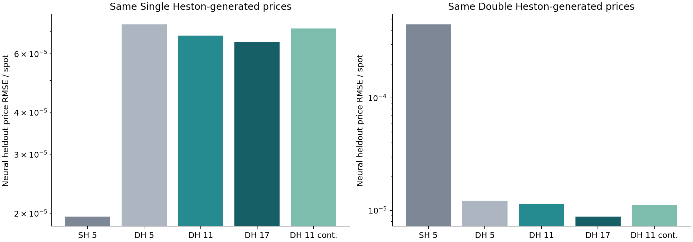
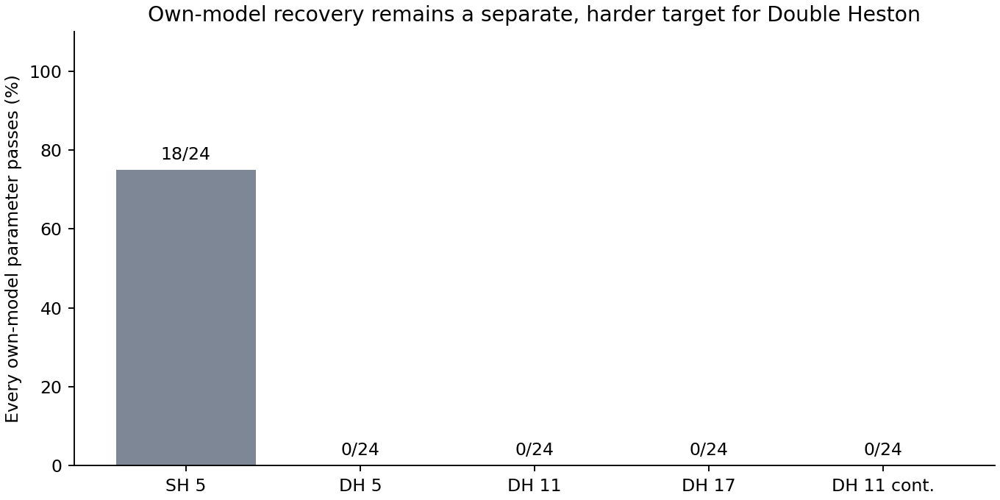

# Deeper Double Heston PINN versus Single Heston

**Pricing result:** the 17-layer Double Heston PINN reduces clean heldout price RMSE by 98.06% versus the Single Heston PINN on the same 24 Double Heston-generated surfaces. It wins in 24/24 cases. This uses one frozen neural network and neural-only calibration, with no exact-pricer refinement.

**Parameter recovery is not better than Single Heston.** Adding layers and derivative supervision improved pricing, but did not establish recovery of all ten Double Heston parameters. No overall superiority or completed recovery goal is claimed.

## Source and models

Fetched `Double/Single-heston` at `b0b461ac012a16894078f7906cd9efb50e204a9c` from [the requested repository](https://github.com/virajchoudhary/double-heston-inverse-calibration/tree/Double/Single-heston). Changes are on local branch `codex/deeper-double-pinn-comparison`. No remote push was performed.

The original models have five width-160 hidden layers. Each new model is one network: the same conditioned variance backbone plus trainable residual layers. The 11-layer network has 477,473 parameters; the 17-layer network has 847,745. Added layers initially preserve the old function, and their nonzero trained weight norms confirm actual learning.

Three runs completed: 6,000, 16,000 and 8,000 additional AdamW updates (30,000 total). The 17-layer model was the pricing candidate selected on development data; the 11-layer model at step 4,000 was the best deeper recovery candidate. All models were frozen before assessment. They share pretrained ancestry, so the continuation seeds are not independent from-scratch trials.

## Same-data price comparison

| Model | Clean DH prices | Noisy DH prices |
|---|---:|---:|
| Single Heston (5 layers) | 0.000453442 | 0.000512557 |
| Original Double Heston (5 layers) | 1.22071e-05 | 0.000243437 |
| Double Heston (11 layers) | 1.13533e-05 | 0.000243603 |
| Double Heston (17 layers) | 8.80347e-06 | 0.000243856 |
| Double Heston (11-layer continuation) | 1.12103e-05 | 0.000243574 |

Errors are normalized by spot and scored against clean generating prices. Noise is independent Gaussian at 1% of option time value; no clipping/resampling. Each comparison uses identical observed surfaces and quote masks, five starts, and at most 400 evaluations per start. Exact repricing of fitted physical parameters is stored separately in `summary.json`; it never refines the estimates.



The paired bootstrap 95% interval for the 17-layer clean DH price-error reduction is 97.27%–98.57% (resampling 24 surfaces). This is limited synthetic evidence, not a market-performance claim. The original shallow Double Heston model also substantially beats Single Heston on DH-generated data; the entire advantage must not be credited to depth.

The Single Heston-generated comparison is also shown, so performance is not judged only on data generated by the more flexible model.

## Own-model parameter recovery

| Model | All parameters pass, clean | Original scaled RMSE | Tolerance-scaled RMSE |
|---|---:|---:|---:|
| Single Heston (5 layers) | 18/24 | 0.0474086 | 0.838876 |
| Original Double Heston (5 layers) | 0/24 | 0.364272 | 7.02288 |
| Double Heston (11 layers) | 0/24 | 0.361815 | 6.97447 |
| Double Heston (17 layers) | 0/24 | 0.194026 | 3.4287 |
| Double Heston (11-layer continuation) | 0/24 | 0.215123 | 3.74801 |



Own-model means five true parameters for Single Heston-generated data and ten for Double Heston-generated data. The unchanged gate requires every positive parameter within 5% and each rho within .05. Original scaled RMSE uses true positive values and .5 for rho; tolerance-scaled RMSE divides by the actual gate tolerance. No generating Single Heston label is invented when Single Heston fits Double Heston data.

These runs did not achieve superiority on both requested outcomes. Neural price errors can be small while parameter estimates move substantially along weak directions. The training-error-covariance diagnostic improved one exposed development RMSE but still passed 0/4 all-parameter cases; it was not used in this frozen comparison.

## Data and checks

Fresh teacher data contains 131,072 training and 16,384 validation points, checked at 128/96 quadrature nodes. The full sensitivity variant uses the same prices plus independently differentiated strike/maturity sensitivities. Training/checkpoint selection uses development labels only. Final seed 909831 supplies 24 truths per generating family: 48 distinct truths reused under clean and noisy observations, not 480 distinct truths.

The grid has 21 strikes and maturities 30/60/90/180/365/730 days. Every third strike is withheld. This is a synthetic central-domain test, not evidence that these expiries trade in an NSE stock chain. Boundary robustness and real-market superiority remain untested in this comparison.

28 scoped tests passed, covering the deeper model, function-preserving initialization, complete MLX/Torch export, additional-layer PDE gradients, full teacher geometry derivatives, exact terminal payoff, and neural-only calibration/holdout isolation. Artifact checks passed for counts, gates, constraints, minimum-objective start selection, hashes and zero exact training/assessment parameter overlap.

| Model | Fresh wide-domain PDE RMSE | Maximum MLX/Torch IV difference |
|---|---:|---:|
| Single Heston (5 layers) | 0.0242073 | 7.61e-07 |
| Original Double Heston (5 layers) | 0.0586804 | 1.1e-06 |
| Double Heston (11 layers) | 0.0490627 | 1.11e-06 |
| Double Heston (17 layers) | 0.0910639 | 1.12e-06 |
| Double Heston (11-layer continuation) | 0.0473183 | 1.22e-06 |

The PDE residuals are not zero and do not certify a globally solved PDE. Reduced PDE weights in the second/third trials are documented in the protocol.

## Use the price-focused 17-layer model

```python
from scripts.mentor_dh_pinn.assess_regular_pinn import load_checkpoint, fit_network

model, metadata = load_checkpoint("outputs/deeper_pinn/deep17_full_s29")
# x = log(F/K), tau in years, observed_iv as annualized decimals.
fit = fit_network(model, x, tau, observed_iv, fit_mask=calibration_mask,
                  starts=5, max_nfev=400)
parameters = fit["physical"]  # slow [kappa,theta,sigma,rho,v0], then fast
```

Run in the new checkout. Install `requirements-regular-pinn.txt`; MLX training requires Apple Silicon. The project-local `.venv` was created for this experiment. Every new run directory must be unused; historical results are preserved.

- [Frozen choices](../selection.json)
- [Clean parameters](../fresh_clean_909831/parameter_recovery.csv)
- [Clean fits and all starts](../fresh_clean_909831/fits_and_starts.json)
- [Noisy comparison](../fresh_noise_909831/summary.json)
- [Artifact and PDE audit](audit.json)
- [Protocol](../../../docs/DEEPER_PINN_COMPARISON_PROTOCOL.md)
