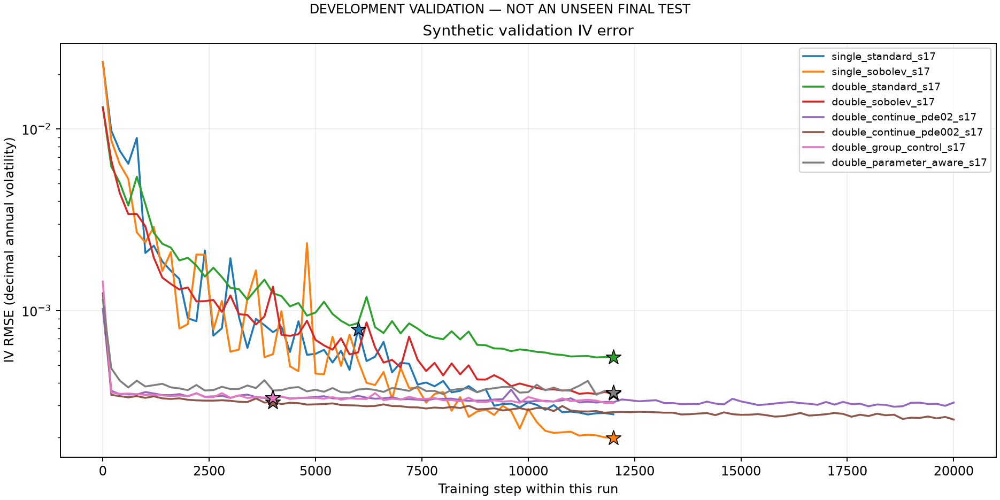
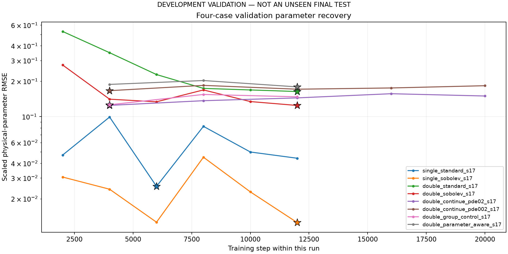

# Regular Heston PINN development evidence

**DEVELOPMENT VALIDATION — NOT AN UNSEEN FINAL TEST**

All results here use synthetic Heston development data. These four recovery-validation cases are repeatedly used to select checkpoints, so their scores do not establish unseen-test generalisation. Single and Double Heston each use their own generating model and parameter vectors; the model families are not fitted to a common NSE dataset in this report.

The regular PINN learns a smooth implied-total-variance function constrained by the pricing PDE. Inverse calibration optimizes the frozen network's IV predictions. Exact Fourier prices supply synthetic targets and training sensitivities; the calibration objective evaluates the neural network with its learned weights promoted to float64.

## Selected checkpoints

Each IV/recovery value below belongs to the selected checkpoint step. The latest recorded step is shown separately. An incomplete status means no completion artifact was found; this report does not inspect whether a process is running.

| Run | Status | Latest / selected step | Selected IV RMSE | Selected parameter RMSE | All-parameter cases passing |
|---|---|---:|---:|---:|---:|
| single_standard_s17 | complete | 12000 / 6000 | 0.00079039 | 0.025484 | 2/4 |
| single_sobolev_s17 | complete | 12000 / 12000 | 0.0001985 | 0.012533 | 4/4 |
| double_standard_s17 | complete | 12000 / 12000 | 0.00055274 | 0.16327 | 0/4 |
| double_sobolev_s17 | complete | 12000 / 12000 | 0.00034849 | 0.12426 | 0/4 |
| double_continue_pde02_s17 | complete | 20000 / 4000 | 0.00033 | 0.12449 | 0/4 |
| double_continue_pde002_s17 | complete | 20000 / 4000 | 0.00031362 | 0.166 | 0/4 |
| double_group_control_s17 | complete | 12000 / 4000 | 0.00033169 | 0.12595 | 0/4 |
| double_parameter_aware_s17 | complete | 12000 / 12000 | 0.00035518 | 0.17875 | 0/4 |

The case gate requires every positive parameter to be within 5% of its generating value and each correlation to be within 0.05 in absolute units. Optimizer success is recorded separately and does not imply that recovery passed. The training selection score divides positive-parameter errors by their true magnitudes and correlation errors by 0.5; it is therefore different from the gate.

## Training histories

Interpretation: lower IV error means the learned forward function matches synthetic option-implied volatility more closely. A star marks the selected checkpoint. This alone does not show that the inverse problem recovers its generating parameters.

Interpretation: lower values mean smaller parameter errors on the same four development surfaces. A star marks checkpoint selection. Repeated use of these cases makes this development evidence; independent final cases are required to assess reliability. Missing/nonfinite history values are counted in the summary and cannot appear on a logarithmic plot.

## Training data and continuation

| Run | Usable training / candidates | Usable IV validation | Collocation pool | Sensitivity weight | Resumed weights |
|---|---:|---:|---:|---:|---|
| single_standard_s17 | 131065 / 131072 | 16384 | 18000 | 0 | No |
| single_sobolev_s17 | 131065 / 131072 | 16384 | 18000 | 0.2 | No |
| double_standard_s17 | 131072 / 131072 | 16384 | 18000 | 0 | No |
| double_sobolev_s17 | 131072 / 131072 | 16384 | 18000 | 0.2 | No |
| double_continue_pde02_s17 | 131072 / 131072 | 16384 | 18000 | 0.2 | outputs/regular_pinn_recovery/double_sobolev_s17/model.safetensors |
| double_continue_pde002_s17 | 131072 / 131072 | 16384 | 18000 | 0.2 | outputs/regular_pinn_recovery/double_sobolev_s17/model.safetensors |
| double_group_control_s17 | 131072 / 131072 | 16384 | 18000 | 0.2 | outputs/regular_pinn_recovery/double_sobolev_s17/model.safetensors |
| double_parameter_aware_s17 | 131072 / 131072 | 16384 | 18000 | 0.2 | outputs/regular_pinn_recovery/double_sobolev_s17/model.safetensors |

A resumed run continues an existing set of network weights. It does not count as an independent initialization. Training uses AdamW weight decay, PDE/shape penalties, and optional parameter-sensitivity supervision; configuration files record their exact weights.

Grouped-surface runs additionally use 1,024 independent synthetic training parameter surfaces (126 quotes each, 129,024 extra quotes). The control and parameter-aware arm use identical extra data. Their parameter-aware weights are recorded in run_summary.csv. These labels are not supplied to the inverse calibrator. Double Heston factor 1 is stored as the slow factor and factor 2 as the fast factor throughout this experiment.

## Every selected validation parameter

The full machine-readable values are in [selected_parameter_details.csv](selected_parameter_details.csv). Gate units are absolute error divided by the allowed tolerance: values at or below 1 pass. The signed scaled-error column uses the training selection scale described above.

single_standard_s17: all selected parameter estimates

| Case | Factor | Parameter | Truth | Estimate | Signed scaled error | Gate units | Pass |
|---:|---:|---|---:|---:|---:|---:|---|
| 0 | 1 | kappa | 0.8087271 | 0.8306549 | 0.027114 | 0.54228 | Yes |
| 0 | 1 | theta | 0.1915743 | 0.1907404 | -0.0043525 | 0.087049 | Yes |
| 0 | 1 | sigma | 0.4163759 | 0.4196022 | 0.0077483 | 0.15497 | Yes |
| 0 | 1 | rho | -0.559658 | -0.5641436 | -0.0089713 | 0.089713 | Yes |
| 0 | 1 | v0 | 0.1030049 | 0.1034325 | 0.0041509 | 0.083019 | Yes |
| 1 | 1 | kappa | 4.732737 | 4.765892 | 0.0070053 | 0.14011 | Yes |
| 1 | 1 | theta | 0.05442037 | 0.05475351 | 0.0061216 | 0.12243 | Yes |
| 1 | 1 | sigma | 0.1932664 | 0.2052857 | 0.062191 | 1.2438 | No |
| 1 | 1 | rho | 0.007835175 | 0.002462308 | -0.010746 | 0.10746 | Yes |
| 1 | 1 | v0 | 0.1207404 | 0.120926 | 0.001537 | 0.03074 | Yes |
| 2 | 1 | kappa | 0.8074826 | 0.7885015 | -0.023506 | 0.47013 | Yes |
| 2 | 1 | theta | 0.08537082 | 0.08479666 | -0.0067254 | 0.13451 | Yes |
| 2 | 1 | sigma | 0.1043025 | 0.09631204 | -0.076609 | 1.5322 | No |
| 2 | 1 | rho | 0.02770397 | 0.02299496 | -0.009418 | 0.09418 | Yes |
| 2 | 1 | v0 | 0.123547 | 0.1236233 | 0.00061797 | 0.012359 | Yes |
| 3 | 1 | kappa | 1.051485 | 1.021901 | -0.028135 | 0.56271 | Yes |
| 3 | 1 | theta | 0.1704532 | 0.1739925 | 0.020764 | 0.41529 | Yes |
| 3 | 1 | sigma | 0.4387008 | 0.444639 | 0.013536 | 0.27072 | Yes |
| 3 | 1 | rho | 0.1149743 | 0.1130831 | -0.0037823 | 0.037823 | Yes |
| 3 | 1 | v0 | 0.06211292 | 0.06244611 | 0.0053642 | 0.10728 | Yes |

single_sobolev_s17: all selected parameter estimates

| Case | Factor | Parameter | Truth | Estimate | Signed scaled error | Gate units | Pass |
|---:|---:|---|---:|---:|---:|---:|---|
| 0 | 1 | kappa | 0.8087271 | 0.8113084 | 0.0031919 | 0.063838 | Yes |
| 0 | 1 | theta | 0.1915743 | 0.1909917 | -0.0030412 | 0.060823 | Yes |
| 0 | 1 | sigma | 0.4163759 | 0.4151102 | -0.0030399 | 0.060797 | Yes |
| 0 | 1 | rho | -0.559658 | -0.561207 | -0.003098 | 0.03098 | Yes |
| 0 | 1 | v0 | 0.1030049 | 0.1029598 | -0.00043762 | 0.0087524 | Yes |
| 1 | 1 | kappa | 4.732737 | 4.769938 | 0.0078602 | 0.1572 | Yes |
| 1 | 1 | theta | 0.05442037 | 0.05451292 | 0.0017008 | 0.034015 | Yes |
| 1 | 1 | sigma | 0.1932664 | 0.1957719 | 0.012964 | 0.25928 | Yes |
| 1 | 1 | rho | 0.007835175 | 0.009006316 | 0.0023423 | 0.023423 | Yes |
| 1 | 1 | v0 | 0.1207404 | 0.1208842 | 0.0011907 | 0.023815 | Yes |
| 2 | 1 | kappa | 0.8074826 | 0.817177 | 0.012006 | 0.24011 | Yes |
| 2 | 1 | theta | 0.08537082 | 0.0854254 | 0.0006393 | 0.012786 | Yes |
| 2 | 1 | sigma | 0.1043025 | 0.09919461 | -0.048972 | 0.97944 | Yes |
| 2 | 1 | rho | 0.02770397 | 0.02845563 | 0.0015033 | 0.015033 | Yes |
| 2 | 1 | v0 | 0.123547 | 0.1235816 | 0.00028009 | 0.0056019 | Yes |
| 3 | 1 | kappa | 1.051485 | 1.034074 | -0.016559 | 0.33117 | Yes |
| 3 | 1 | theta | 0.1704532 | 0.1714949 | 0.0061117 | 0.12223 | Yes |
| 3 | 1 | sigma | 0.4387008 | 0.4381223 | -0.0013186 | 0.026372 | Yes |
| 3 | 1 | rho | 0.1149743 | 0.1140118 | -0.0019249 | 0.019249 | Yes |
| 3 | 1 | v0 | 0.06211292 | 0.06217794 | 0.0010467 | 0.020934 | Yes |

double_standard_s17: all selected parameter estimates

| Case | Factor | Parameter | Truth | Estimate | Signed scaled error | Gate units | Pass |
|---:|---:|---|---:|---:|---:|---:|---|
| 0 | 1 | kappa | 1.649795 | 1.472286 | -0.10759 | 2.1519 | No |
| 0 | 1 | theta | 0.03939343 | 0.0431885 | 0.096338 | 1.9268 | No |
| 0 | 1 | sigma | 0.2058855 | 0.2124279 | 0.031777 | 0.63554 | Yes |
| 0 | 1 | rho | -0.2464467 | -0.1882223 | 0.11645 | 1.1645 | No |
| 0 | 1 | v0 | 0.01845716 | 0.02271862 | 0.23088 | 4.6177 | No |
| 0 | 2 | kappa | 6.96594 | 6.65108 | -0.0452 | 0.904 | Yes |
| 0 | 2 | theta | 0.04993438 | 0.046942 | -0.059926 | 1.1985 | No |
| 0 | 2 | sigma | 0.5779429 | 0.6046104 | 0.046142 | 0.92284 | Yes |
| 0 | 2 | rho | -0.007524568 | -0.005068187 | 0.0049128 | 0.049128 | Yes |
| 0 | 2 | v0 | 0.0333573 | 0.02912442 | -0.1269 | 2.5379 | No |
| 1 | 1 | kappa | 1.650889 | 1.683099 | 0.01951 | 0.39021 | Yes |
| 1 | 1 | theta | 0.04780292 | 0.04438719 | -0.071454 | 1.4291 | No |
| 1 | 1 | sigma | 0.1600093 | 0.1747814 | 0.09232 | 1.8464 | No |
| 1 | 1 | rho | -0.2751483 | -0.2767193 | -0.0031419 | 0.031419 | Yes |
| 1 | 1 | v0 | 0.04971122 | 0.04714478 | -0.051627 | 1.0325 | No |
| 1 | 2 | kappa | 4.620667 | 4.42971 | -0.041327 | 0.82654 | Yes |
| 1 | 2 | theta | 0.03638423 | 0.0396592 | 0.090011 | 1.8002 | No |
| 1 | 2 | sigma | 0.1686148 | 0.08891757 | -0.47266 | 9.4532 | No |
| 1 | 2 | rho | -0.1250234 | -0.1657521 | -0.081457 | 0.81457 | Yes |
| 1 | 2 | v0 | 0.0202971 | 0.02285857 | 0.1262 | 2.524 | No |
| 2 | 1 | kappa | 0.9412414 | 0.8471275 | -0.099989 | 1.9998 | No |
| 2 | 1 | theta | 0.0170392 | 0.01489537 | -0.12582 | 2.5164 | No |
| 2 | 1 | sigma | 0.0964517 | 0.07233518 | -0.25004 | 5.0007 | No |
| 2 | 1 | rho | -0.5605928 | -0.6898817 | -0.25858 | 2.5858 | No |
| 2 | 1 | v0 | 0.03324041 | 0.03132049 | -0.057759 | 1.1552 | No |
| 2 | 2 | kappa | 6.113868 | 6.219192 | 0.017227 | 0.34454 | Yes |
| 2 | 2 | theta | 0.03023963 | 0.03161712 | 0.045552 | 0.91104 | Yes |
| 2 | 2 | sigma | 0.1975487 | 0.242337 | 0.22672 | 4.5344 | No |
| 2 | 2 | rho | -0.04455256 | -0.09811555 | -0.10713 | 1.0713 | No |
| 2 | 2 | v0 | 0.0148063 | 0.01666912 | 0.12581 | 2.5163 | No |
| 3 | 1 | kappa | 0.331245 | 0.2590293 | -0.21801 | 4.3603 | No |
| 3 | 1 | theta | 0.04721769 | 0.06189065 | 0.31075 | 6.215 | No |
| 3 | 1 | sigma | 0.09961979 | 0.07467419 | -0.25041 | 5.0082 | No |
| 3 | 1 | rho | -0.06578391 | -0.02879606 | 0.073976 | 0.73976 | Yes |
| 3 | 1 | v0 | 0.03544835 | 0.04733229 | 0.33525 | 6.7049 | No |
| 3 | 2 | kappa | 8.005495 | 8.09221 | 0.010832 | 0.21664 | Yes |
| 3 | 2 | theta | 0.03985632 | 0.02799287 | -0.29766 | 5.9531 | No |
| 3 | 2 | sigma | 0.3634601 | 0.3890244 | 0.070336 | 1.4067 | No |
| 3 | 2 | rho | 0.2812903 | 0.3150603 | 0.06754 | 0.6754 | Yes |
| 3 | 2 | v0 | 0.08637276 | 0.07455027 | -0.13688 | 2.7375 | No |

double_sobolev_s17: all selected parameter estimates

| Case | Factor | Parameter | Truth | Estimate | Signed scaled error | Gate units | Pass |
|---:|---:|---|---:|---:|---:|---:|---|
| 0 | 1 | kappa | 1.649795 | 1.8093 | 0.096682 | 1.9336 | No |
| 0 | 1 | theta | 0.03939343 | 0.03930105 | -0.0023451 | 0.046902 | Yes |
| 0 | 1 | sigma | 0.2058855 | 0.2770408 | 0.34561 | 6.9121 | No |
| 0 | 1 | rho | -0.2464467 | -0.2008201 | 0.091253 | 0.91253 | Yes |
| 0 | 1 | v0 | 0.01845716 | 0.01627565 | -0.11819 | 2.3639 | No |
| 0 | 2 | kappa | 6.96594 | 7.686003 | 0.10337 | 2.0674 | No |
| 0 | 2 | theta | 0.04993438 | 0.04992448 | -0.00019833 | 0.0039665 | Yes |
| 0 | 2 | sigma | 0.5779429 | 0.5646666 | -0.022972 | 0.45943 | Yes |
| 0 | 2 | rho | -0.007524568 | -0.008954089 | -0.002859 | 0.02859 | Yes |
| 0 | 2 | v0 | 0.0333573 | 0.03554895 | 0.065702 | 1.314 | No |
| 1 | 1 | kappa | 1.650889 | 1.328145 | -0.1955 | 3.9099 | No |
| 1 | 1 | theta | 0.04780292 | 0.03885968 | -0.18709 | 3.7417 | No |
| 1 | 1 | sigma | 0.1600093 | 0.1578023 | -0.013793 | 0.27587 | Yes |
| 1 | 1 | rho | -0.2751483 | -0.2775395 | -0.0047824 | 0.047824 | Yes |
| 1 | 1 | v0 | 0.04971122 | 0.040495 | -0.1854 | 3.7079 | No |
| 1 | 2 | kappa | 4.620667 | 4.613913 | -0.0014616 | 0.029232 | Yes |
| 1 | 2 | theta | 0.03638423 | 0.04537536 | 0.24712 | 4.9423 | No |
| 1 | 2 | sigma | 0.1686148 | 0.1709038 | 0.013575 | 0.2715 | Yes |
| 1 | 2 | rho | -0.1250234 | -0.1672165 | -0.084386 | 0.84386 | Yes |
| 1 | 2 | v0 | 0.0202971 | 0.0294741 | 0.45213 | 9.0427 | No |
| 2 | 1 | kappa | 0.9412414 | 0.8936113 | -0.050603 | 1.0121 | No |
| 2 | 1 | theta | 0.0170392 | 0.01550357 | -0.090123 | 1.8025 | No |
| 2 | 1 | sigma | 0.0964517 | 0.1021539 | 0.05912 | 1.1824 | No |
| 2 | 1 | rho | -0.5605928 | -0.5652586 | -0.0093316 | 0.093316 | Yes |
| 2 | 1 | v0 | 0.03324041 | 0.03151174 | -0.052005 | 1.0401 | No |
| 2 | 2 | kappa | 6.113868 | 6.21674 | 0.016826 | 0.33652 | Yes |
| 2 | 2 | theta | 0.03023963 | 0.03161097 | 0.045349 | 0.90698 | Yes |
| 2 | 2 | sigma | 0.1975487 | 0.1749832 | -0.11423 | 2.2845 | No |
| 2 | 2 | rho | -0.04455256 | -0.04257038 | 0.0039644 | 0.039644 | Yes |
| 2 | 2 | v0 | 0.0148063 | 0.01649961 | 0.11436 | 2.2873 | No |
| 3 | 1 | kappa | 0.331245 | 0.3532944 | 0.066565 | 1.3313 | No |
| 3 | 1 | theta | 0.04721769 | 0.04950239 | 0.048386 | 0.96773 | Yes |
| 3 | 1 | sigma | 0.09961979 | 0.108208 | 0.086209 | 1.7242 | No |
| 3 | 1 | rho | -0.06578391 | -0.04916233 | 0.033243 | 0.33243 | Yes |
| 3 | 1 | v0 | 0.03544835 | 0.03775219 | 0.064992 | 1.2998 | No |
| 3 | 2 | kappa | 8.005495 | 7.98997 | -0.0019392 | 0.038785 | Yes |
| 3 | 2 | theta | 0.03985632 | 0.03748938 | -0.059387 | 1.1877 | No |
| 3 | 2 | sigma | 0.3634601 | 0.3556283 | -0.021548 | 0.43096 | Yes |
| 3 | 2 | rho | 0.2812903 | 0.2941989 | 0.025817 | 0.25817 | Yes |
| 3 | 2 | v0 | 0.08637276 | 0.08406193 | -0.026754 | 0.53508 | Yes |

double_continue_pde02_s17: all selected parameter estimates

| Case | Factor | Parameter | Truth | Estimate | Signed scaled error | Gate units | Pass |
|---:|---:|---|---:|---:|---:|---:|---|
| 0 | 1 | kappa | 1.649795 | 1.798537 | 0.090158 | 1.8032 | No |
| 0 | 1 | theta | 0.03939343 | 0.0389867 | -0.010325 | 0.20649 | Yes |
| 0 | 1 | sigma | 0.2058855 | 0.2790242 | 0.35524 | 7.1048 | No |
| 0 | 1 | rho | -0.2464467 | -0.1925133 | 0.10787 | 1.0787 | No |
| 0 | 1 | v0 | 0.01845716 | 0.01612234 | -0.1265 | 2.53 | No |
| 0 | 2 | kappa | 6.96594 | 7.648346 | 0.097963 | 1.9593 | No |
| 0 | 2 | theta | 0.04993438 | 0.05020734 | 0.0054662 | 0.10932 | Yes |
| 0 | 2 | sigma | 0.5779429 | 0.5623168 | -0.027037 | 0.54075 | Yes |
| 0 | 2 | rho | -0.007524568 | -0.01070147 | -0.0063538 | 0.063538 | Yes |
| 0 | 2 | v0 | 0.0333573 | 0.03567639 | 0.069523 | 1.3905 | No |
| 1 | 1 | kappa | 1.650889 | 1.278729 | -0.22543 | 4.5086 | No |
| 1 | 1 | theta | 0.04780292 | 0.03974047 | -0.16866 | 3.3732 | No |
| 1 | 1 | sigma | 0.1600093 | 0.1591314 | -0.0054869 | 0.10974 | Yes |
| 1 | 1 | rho | -0.2751483 | -0.2477433 | 0.05481 | 0.5481 | Yes |
| 1 | 1 | v0 | 0.04971122 | 0.04111375 | -0.17295 | 3.459 | No |
| 1 | 2 | kappa | 4.620667 | 4.673422 | 0.011417 | 0.22834 | Yes |
| 1 | 2 | theta | 0.03638423 | 0.04452622 | 0.22378 | 4.4756 | No |
| 1 | 2 | sigma | 0.1686148 | 0.1618991 | -0.039829 | 0.79658 | Yes |
| 1 | 2 | rho | -0.1250234 | -0.2106412 | -0.17124 | 1.7124 | No |
| 1 | 2 | v0 | 0.0202971 | 0.02886204 | 0.42198 | 8.4396 | No |
| 2 | 1 | kappa | 0.9412414 | 0.9175615 | -0.025158 | 0.50316 | Yes |
| 2 | 1 | theta | 0.0170392 | 0.01610071 | -0.055078 | 1.1016 | No |
| 2 | 1 | sigma | 0.0964517 | 0.1006148 | 0.043163 | 0.86325 | Yes |
| 2 | 1 | rho | -0.5605928 | -0.5589816 | 0.0032226 | 0.032226 | Yes |
| 2 | 1 | v0 | 0.03324041 | 0.03212055 | -0.03369 | 0.67379 | Yes |
| 2 | 2 | kappa | 6.113868 | 6.206348 | 0.015126 | 0.30253 | Yes |
| 2 | 2 | theta | 0.03023963 | 0.03114357 | 0.029892 | 0.59785 | Yes |
| 2 | 2 | sigma | 0.1975487 | 0.1708104 | -0.13535 | 2.707 | No |
| 2 | 2 | rho | -0.04455256 | -0.04835595 | -0.0076068 | 0.076068 | Yes |
| 2 | 2 | v0 | 0.0148063 | 0.01588855 | 0.073094 | 1.4619 | No |
| 3 | 1 | kappa | 0.331245 | 0.3700587 | 0.11717 | 2.3435 | No |
| 3 | 1 | theta | 0.04721769 | 0.04840778 | 0.025204 | 0.50409 | Yes |
| 3 | 1 | sigma | 0.09961979 | 0.1124475 | 0.12877 | 2.5753 | No |
| 3 | 1 | rho | -0.06578391 | -0.04939089 | 0.032786 | 0.32786 | Yes |
| 3 | 1 | v0 | 0.03544835 | 0.03694627 | 0.042256 | 0.84513 | Yes |
| 3 | 2 | kappa | 8.005495 | 7.984607 | -0.0026092 | 0.052184 | Yes |
| 3 | 2 | theta | 0.03985632 | 0.03824958 | -0.040313 | 0.80627 | Yes |
| 3 | 2 | sigma | 0.3634601 | 0.3453422 | -0.049849 | 0.99697 | Yes |
| 3 | 2 | rho | 0.2812903 | 0.3003306 | 0.03808 | 0.3808 | Yes |
| 3 | 2 | v0 | 0.08637276 | 0.08478093 | -0.01843 | 0.36859 | Yes |

double_continue_pde002_s17: all selected parameter estimates

| Case | Factor | Parameter | Truth | Estimate | Signed scaled error | Gate units | Pass |
|---:|---:|---|---:|---:|---:|---:|---|
| 0 | 1 | kappa | 1.649795 | 1.774388 | 0.075521 | 1.5104 | No |
| 0 | 1 | theta | 0.03939343 | 0.03795626 | -0.036482 | 0.72965 | Yes |
| 0 | 1 | sigma | 0.2058855 | 0.278039 | 0.35045 | 7.0091 | No |
| 0 | 1 | rho | -0.2464467 | -0.2010258 | 0.090842 | 0.90842 | Yes |
| 0 | 1 | v0 | 0.01845716 | 0.01541098 | -0.16504 | 3.3008 | No |
| 0 | 2 | kappa | 6.96594 | 7.529267 | 0.080869 | 1.6174 | No |
| 0 | 2 | theta | 0.04993438 | 0.05121201 | 0.025586 | 0.51172 | Yes |
| 0 | 2 | sigma | 0.5779429 | 0.5555051 | -0.038824 | 0.77647 | Yes |
| 0 | 2 | rho | -0.007524568 | -0.01039021 | -0.0057313 | 0.057313 | Yes |
| 0 | 2 | v0 | 0.0333573 | 0.03639526 | 0.091073 | 1.8215 | No |
| 1 | 1 | kappa | 1.650889 | 1.265867 | -0.23322 | 4.6644 | No |
| 1 | 1 | theta | 0.04780292 | 0.03750401 | -0.21545 | 4.3089 | No |
| 1 | 1 | sigma | 0.1600093 | 0.1588901 | -0.0069945 | 0.13989 | Yes |
| 1 | 1 | rho | -0.2751483 | -0.2612408 | 0.027815 | 0.27815 | Yes |
| 1 | 1 | v0 | 0.04971122 | 0.03886357 | -0.21821 | 4.3643 | No |
| 1 | 2 | kappa | 4.620667 | 4.686439 | 0.014234 | 0.28469 | Yes |
| 1 | 2 | theta | 0.03638423 | 0.04670879 | 0.28376 | 5.6753 | No |
| 1 | 2 | sigma | 0.1686148 | 0.175465 | 0.040626 | 0.81252 | Yes |
| 1 | 2 | rho | -0.1250234 | -0.1839389 | -0.11783 | 1.1783 | No |
| 1 | 2 | v0 | 0.0202971 | 0.03108349 | 0.53142 | 10.628 | No |
| 2 | 1 | kappa | 0.9412414 | 0.9321707 | -0.0096369 | 0.19274 | Yes |
| 2 | 1 | theta | 0.0170392 | 0.01358789 | -0.20255 | 4.051 | No |
| 2 | 1 | sigma | 0.0964517 | 0.09409049 | -0.024481 | 0.48961 | Yes |
| 2 | 1 | rho | -0.5605928 | -0.7017925 | -0.2824 | 2.824 | No |
| 2 | 1 | v0 | 0.03324041 | 0.0295626 | -0.11064 | 2.2129 | No |
| 2 | 2 | kappa | 6.113868 | 6.233397 | 0.019551 | 0.39101 | Yes |
| 2 | 2 | theta | 0.03023963 | 0.0336917 | 0.11416 | 2.2831 | No |
| 2 | 2 | sigma | 0.1975487 | 0.1673837 | -0.1527 | 3.0539 | No |
| 2 | 2 | rho | -0.04455256 | 0.006843189 | 0.10279 | 1.0279 | No |
| 2 | 2 | v0 | 0.0148063 | 0.01840837 | 0.24328 | 4.8656 | No |
| 3 | 1 | kappa | 0.331245 | 0.446144 | 0.34687 | 6.9374 | No |
| 3 | 1 | theta | 0.04721769 | 0.04772192 | 0.010679 | 0.21358 | Yes |
| 3 | 1 | sigma | 0.09961979 | 0.113689 | 0.14123 | 2.8246 | No |
| 3 | 1 | rho | -0.06578391 | -0.04988358 | 0.031801 | 0.31801 | Yes |
| 3 | 1 | v0 | 0.03544835 | 0.03759421 | 0.060535 | 1.2107 | No |
| 3 | 2 | kappa | 8.005495 | 7.955283 | -0.0062722 | 0.12544 | Yes |
| 3 | 2 | theta | 0.03985632 | 0.03744591 | -0.060478 | 1.2096 | No |
| 3 | 2 | sigma | 0.3634601 | 0.3509408 | -0.034445 | 0.68889 | Yes |
| 3 | 2 | rho | 0.2812903 | 0.2982098 | 0.033839 | 0.33839 | Yes |
| 3 | 2 | v0 | 0.08637276 | 0.08411279 | -0.026165 | 0.52331 | Yes |

double_group_control_s17: all selected parameter estimates

| Case | Factor | Parameter | Truth | Estimate | Signed scaled error | Gate units | Pass |
|---:|---:|---|---:|---:|---:|---:|---|
| 0 | 1 | kappa | 1.649795 | 1.775206 | 0.076016 | 1.5203 | No |
| 0 | 1 | theta | 0.03939343 | 0.03861757 | -0.019695 | 0.3939 | Yes |
| 0 | 1 | sigma | 0.2058855 | 0.2783694 | 0.35206 | 7.0412 | No |
| 0 | 1 | rho | -0.2464467 | -0.2006207 | 0.091652 | 0.91652 | Yes |
| 0 | 1 | v0 | 0.01845716 | 0.01579678 | -0.14414 | 2.8828 | No |
| 0 | 2 | kappa | 6.96594 | 7.621115 | 0.094054 | 1.8811 | No |
| 0 | 2 | theta | 0.04993438 | 0.05066354 | 0.014602 | 0.29205 | Yes |
| 0 | 2 | sigma | 0.5779429 | 0.5588725 | -0.032997 | 0.65994 | Yes |
| 0 | 2 | rho | -0.007524568 | -0.01133597 | -0.0076228 | 0.076228 | Yes |
| 0 | 2 | v0 | 0.0333573 | 0.03600724 | 0.079441 | 1.5888 | No |
| 1 | 1 | kappa | 1.650889 | 1.284599 | -0.22187 | 4.4375 | No |
| 1 | 1 | theta | 0.04780292 | 0.03961435 | -0.1713 | 3.426 | No |
| 1 | 1 | sigma | 0.1600093 | 0.1541067 | -0.036889 | 0.73778 | Yes |
| 1 | 1 | rho | -0.2751483 | -0.264092 | 0.022113 | 0.22113 | Yes |
| 1 | 1 | v0 | 0.04971122 | 0.04093846 | -0.17647 | 3.5295 | No |
| 1 | 2 | kappa | 4.620667 | 4.688916 | 0.014771 | 0.29541 | Yes |
| 1 | 2 | theta | 0.03638423 | 0.04464329 | 0.227 | 4.5399 | No |
| 1 | 2 | sigma | 0.1686148 | 0.1831034 | 0.085927 | 1.7185 | No |
| 1 | 2 | rho | -0.1250234 | -0.1822717 | -0.1145 | 1.145 | No |
| 1 | 2 | v0 | 0.0202971 | 0.02901671 | 0.4296 | 8.592 | No |
| 2 | 1 | kappa | 0.9412414 | 0.9199718 | -0.022597 | 0.45195 | Yes |
| 2 | 1 | theta | 0.0170392 | 0.01574723 | -0.075823 | 1.5165 | No |
| 2 | 1 | sigma | 0.0964517 | 0.09778026 | 0.013774 | 0.27549 | Yes |
| 2 | 1 | rho | -0.5605928 | -0.5940627 | -0.06694 | 0.6694 | Yes |
| 2 | 1 | v0 | 0.03324041 | 0.03175106 | -0.044805 | 0.8961 | Yes |
| 2 | 2 | kappa | 6.113868 | 6.209769 | 0.015686 | 0.31372 | Yes |
| 2 | 2 | theta | 0.03023963 | 0.03149548 | 0.04153 | 0.83059 | Yes |
| 2 | 2 | sigma | 0.1975487 | 0.1858563 | -0.059187 | 1.1837 | No |
| 2 | 2 | rho | -0.04455256 | -0.03396633 | 0.021172 | 0.21172 | Yes |
| 2 | 2 | v0 | 0.0148063 | 0.0162468 | 0.09729 | 1.9458 | No |
| 3 | 1 | kappa | 0.331245 | 0.384213 | 0.15991 | 3.1981 | No |
| 3 | 1 | theta | 0.04721769 | 0.04920033 | 0.041989 | 0.83979 | Yes |
| 3 | 1 | sigma | 0.09961979 | 0.1139898 | 0.14425 | 2.885 | No |
| 3 | 1 | rho | -0.06578391 | -0.05102552 | 0.029517 | 0.29517 | Yes |
| 3 | 1 | v0 | 0.03544835 | 0.03792474 | 0.069859 | 1.3972 | No |
| 3 | 2 | kappa | 8.005495 | 7.969426 | -0.0045056 | 0.090111 | Yes |
| 3 | 2 | theta | 0.03985632 | 0.03720752 | -0.066459 | 1.3292 | No |
| 3 | 2 | sigma | 0.3634601 | 0.3494235 | -0.038619 | 0.77238 | Yes |
| 3 | 2 | rho | 0.2812903 | 0.2998088 | 0.037037 | 0.37037 | Yes |
| 3 | 2 | v0 | 0.08637276 | 0.08381182 | -0.02965 | 0.593 | Yes |

double_parameter_aware_s17: all selected parameter estimates

| Case | Factor | Parameter | Truth | Estimate | Signed scaled error | Gate units | Pass |
|---:|---:|---|---:|---:|---:|---:|---|
| 0 | 1 | kappa | 1.649795 | 1.81204 | 0.098343 | 1.9669 | No |
| 0 | 1 | theta | 0.03939343 | 0.04410867 | 0.1197 | 2.3939 | No |
| 0 | 1 | sigma | 0.2058855 | 0.2445381 | 0.18774 | 3.7548 | No |
| 0 | 1 | rho | -0.2464467 | -0.2123511 | 0.068191 | 0.68191 | Yes |
| 0 | 1 | v0 | 0.01845716 | 0.02145095 | 0.1622 | 3.244 | No |
| 0 | 2 | kappa | 6.96594 | 7.550374 | 0.083899 | 1.678 | No |
| 0 | 2 | theta | 0.04993438 | 0.04503537 | -0.098109 | 1.9622 | No |
| 0 | 2 | sigma | 0.5779429 | 0.6007655 | 0.039489 | 0.78979 | Yes |
| 0 | 2 | rho | -0.007524568 | 0.001881599 | 0.018812 | 0.18812 | Yes |
| 0 | 2 | v0 | 0.0333573 | 0.0303482 | -0.090208 | 1.8042 | No |
| 1 | 1 | kappa | 1.650889 | 1.214101 | -0.26458 | 5.2916 | No |
| 1 | 1 | theta | 0.04780292 | 0.04218835 | -0.11745 | 2.349 | No |
| 1 | 1 | sigma | 0.1600093 | 0.1582563 | -0.010956 | 0.21911 | Yes |
| 1 | 1 | rho | -0.2751483 | -0.2187584 | 0.11278 | 1.1278 | No |
| 1 | 1 | v0 | 0.04971122 | 0.04315312 | -0.13192 | 2.6385 | No |
| 1 | 2 | kappa | 4.620667 | 4.700526 | 0.017283 | 0.34566 | Yes |
| 1 | 2 | theta | 0.03638423 | 0.04229602 | 0.16248 | 3.2496 | No |
| 1 | 2 | sigma | 0.1686148 | 0.1733711 | 0.028208 | 0.56415 | Yes |
| 1 | 2 | rho | -0.1250234 | -0.2444861 | -0.23893 | 2.3893 | No |
| 1 | 2 | v0 | 0.0202971 | 0.02676658 | 0.31874 | 6.3748 | No |
| 2 | 1 | kappa | 0.9412414 | 0.8992982 | -0.044562 | 0.89123 | Yes |
| 2 | 1 | theta | 0.0170392 | 0.01318095 | -0.22643 | 4.5287 | No |
| 2 | 1 | sigma | 0.0964517 | 0.09492413 | -0.015838 | 0.31675 | Yes |
| 2 | 1 | rho | -0.5605928 | -0.6900302 | -0.25887 | 2.5887 | No |
| 2 | 1 | v0 | 0.03324041 | 0.02900112 | -0.12753 | 2.5507 | No |
| 2 | 2 | kappa | 6.113868 | 6.226328 | 0.018394 | 0.36788 | Yes |
| 2 | 2 | theta | 0.03023963 | 0.03408565 | 0.12718 | 2.5437 | No |
| 2 | 2 | sigma | 0.1975487 | 0.1754513 | -0.11186 | 2.2372 | No |
| 2 | 2 | rho | -0.04455256 | -0.01017677 | 0.068752 | 0.68752 | Yes |
| 2 | 2 | v0 | 0.0148063 | 0.01897783 | 0.28174 | 5.6348 | No |
| 3 | 1 | kappa | 0.331245 | 0.5658262 | 0.70818 | 14.164 | No |
| 3 | 1 | theta | 0.04721769 | 0.05083603 | 0.076631 | 1.5326 | No |
| 3 | 1 | sigma | 0.09961979 | 0.1163126 | 0.16756 | 3.3513 | No |
| 3 | 1 | rho | -0.06578391 | -0.03853679 | 0.054494 | 0.54494 | Yes |
| 3 | 1 | v0 | 0.03544835 | 0.04189957 | 0.18199 | 3.6398 | No |
| 3 | 2 | kappa | 8.005495 | 7.953184 | -0.0065344 | 0.13069 | Yes |
| 3 | 2 | theta | 0.03985632 | 0.0330397 | -0.17103 | 3.4206 | No |
| 3 | 2 | sigma | 0.3634601 | 0.359476 | -0.010962 | 0.21923 | Yes |
| 3 | 2 | rho | 0.2812903 | 0.3137035 | 0.064826 | 0.64826 | Yes |
| 3 | 2 | v0 | 0.08637276 | 0.07978928 | -0.076222 | 1.5244 | No |

## Reproducibility

[evidence.json](evidence.json) contains the input snapshots, selected-checkpoint hashes, training manifests and exact report inputs. [run_summary.csv](run_summary.csv) and [selected_case_gates.csv](selected_case_gates.csv) retain run and case-level outcomes, including missing or failed recovery records.
