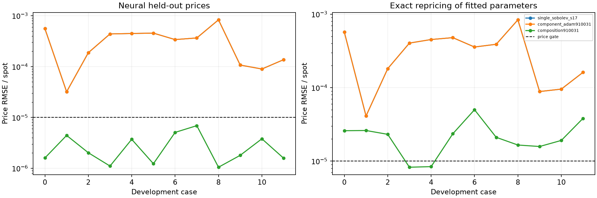
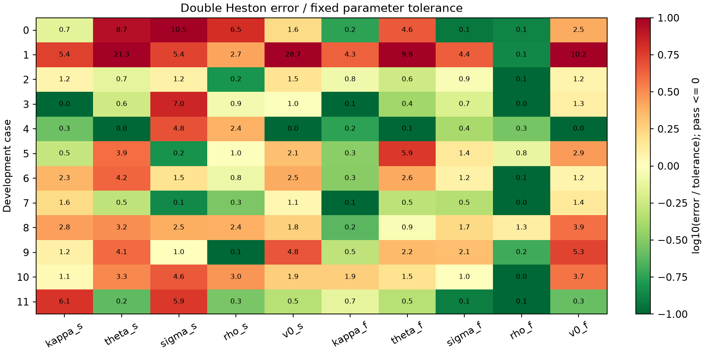

# Compositional Double Heston PINN — development results

This is an exposed synthetic pilot, not an unseen or real-market performance claim.

## Results

| Model | All parameters | Individual DH gates | Neural price gate | Exact repricing gate |
|---|---:|---:|---:|---:|
| single_sobolev_s17 | N/A | N/A | 0/12 | 0/12 |
| component_adam910031 | N/A | N/A | 0/12 | 0/12 |
| composition910031 | 0/12 | 57/120 | 12/12 | 2/12 |

Single Heston has no matching five-parameter truth on these Double Heston surfaces. A lower pricing error does not demonstrate accurate ten-parameter recovery.

Interpretation: lower is better. Left measures the fitted neural function; right checks whether its recovered parameters also price accurately in the independent reference engine. The dashed line is the unchanged 1e-5-of-spot gate.

Interpretation: each cell is error divided by its allowed tolerance. Values <=1 pass; a case succeeds only if all ten cells pass. Display color limits do not cap printed errors.

## Paired pricing comparison

- composition910031 vs single_sobolev_s17, neural: Double wins 12/12; valid pairs 12; median Double/Single RMSE ratio 0.011192576084281241.
- composition910031 vs single_sobolev_s17, exact_repricing: Double wins 12/12; valid pairs 12; median Double/Single RMSE ratio 0.09077178576436545.
- composition910031 vs component_adam910031, neural: Double wins 12/12; valid pairs 12; median Double/Single RMSE ratio 0.011192576084281241.
- composition910031 vs component_adam910031, exact_repricing: Double wins 12/12; valid pairs 12; median Double/Single RMSE ratio 0.09077178576436545.

## What changed and what training achieved

Two evaluations of a shared Single Heston price-PDE PINN are combined through the independent-return convolution identity. Density is obtained by automatic price derivatives. Fixed 96-node quadrature is differentiable. No exact Heston pricer, ODE solver, density clipping or normalization enters calibration. This is a separately labelled component-PDE architecture, not direct full Double Heston PDE training.

The broader-domain continuation ran 5000 float64 AdamW steps with 18000 collocation points, 129840 usable synthetic training states and 16239 validation states. Selection chose step 0, validation IV RMSE 0.0003641528637. The initial learning rate was 1e-05, PDE weight 0.2. Step 0 remained best; the continuation did not improve validation and the selected weights are unchanged from the warm start. This also means the original narrower training-domain limitation persists despite the broader validation check.

Training targets are reference synthetic prices/IV corrections and parameter sensitivities, plus the component pricing PDE. Those are forward-training inputs; recovery-case truths are used only in assessment. All 1232 rejected training and 145 rejected validation reference candidates remain in the archives. No prediction failures were removed from the assessment denominators.

## Data and controls

Twelve already-exposed DH parameter vectors (truth seed 927931), each with 21 strikes from .8 to 1.2 of unit spot and six maturities: 30,60,90,180,365,730 days divided by365. These are normalized synthetic European calls with zero rate/carry; they are not NSE observations or a representation of currently available Indian stock expiries. Each case uses 84 calibration and 42 held-out quotes, identical across models.

All models use five blind LHS starts and at most 400 evaluations/start; selection uses calibration neural-IV SSE only. All starts and failures are retained. The three models completed with reference-pricer entry points blocked during every fit; case 0 was replayed across all starts with held-out coordinates/values replaced by NaN. The replay was identical excluding timings. This is a concrete isolation test, not a guarantee against every possible implementation issue. Source and weight hashes were rechecked. Parameter gates, scores and start selections were independently recomputed by this report script.

## Test scope

The 52 scoped regular/composition tests pass, including parameter Jacobians, reference composition, checkpoint roundtrip and guarded held-out isolation. The whole checkout is NOT fully passing: with the legacy Single source import path configured, the broader run has 629 passed,43 failed,1 skipped. Its archived XML lists missing historical market/evidence files, hash/runtime/schema mismatches, an unavailable openpyxl dependency and the old 1e-12 numerical fixture discrepancy. Three legacy dtype-sensitive training tests fail together but pass in isolation. No old fixture, recorded hash or gate was changed to conceal these failures.

## Limitations and next work

The twelve cases have informed development and cannot provide an unbiased final generalization estimate. There is one training lineage, no fresh noise cohort here, and only DH-generated comparison surfaces. Check density, martingale, factor-swap and quadrature diagnostics in every case JSON; they are reported without corrections. The finite Fourier reference aliases at extreme integration tails; the independent composition identity test uses converged 32/48-node rules, while the learned model uses 96 nodes and is audited at 128.

Further claims require improved component accuracy, all-ten recovery on the fixed development gates, then a frozen independent cohort covering both Single- and Double-generated surfaces, noisy quotes and independent training seeds. No universal identifiability or Single-Heston superiority claim follows from this pilot.

[Full parameters](PARAMETERS.md) · [Machine-readable audit](audit.json)
