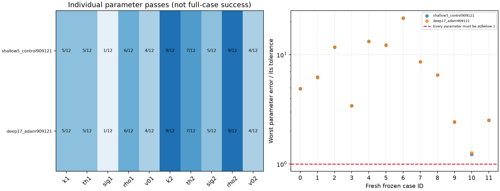
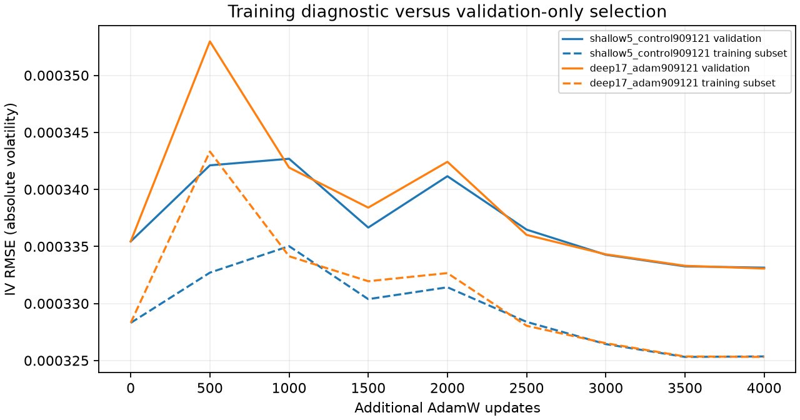

# Regular-PINN architecture and training comparison

One-use fresh synthetic Double Heston comparison. Cases were predeclared before evaluation and were not used for training or selection. Twelve central-domain cases are not broad reliability evidence.

| Checkpoint | Individual parameters | All ten | Neural price gate | Exact repricing | Joint |
|---|---:|---:|---:|---:|---:|
| shallow5_control909121 | 55/120 | 0/12 | 7/12 | 0/12 | 0/12 |
| deep17_adam909121 | 55/120 | 0/12 | 7/12 | 0/12 | 0/12 |

Interpretation: separate passing parameters do not add up to a successful case. A dot above 1 means at least one parameter failed its unchanged tolerance.

## Training and integrity

All models use the regular implied-variance price-PDE PINN, with architecture sizes explicitly listed below. Added residual blocks, where present, contain two tanh hidden layers each; the layer count is the longest path, including those branches. Training reuses 131,072 synthetic price/correction and parameter-derivative labels, 16,384 validation quotes and 18,000 collocation points. This is a conditional forward PINN followed by frozen-neural inverse calibration, not a direct parameter encoder. Synthetic sensitivity supervision is disclosed; prices and IV are not independent observations.

Each recovery case uses 21 strike/forward ratios (0.8–1.2) at 30, 60, 90, 180, 365 and 730 days divided by 365. Only 84 quotes enter fitting; 42 strikes are withheld. This is synthetic maturity coverage, not a claim about available NSE expiries. Eight positive parameters require <=5% relative error; two correlations require <=0.05 absolute error. Canonical storage is slow factor first.

Weights were selected solely by validation IV RMSE, including the initial checkpoint. Training-data hashes, source snapshots, selected tensors and the validation score were verified. Baseline truths, quotes and sixty blind starts are identical. Each actual fit was replayed after corrupting every held-out input while blocking six reference-pricer entry points: every fit field except elapsed time was identical. This is bounded leakage evidence, not a universal guarantee.

- shallow5_control909121: selected step 4000; validation IV RMSE 0.0003354423479 → 0.0003331412723; invalid assessed neural IV quotes: 0.
  Architecture: 5 hidden layers, width 160, 107,201 neural weights/biases (separate from the ten calibrated Heston parameters).
- deep17_adam909121: selected step 4000; validation IV RMSE 0.0003354423479 → 0.0003330637248; invalid assessed neural IV quotes: 0.
  Architecture: 17 hidden layers, width 160, 416,321 neural weights/biases (separate from the ten calibrated Heston parameters).

The shallow/deep pair has identical starting predictions, parent checkpoint, training settings, sampled-quote visit counts, collocation indices and fixed PDE weights. This comparison matches updates and data, not wall-clock time or compute. Neither arm is an independent restart.

Interpretation: solid lines are validation IV errors; dashed lines use a fixed 16,384-row training subset. A smaller IV error or a modest gap does not establish correct parameter recovery or absence of overfitting. Only solid-line minima select checkpoints.

## Limits and next work

No complete-case recovery should be claimed unless the all-ten and joint columns actually pass. Lower validation price/IV error alone is insufficient. These are warm starts, not independent initializations or a dtype-only causal ablation. Larger independent case sets, noise tests and a matched Single-Heston comparison remain necessary. A fresh sample used to inform later development becomes exposed and cannot be reused as an unseen test. No NSE, PostgreSQL or Kaggle data were changed.

[Full parameter table](PARAMETERS.md). Full fit/start records and input hashes are retained in audit.json.
