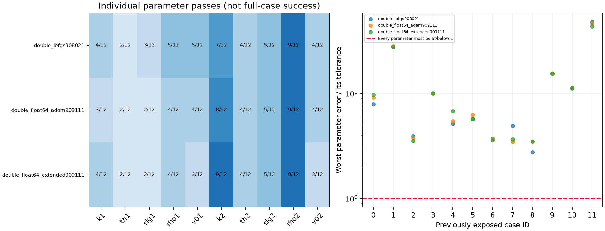

# Regular-PINN float64 continuation — development evidence

These are previously exposed synthetic Double Heston cases, not an unseen generalization test.

| Checkpoint | Individual parameters | All ten | Neural price gate | Exact repricing | Joint |
|---|---:|---:|---:|---:|---:|
| double_lbfgs908021 | 48/120 | 0/12 | 8/12 | 0/12 | 0/12 |
| double_float64_adam909111 | 45/120 | 0/12 | 8/12 | 0/12 | 0/12 |
| double_float64_extended909111 | 45/120 | 0/12 | 8/12 | 0/12 | 0/12 |

Interpretation: separate passing parameters do not add up to a successful case. A dot above 1 means at least one parameter failed its unchanged tolerance.

## Training and integrity

The architecture remains the regular five-hidden-layer, 160-unit tanh implied-variance price-PDE PINN. Training reuses 131,072 synthetic price/correction and parameter-derivative labels, 16,384 validation quotes and 18,000 collocation points. This is a conditional forward PINN followed by frozen-neural inverse calibration, not a direct parameter encoder. Synthetic sensitivity supervision is disclosed; prices and IV are not independent observations.

Each recovery case uses 21 strike/forward ratios (0.8–1.2) at 30, 60, 90, 180, 365 and 730 days divided by 365. Only 84 quotes enter fitting; 42 strikes are withheld. This is synthetic maturity coverage, not a claim about available NSE expiries. Eight positive parameters require <=5% relative error; two correlations require <=0.05 absolute error. Canonical storage is slow factor first.

Weights were selected solely by validation IV RMSE, including the initial checkpoint. Training-data hashes, source snapshots, selected tensors and the validation score were verified. Baseline truths, quotes and sixty blind starts are identical. Each actual fit was replayed after corrupting every held-out input while blocking six reference-pricer entry points: every fit field except elapsed time was identical. This is bounded leakage evidence, not a universal guarantee.

- double_float64_adam909111: selected step 1000; validation IV RMSE 0.0003484951214 → 0.0003410810733; invalid assessed neural IV quotes: 0.
- double_float64_extended909111: selected step 5000; validation IV RMSE 0.0003410810733 → 0.0003354423479; invalid assessed neural IV quotes: 0.

## Limits and next work

No complete-case recovery should be claimed unless the all-ten and joint columns actually pass. Lower validation price/IV error alone is insufficient. These are sequential warm starts, not independent initializations or a dtype-only causal ablation. Fresh sealed cases, noise tests and a matched Single-Heston comparison remain necessary. No NSE, PostgreSQL or Kaggle data were changed.

[Full parameter table](PARAMETERS.md). Full fit/start records and input hashes are retained in audit.json.
