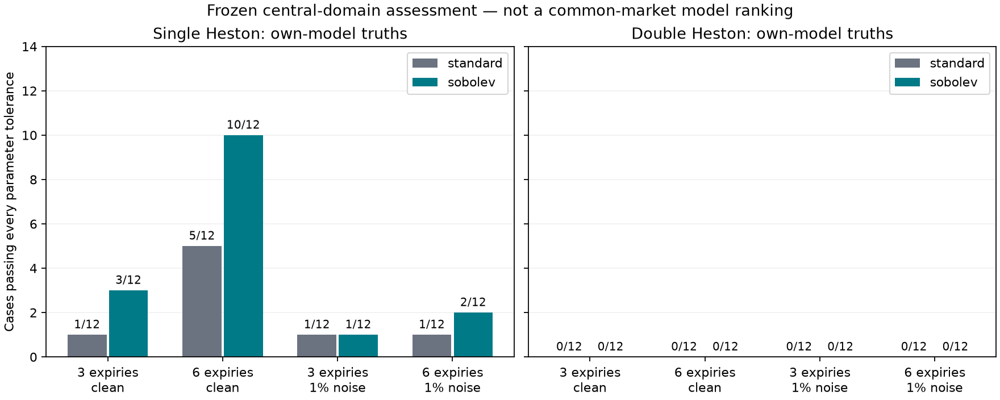
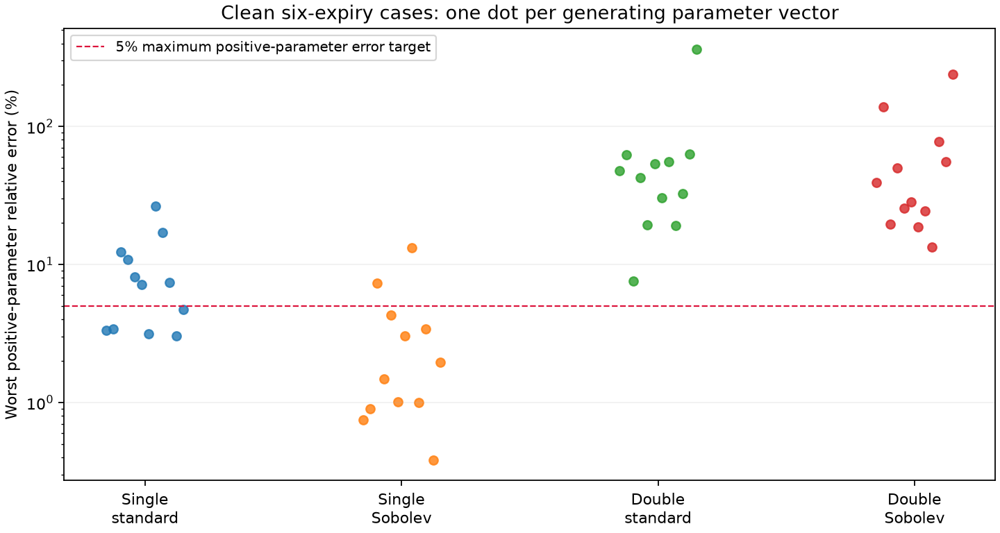

# Frozen regular-PINN assessment

Double Heston parameter recovery is **not achieved** in this experiment. Both frozen Double Heston variants failed the all-ten-parameter gate in every assessed condition. Neural price fitting alone must not be presented as parameter recovery.

The assessment contains 24 distinct new synthetic parameter vectors (12 Single and 12 Double), reused across clean/noisy and monthly/rich conditions. There are 192 neural model-condition fits and 960 recorded starting-point attempts, not that many independent truths. All four models use training seed 17.

## Results

| Model | Expiries | Noise | All parameters | Neural heldout prices | Exact repricing of fitted parameters | All gates |
|---|---|---:|---:|---:|---:|---:|
| double_sobolev_s17 | monthly | 0% | 0/12 | 12/12 | 4/12 | 0/12 |
| double_sobolev_s17 | monthly | 1% | 0/12 | 0/12 | 0/12 | 0/12 |
| double_sobolev_s17 | rich | 0% | 0/12 | 8/12 | 0/12 | 0/12 |
| double_sobolev_s17 | rich | 1% | 0/12 | 0/12 | 0/12 | 0/12 |
| double_standard_s17 | monthly | 0% | 0/12 | 12/12 | 0/12 | 0/12 |
| double_standard_s17 | monthly | 1% | 0/12 | 0/12 | 0/12 | 0/12 |
| double_standard_s17 | rich | 0% | 0/12 | 6/12 | 0/12 | 0/12 |
| double_standard_s17 | rich | 1% | 0/12 | 0/12 | 0/12 | 0/12 |
| single_sobolev_s17 | monthly | 0% | 3/12 | 12/12 | 8/12 | 2/12 |
| single_sobolev_s17 | monthly | 1% | 1/12 | 0/12 | 0/12 | 0/12 |
| single_sobolev_s17 | rich | 0% | 10/12 | 3/12 | 2/12 | 1/12 |
| single_sobolev_s17 | rich | 1% | 2/12 | 0/12 | 0/12 | 0/12 |
| single_standard_s17 | monthly | 0% | 1/12 | 10/12 | 1/12 | 0/12 |
| single_standard_s17 | monthly | 1% | 1/12 | 0/12 | 0/12 | 0/12 |
| single_standard_s17 | rich | 0% | 5/12 | 1/12 | 0/12 | 0/12 |
| single_standard_s17 | rich | 1% | 1/12 | 0/12 | 0/12 | 0/12 |

Parameter tolerances: each positive parameter within 5% of truth and each rho within 0.05. Price tolerance: heldout RMSE <=1e-5 of spot. Exact repricing is performed only after fitting the frozen neural network; it never refines the parameters. These are separate gates.

Interpretation: adding training sensitivities improves Single Heston recovery, especially with six expiries. It does not establish ten-parameter recovery for Double Heston. Short maturities and noise are harder.

Interpretation: each dot is an actual worst positive-parameter error, without aggregation into density bins. Points above 5% fail that part of the recovery target. Correlations have a separate absolute tolerance; all parameters are retained in the source CSV.

## Integrity and limits

All 15 automated artifact checks passed, including unique row keys, expected counts, recomputed gates, valid fitted parameters, minimum calibration-SSE start selection, frozen hashes and zero exact parameter overlap with training/validation. Selected optimizers reported convergence in 191/192 fits; convergence is not recovery. See [audit.json](audit.json).

Unit parameters are sampled in [0.1,0.9], only about 10.7% of the ten-dimensional training unit cube by volume. This is not full-boundary validation. One training initialization and 12 truths per family are insufficient for a broad reliability claim. No real NSE quotes were used or altered. The additional Black–Scholes rows are an analytic one-volatility pricing baseline, not a trained Black–Scholes PINN and not a DH parameter-recovery test. Single/Double own-model results do not establish which prices a common market dataset better.

Monthly means 30/60/90 days; rich adds 180/365/730 days. These are synthetic maturity scenarios, not a claim that all such NSE stock expiries exist. Tau is expiry-minus-trade days divided by 365. Noise is independent Gaussian with standard deviation 1% of option time value, without clipping/resampling. Every third strike is withheld.

## Evidence and continuation

- [All fitted parameters and truths](/Users/dhruvaambhaikar/Documents/Options%20pricing/double-heston-calibration/outputs/regular_pinn_recovery/locked_assessment_907931/parameter_recovery.csv)
- [All prices/metrics](/Users/dhruvaambhaikar/Documents/Options%20pricing/double-heston-calibration/outputs/regular_pinn_recovery/locked_assessment_907931/metrics.csv)
- [All starts and convergence records](/Users/dhruvaambhaikar/Documents/Options%20pricing/double-heston-calibration/outputs/regular_pinn_recovery/locked_assessment_907931/fits_and_starts.json)
- [Frozen manifest](/Users/dhruvaambhaikar/Documents/Options%20pricing/double-heston-calibration/outputs/regular_pinn_recovery/locked_assessment_907931/manifest.json)

This assessment must not be reused as unseen evidence for later model changes chosen after inspecting it. Keep all negative trials. A later iteration needs fresh assessment data, repeated training initializations and boundary/noise tests. Perfect or universally unique recovery has not been demonstrated.