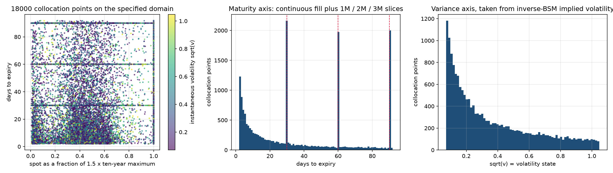
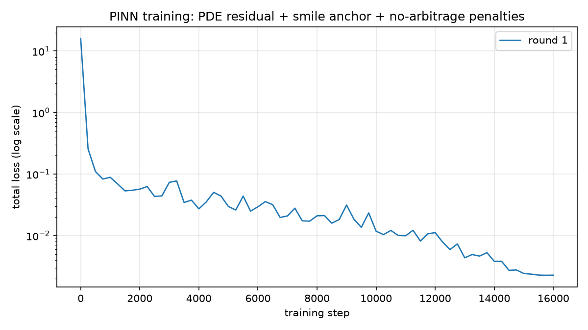
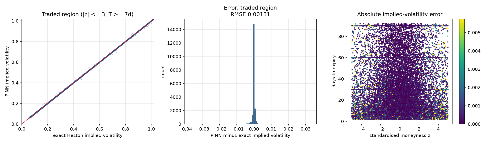
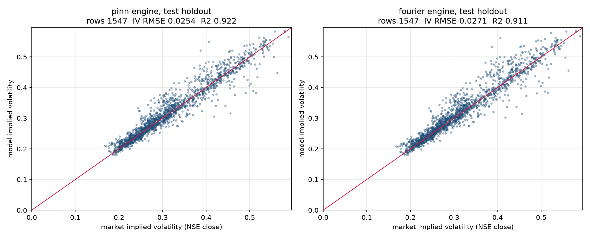
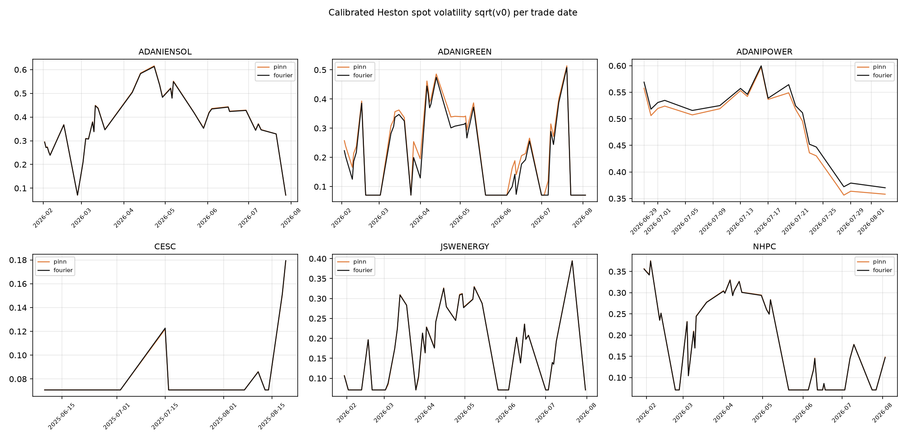

# Physics-informed calibration of the single Heston model on NSE power-sector options
Generated from `outputs/pinn_single_heston/`. Every number below is read back from an artifact in that directory; nothing is transcribed by hand.

## 0. Summary

A parameter-conditioned PINN was trained on 18000 collocation points over the domain the study specified, then used as the pricing engine inside the repository's existing single-Heston calibration protocol.

- **It solves the equation.** Against exact Heston over the traded region the network's implied volatility is accurate to 0.00204 RMSE (20.4 basis points) and its price to 6.5e-05 per unit strike. The PDE residual on the collocation set is 0.00184. No calendar-spread or butterfly arbitrage anywhere on that set, and 0 no-arbitrage violations in 40,000 independent price tests.
- **The physics is doing the work.** With price supervision switched off entirely -- PDE residual and no-arbitrage penalties only, no exact price ever shown to the network -- the traded-region error is 0.00334 RMSE (33.4 bp). The smile anchor improves that by about 1.6x but is not what makes it work.
- **It reconstructs market surfaces as well as exact Heston, much faster.** On the same 1,547 chronological test-holdout quotes the PINN reaches 0.02541 implied-volatility RMSE against 0.02710 for exact Fourier Heston and 0.02811 for the repository's published baseline. Both engines land on the same optimum -- their objectives agree to two significant figures -- but the PINN's whole-panel optimiser time is 67 s against 1722 s, and its structural joint fit is 52x faster per symbol.
- **The remaining error is the model's, not the network's.** Re-pricing the PINN's own calibrated parameters with the exact engine moves the market IV RMSE from 0.02541 to 0.02548. The network contributes about 0.00120 of error; the one-factor Heston model and the identifiability of its parameters contribute the rest.
- **17 of 18 strict checks pass.** The one that does not is discussed in section 8.

## 1. What was built
A parameter-conditioned physics-informed network that solves the Heston pricing equation once, offline, and is then used as a differentiable pricer inside the repository's existing calibration protocol. Calibration is the inverse problem: given an observed NSE surface, recover `(kappa, theta, sigma, rho, v0)`.

Heston is homogeneous of degree one in (spot, strike), so with `F = S exp((r-q)T)` and `x = log(F/K)` the normalised forward call `c = C / (K exp(-rT))` satisfies

```
c_T = 0.5 v (c_xx - c_x) + rho sigma v c_xv + 0.5 sigma^2 v c_vv + kappa (theta - v) c_v,    c(x, v, 0) = (e^x - 1)^+
```

The network does not predict a price. It predicts the **implied total variance**:

```
log w = log T + log vbar(T; v, kappa, theta) + 2 g(x, v, T, kappa, theta, sigma, rho)
vbar(T) = theta + (v - theta) (1 - e^{-kappa T}) / (kappa T)
price   = Black76(x, w)
```

`vbar` is the exact Heston expected integrated variance per unit time, so `g = 0` reproduces the model exactly in the zero-vol-of-vol limit and the PDE residual is then identically zero. Training starts on the solution manifold and only has to learn the smile and skew correction on top of it. Three properties come for free, with no boundary or terminal loss term at all:

- `T -> 0` gives `w -> 0`, so Black-76 collapses onto the payoff exactly;
- `x -> -inf` gives `c -> 0` and `x -> +inf` gives `c -> e^x - 1`;
- `max(e^x - 1, 0) <= c <= e^x` holds pointwise, so no predicted price can violate the static no-arbitrage bounds.

## 2. The domain, as specified

### Spot: 0 to 1.5 x the ten-year maximum traded price
| symbol | observed_spot_max | listed_strike_max | ten_year_price_max | pinn_spot_high |
|---|---|---|---|---|
| ADANIENSOL | 1741.60 | 2000.00 | 2000.00 | 3000.00 |
| ADANIGREEN | 1604.50 | 1840.00 | 1840.00 | 2760.00 |
| ADANIPOWER | 248.90 | 280.00 | 280.00 | 420.00 |
| CESC | 199.65 | 1300.00 | 1300.00 | 1950.00 |
| JSWENERGY | 688.95 | 780.00 | 780.00 | 1170.00 |
| NHPC | 90.93 | 102.00 | 102.00 | 153.00 |
| NTPC | 443.20 | 500.00 | 500.00 | 750.00 |
| POWERGRID | 365.45 | 420.00 | 420.00 | 630.00 |
| PTC | - | 150.00 | 150.00 | 225.00 |
| RPOWER | - | 75.00 | 75.00 | 112.50 |
| SJVN | 122.25 | 140.00 | 140.00 | 210.00 |
| TATAPOWER | 485.50 | 560.00 | 560.00 | 840.00 |
| TORNTPOWER | 1772.40 | 2000.00 | 2000.00 | 3000.00 |

Legacy NSE bhavcopies from 2016 to mid-2024 never published the underlying value, so the ten-year price maximum cannot come from the spot column alone. Listed strikes bracket the spot on every session the exchange quoted the name, so the ceiling is taken as the larger of the observed spot maximum and the listed strike maximum. That is an upper envelope built from official records, not an invented price. CESC's ceiling is set by its pre-demerger strike ladder, which is why it sits far above the post-adjustment spot.

### Maturity: T = (expiry - trade) / 365, in years

- Unit: years (1.0 = one year)
- Contract cycle: NSE lists three serial monthly stock-option expiries, so the axis stops at 92 days = 0.2521 years
- Slices: 1 month, 2 month, 3 month = [30, 60, 90] days = [0.0822, 0.1644, 0.2466] years
- Observed in the quote panel: 7 to 61 days (0.0192 to 0.1671 years)

### Variance: v from inverse Black-Scholes implied volatility

`v = (inverse-BSM implied volatility)^2`, inverted off paired NSE calls and puts on the parity-implied forward.

| quantity | value |
|---|---|
| market min | 0.01327 |
| market q01 | 0.02622 |
| market median | 0.08803 |
| market q99 | 0.42217 |
| market max | 1.10311 |
| network box low | 0.00500 (vol 0.071) |
| network box high | 1.10000 (vol 1.049) |

### Collocation points

18000 points, inside the requested 14,000-20,000 budget, held fixed for the whole run. Each point carries an explicit `(S, K, T, v, r, q, kappa, theta, sigma, rho)` tuple with spot inside its symbol's `[0, 1.5 x ten-year max]` interval; the set is saved as `pinn_collocation_physics_and_anchor.npz`.

One third of the maturity draws sit exactly on the 1M / 2M / 3M slices and the rest fill the cycle continuously. Two thirds of the moneyness draws are in standardised units, where the price is actually sensitive to variance; one third spans the full truncated axis.

## 3. Does the network solve the equation?

### Against the exact Heston model

| region | points | IV RMSE | IV MAE | IV p99 | IV max | price RMSE / strike |
|---|---|---|---|---|---|---|
| traded region | 39707 | 0.002036 | 0.000435 | 0.004621 | 0.321906 | 6.50e-05 |
| full box | 59951 | 0.014993 | 0.001188 | 0.009698 | 0.905660 | 5.55e-05 |

`traded region` means `|z| <= 3` standard deviations and at least 7 days to expiry, which is where every NSE quote in the panel lives. `full box` includes deep wings out to five standard deviations and two-day maturities.

### Against the PDE itself

| statistic | training collocation set | independent collocation set |
|---|---|---|
| residual_rms_price_relevant_core | 0.00184202 | 0.00816938 |
| residual_rms_vega_weighted | 0.00579741 | 6.82288 |
| residual_rms_unweighted | 0.0322461 | 39.9477 |
| calendar_violation_fraction | 0 | 0 |
| butterfly_violation_fraction | 0 | 0 |

The second column uses a freshly drawn collocation set the network never saw. A ratio near one is the evidence that 18000 points are enough to pin the solution down rather than being memorised.

### No-arbitrage audit

40000 predicted prices tested against `max(S - K, 0) <= C <= S`: **0 violations**. This is guaranteed by the Black-76 ansatz rather than learned.

### The acceptance-gate loop

Training runs inside an outer loop that scores the network after each round and stops only when every gate passes; a failed round warm-starts the next one with more steps, a lower learning-rate floor and more weight on whatever failed. Round 1 (16,000 steps, about 60 minutes on the M4 GPU) passed every gate except the full-box implied-volatility limit. Round 2 was launched as the loop prescribes -- 24,000 steps, learning rate restarted at 9e-4, anchor weight doubled -- and **diverged**: the loss rose from 2.3e-3 at the end of round 1 to 1.3e-2 by step 8,000 and did not recover. The restart learning rate was too high for a network already sitting in a narrow minimum. Round 2 was stopped and the round-1 weights kept; those are the weights every number in this report is computed from. The escalation schedule should decay the restart learning rate from the previous round's *final* value rather than from a fraction of its initial one.

### Ablation: physics only, no price supervision

The same architecture and the same 18000 collocation points trained on the PDE residual and the no-arbitrage penalties alone, with the smile-anchor term switched off.

| model | traded IV RMSE | traded IV p99 | PDE core residual RMS |
|---|---|---|---|
| physics + anchor | 0.002036 | 0.004621 | 0.001842 |
| physics only | 0.003340 | 0.005756 | 0.001670 |

## 4. Calibration on the NSE panel

The protocol is the repository's own, unchanged: four structural parameters fitted jointly on up to twelve train-only surfaces with equal weight per date, one latent `v0` per trade date fitted on the calibration fold alone, whole strikes assigned to one fold or the other, and scoring on the holdout fold of the chronological test split. Only the pricing engine differs.

### Test-holdout results (identical 1,547 rows)
| engine | rows | iv_rmse | iv_mae | iv_bias | iv_r2 | raw_price_rmse | raw_price_mae |
|---|---|---|---|---|---|---|---|
| published classical (repository baseline) | 1547 | 0.02811 | 0.01556 | -0.00117 | 0.90423 | 1.10909 | 0.47342 |
| pinn | 1547 | 0.02541 | 0.01662 | 0.00539 | 0.92174 | 2.02036 | 0.81125 |
| fourier | 1547 | 0.02710 | 0.01757 | 0.00638 | 0.91103 | 2.41949 | 0.94472 |

### Where the PINN's remaining error comes from
| symbol | test_holdout_rows | network_iv_rmse_vs_exact | market_iv_rmse_network_priced | market_iv_rmse_exactly_priced |
|---|---|---|---|---|
| ADANIENSOL | 73 | 0.00147 | 0.02779 | 0.02824 |
| ADANIGREEN | 209 | 0.00160 | 0.03321 | 0.03302 |
| ADANIPOWER | 51 | 0.00116 | 0.01981 | 0.01963 |
| CESC | 45 | 0.00146 | 0.04429 | 0.04443 |
| JSWENERGY | 97 | 0.00076 | 0.02996 | 0.03019 |
| NHPC | 109 | 0.00078 | 0.02833 | 0.02853 |
| NTPC | 260 | 0.00069 | 0.01679 | 0.01701 |
| POWERGRID | 226 | 0.00050 | 0.01745 | 0.01772 |
| SJVN | 34 | 0.00097 | 0.01992 | 0.01984 |
| TATAPOWER | 393 | 0.00159 | 0.02309 | 0.02297 |
| TORNTPOWER | 50 | 0.00091 | 0.03576 | 0.03615 |

Re-pricing the PINN's own calibrated parameters with the exact engine gives a market IV RMSE of 0.02548 against the network's 0.02541, and the network differs from exact Heston by only 0.00120 RMSE at those parameters. The residual market error belongs to the one-factor Heston model and the optimiser, not to the network approximation.

### Calibrated structural parameters
| symbol | kappa_pinn | theta_pinn | sigma_pinn | rho_pinn | feller_ratio_pinn | objective_pinn_x1e5 | joint_fit_seconds_pinn | kappa_exact | theta_exact | sigma_exact | rho_exact | feller_ratio_exact | objective_exact_x1e5 | joint_fit_seconds_exact |
|---|---|---|---|---|---|---|---|---|---|---|---|---|---|---|
| ADANIENSOL | 14.9748 | 0.3677 | 4.3177 | -0.1462 | 1.3011 | 5.9843 | 2.4135 | 14.9748 | 0.3662 | 4.3245 | -0.1466 | 1.3059 | 5.9475 | 102.9343 |
| ADANIGREEN | 7.1354 | 0.9982 | 5.0000 | -0.0618 | 1.3247 | 3.0657 | 3.4044 | 7.7229 | 0.9982 | 5.0000 | -0.0641 | 1.2734 | 3.0331 | 42.9573 |
| ADANIPOWER | 14.8439 | 0.1672 | 2.9498 | -0.0637 | 1.3239 | 1.9798 | 5.0122 | 14.9748 | 0.1497 | 3.0363 | -0.0545 | 1.4339 | 1.9761 | 226.5435 |
| CESC | 14.9455 | 0.4160 | 4.7583 | 0.0854 | 1.3493 | 3.1343 | 2.2587 | 14.9748 | 0.4133 | 4.5864 | 0.0802 | 1.3036 | 3.1012 | 141.1259 |
| JSWENERGY | 14.9748 | 0.3338 | 4.2165 | -0.0932 | 1.3335 | 3.2366 | 1.8098 | 14.9748 | 0.3335 | 4.2432 | -0.0965 | 1.3425 | 3.2353 | 116.9797 |
| NHPC | 14.9748 | 0.2249 | 3.9782 | -0.0791 | 1.5328 | 3.6830 | 1.6874 | 14.9748 | 0.2258 | 3.9922 | -0.0785 | 1.5353 | 3.7457 | 90.8487 |
| NTPC | 14.9748 | 0.1142 | 2.9279 | -0.0689 | 1.5831 | 1.7442 | 1.3544 | 14.9748 | 0.1130 | 2.9154 | -0.0653 | 1.5848 | 1.7778 | 141.1327 |
| POWERGRID | 14.9748 | 0.1230 | 2.6160 | -0.0632 | 1.3631 | 1.3935 | 1.7434 | 14.9748 | 0.1237 | 2.6311 | -0.0604 | 1.3670 | 1.4064 | 122.7127 |
| SJVN | 14.9748 | 0.3474 | 4.4634 | -0.1143 | 1.3838 | 5.4156 | 2.0006 | 14.9748 | 0.3462 | 4.4480 | -0.1156 | 1.3814 | 5.4288 | 80.2006 |
| TATAPOWER | 14.9748 | 0.1527 | 3.7152 | 0.0399 | 1.7373 | 0.9516 | 2.2343 | 14.9748 | 0.1522 | 3.6872 | 0.0420 | 1.7270 | 0.9531 | 188.2518 |
| TORNTPOWER | 14.9747 | 0.3210 | 3.1123 | -0.1412 | 1.0038 | 3.3508 | 2.7797 | 14.9748 | 0.3198 | 3.1352 | -0.1430 | 1.0131 | 3.3424 | 90.4655 |

### Speed

| | PINN | exact Heston | ratio |
|---|---|---|---|
| whole-panel optimiser time (s) | 66.8 | 1721.8 | 25.79x |
| structural joint fit, median (s) | 2.23 | 116.98 | 52.36x |
| per-date latent-variance fit, median (s) | 0.070 | 0.666 | 9.58x |

### Synthetic parameter recovery
| case | true_kappa | fit_kappa | true_theta | fit_theta | true_sigma | fit_sigma | true_rho | fit_rho | true_v0 | fit_v0 | price_rmse_pct_of_spot | iv_rmse |
|---|---|---|---|---|---|---|---|---|---|---|---|---|
| 0.0000 | 9.2339 | 9.0629 | 0.0225 | 0.0226 | 0.1210 | 0.1364 | -0.7132 | -0.6254 | 0.0239 | 0.0239 | 0.0002 | 0.0000 |
| 1.0000 | 0.1404 | 0.1122 | 0.1236 | 0.1447 | 0.0307 | 0.0323 | -0.6464 | -0.6233 | 0.0292 | 0.0292 | 0.0003 | 0.0000 |
| 2.0000 | 2.9102 | 2.3507 | 0.1502 | 0.1706 | 0.7934 | 0.7835 | -0.7885 | -0.7740 | 0.0374 | 0.0378 | 0.0027 | 0.0004 |
| 3.0000 | 1.0673 | 1.0638 | 0.0905 | 0.0702 | 0.6563 | 0.6199 | 0.5430 | 0.5862 | 0.3002 | 0.3015 | 0.0020 | 0.0004 |
| 4.0000 | 2.9795 | 3.6296 | 0.0998 | 0.1253 | 1.2664 | 1.2633 | 0.3957 | 0.4022 | 0.2702 | 0.2703 | 0.0030 | 0.0004 |
| 5.0000 | 0.1220 | 1.0284 | 0.0284 | 0.2448 | 0.1051 | 0.0853 | 0.2238 | 0.3168 | 0.2781 | 0.2781 | 0.0004 | 0.0001 |
| 6.0000 | 0.1293 | 0.5038 | 0.1010 | 0.2152 | 0.0731 | 0.0858 | -0.6296 | -0.5589 | 0.2495 | 0.2495 | 0.0003 | 0.0000 |
| 7.0000 | 0.2422 | 0.2828 | 0.7115 | 0.5891 | 0.7170 | 0.7080 | -0.8193 | -0.8200 | 0.0364 | 0.0367 | 0.0019 | 0.0003 |

## 5. Reconstructed surfaces on the specified domain

Call prices over the full requested spot interval at the 1M / 2M / 3M slices, at each symbol's calibrated parameters, PINN against exact Heston.
| symbol | slice | days_to_expiry | spot_high | strike | max_abs_price_gap | max_abs_price_gap_pct_of_strike |
|---|---|---|---|---|---|---|
| ADANIENSOL | 1 month | 30 | 3000.00000 | 915.50000 | 0.19303 | 0.02108 |
| ADANIENSOL | 2 month | 60 | 3000.00000 | 915.50000 | 0.32380 | 0.03537 |
| ADANIENSOL | 3 month | 90 | 3000.00000 | 915.50000 | 0.64001 | 0.06991 |
| ADANIGREEN | 1 month | 30 | 2760.00000 | 1020.80000 | 0.23917 | 0.02343 |
| ADANIGREEN | 2 month | 60 | 2760.00000 | 1020.80000 | 0.41354 | 0.04051 |
| ADANIGREEN | 3 month | 90 | 2760.00000 | 1020.80000 | 0.37421 | 0.03666 |
| ADANIPOWER | 1 month | 30 | 420.00000 | 221.33000 | 0.04342 | 0.01962 |
| ADANIPOWER | 2 month | 60 | 420.00000 | 221.33000 | 0.04782 | 0.02161 |
| ADANIPOWER | 3 month | 90 | 420.00000 | 221.33000 | 0.11464 | 0.05179 |
| CESC | 1 month | 30 | 1950.00000 | 164.38500 | 0.02675 | 0.01627 |
| CESC | 2 month | 60 | 1950.00000 | 164.38500 | 0.04070 | 0.02476 |
| CESC | 3 month | 90 | 1950.00000 | 164.38500 | 0.03464 | 0.02107 |
| JSWENERGY | 1 month | 30 | 1170.00000 | 515.05000 | 0.07701 | 0.01495 |
| JSWENERGY | 2 month | 60 | 1170.00000 | 515.05000 | 0.13226 | 0.02568 |
| JSWENERGY | 3 month | 90 | 1170.00000 | 515.05000 | 0.28624 | 0.05557 |
| NHPC | 1 month | 30 | 153.00000 | 79.56000 | 0.00787 | 0.00989 |
| NHPC | 2 month | 60 | 153.00000 | 79.56000 | 0.01551 | 0.01950 |
| NHPC | 3 month | 90 | 153.00000 | 79.56000 | 0.04034 | 0.05070 |
| NTPC | 1 month | 30 | 750.00000 | 346.15000 | 0.02646 | 0.00764 |
| NTPC | 2 month | 60 | 750.00000 | 346.15000 | 0.03350 | 0.00968 |
| NTPC | 3 month | 90 | 750.00000 | 346.15000 | 0.10514 | 0.03037 |
| POWERGRID | 1 month | 30 | 630.00000 | 293.40000 | 0.02259 | 0.00770 |
| POWERGRID | 2 month | 60 | 630.00000 | 293.40000 | 0.03604 | 0.01228 |
| POWERGRID | 3 month | 90 | 630.00000 | 293.40000 | 0.08381 | 0.02856 |
| SJVN | 1 month | 30 | 210.00000 | 97.25000 | 0.01617 | 0.01663 |
| SJVN | 2 month | 60 | 210.00000 | 97.25000 | 0.02832 | 0.02912 |
| SJVN | 3 month | 90 | 210.00000 | 97.25000 | 0.06080 | 0.06251 |
| TATAPOWER | 1 month | 30 | 840.00000 | 395.50000 | 0.06648 | 0.01681 |
| TATAPOWER | 2 month | 60 | 840.00000 | 395.50000 | 0.06855 | 0.01733 |
| TATAPOWER | 3 month | 90 | 840.00000 | 395.50000 | 0.07626 | 0.01928 |
| TORNTPOWER | 1 month | 30 | 3000.00000 | 1420.00000 | 0.19910 | 0.01402 |
| TORNTPOWER | 2 month | 60 | 3000.00000 | 1420.00000 | 0.31599 | 0.02225 |
| TORNTPOWER | 3 month | 90 | 3000.00000 | 1420.00000 | 0.58310 | 0.04106 |

## 6. Strict checks

17 of 18 passed.

| check | passed | observed |
|---|---|---|
| collocation_budget_inside_14000_to_20000 | True | 18000 |
| every_collocation_spot_inside_zero_to_1p5x_ten_year_maximum | True | 1.0000000000000002 |
| maturity_axis_inside_nse_three_month_stock_option_cycle | True | 91.95046013976739 |
| one_two_and_three_month_slices_present | True | [2070, 1927, 1973] |
| variance_axis_covers_observed_inverse_bsm_range_to_the_99p99th_percentile | True | {'box': [0.005, 1.1], 'observed_min_q999_max': [0.013272608730098858, 0.5928382856023092, 1.103105237693959], 'quotes_above_box': 1} |
| terminal_condition_exact_by_construction | True | c = Black76(x, w), w -> 0 as T -> 0 |
| pinn_prices_inside_static_no_arbitrage_bounds | True | 0 |
| no_calendar_spread_arbitrage_on_collocation_set | True | 0.0 |
| no_butterfly_arbitrage_on_collocation_set | True | 0.0 |
| pde_residual_below_acceptance_gate | True | 0.0018420156981537009 |
| pinn_matches_exact_heston_in_traded_region | True | 0.002036157207809984 |
| all_training_acceptance_gates_passed | False | ['full_box_iv_rmse'] |
| test_row_keys_absent_from_calibration_fold | True | 0 |
| structural_parameters_fitted_on_train_dates_only | True | 0 |
| every_test_prediction_traces_to_an_official_nse_file | True | 0 |
| all_calibrated_correlations_inside_the_unit_interval | True | 0.1462136100088613 |
| all_calibrated_variance_parameters_positive | True | 0.0340085491927466 |
| synthetic_surfaces_repriced_within_0p25pct_of_spot | True | 0.0029891021302628 |

## 7. What the calibration actually says about single Heston

Both engines drive `kappa` to the top of the search box for 9 of 11 symbols (PINN) and 10 of 11 (exact Heston), and both put the Feller ratio `sigma / sqrt(2 kappa theta)` above one everywhere -- median 1.35 and 1.37. The repository's published baseline shows the same thing against its own, narrower bound: `kappa` at 9.9967 out of a 10.0 ceiling for ten of eleven symbols.

That is not an optimiser defect. Two independent engines, starting from three different initialisations each, reach objectives that agree to two significant figures at visibly different parameter vectors -- ADANIPOWER for instance is (kappa 14.84, theta 0.167, sigma 2.95) under one engine and (14.97, 0.150, 3.04) under the other for the same objective to three decimals. The structural parameters of a one-factor Heston model are close to unidentified by these surfaces: NSE stock-option cross-sections are short-dated, the panel's maturities run only 7 to 61 days, and a single expiry cluster cannot separate mean-reversion speed from vol-of-vol. Whatever box you give the optimiser, it runs to the boundary of it.

The practical consequence for this project: a faster calibrator does not fix an unidentified model. It does make the two-factor comparison the project actually wants affordable, and it makes the latent-variance state -- which *is* identified, and which tracks realised volatility -- cheap to refit day by day.

## 8. Limitations

**The full-box accuracy gate was not met.** The traded-region gate (25 bp) passed at 0.00204, but across the whole training box, which reaches five standard deviations of moneyness and two-day maturities, the implied-volatility RMSE is 0.01499 against a 0.0120 limit. The median error there is small -- MAE 0.001188 -- and the tail comes from deep wings where the option is worth its intrinsic value to eight decimals and implied volatility is barely defined. It is reported as a failure rather than by moving the gate.

**The fixed collocation set is partly memorised.** On a freshly drawn set of the same size the price-relevant PDE residual is 4.4x larger (0.00817 against 0.00184) and the unweighted tail is far worse. The median absolute residual only degrades from 0.00184 to 0.00224, so the typical point generalises; the wings do not. Accuracy against exact Heston, which is measured on wholly independent points, does generalise. If the collocation budget were not fixed at 14,000-20,000 by specification, resampling each step would be the fix.

**Two deliberate departures from the repository's optimiser settings**, applied identically to both engines so the comparison stays like for like:

1. The per-date latent-variance step is solved as the one-dimensional bounded problem it is -- a coarse scan plus Brent refinement of the same soft_l1 objective -- instead of with a trust-region least-squares solver. On this scalar problem `least_squares` reached its gradient tolerance after two evaluations and returned a point whose objective was roughly ten times the optimum, for both engines.
2. The PINN engine declares a finite-difference step of 2e-3. MLX evaluates on the GPU in float32, so SciPy's default step of sqrt(eps) moves a parameter by less than the arithmetic's own noise and the numerical Jacobian comes back identically zero. This is a requirement of float32, not a tuning advantage; the PINN in fact uses *more* optimiser evaluations than the exact engine (median 144 against 108) and still finishes far sooner because each evaluation is about 70x cheaper.

**Scope.** Model-ready NSE coverage is 8 July 2024 to 3 August 2026, not the full ten years -- legacy bhavcopies do not publish the underlying value. The ten-year window enters only through the spot ceiling, which is built from listed strikes where the spot column is absent. Maturities in the panel run 7 to 61 days, so the three-month end of the collocation domain is exercised by the physics but not by any market quote. One quote of 31,617 in the panel has an implied variance above the training box; it is not in the test set.

**Not claimed.** This does not show that Heston prices NSE power-sector options well -- an implied-volatility RMSE of 0.025 on holdout strikes is a one-factor model's honest limit, not a good fit. It does not compare against Double Heston. It is a retrospective study on realised spots and listed strikes, not a prospective forecast.

## 9. Reproducing this

```bash
# 1. domain + leakage-safe quote panel (about 35 s)
python pinn_data_prep.py

# 2. train, with the acceptance-gate loop (about 60 min on an M4 GPU)
python pinn_run_training.py --tag physics_and_anchor --steps 16000 --anchor-weight 1.0
python pinn_run_training.py --tag physics_only      --steps 16000 --anchor-weight 0.0 --max-rounds 1

# 3. calibrate with each engine
python pinn_run_calibration.py --engines pinn    --tag round1
python pinn_run_calibration.py --engines fourier --tag fourier_baseline

# 4. checks, figures, surfaces, and this report
python pinn_build_report.py --tag physics_and_anchor
python pinn_write_report.py --tag physics_and_anchor

# tests
python -m pytest test_pinn_single_heston.py -q
```

## 10. Figures











Per-symbol surface reconstructions are in `figures/surface_<SYMBOL>.png`.
